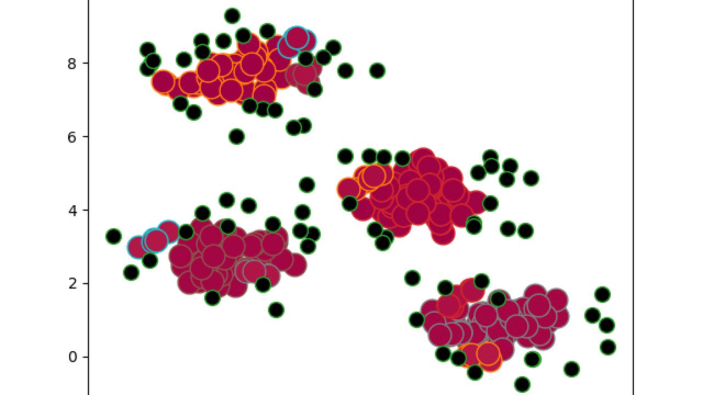
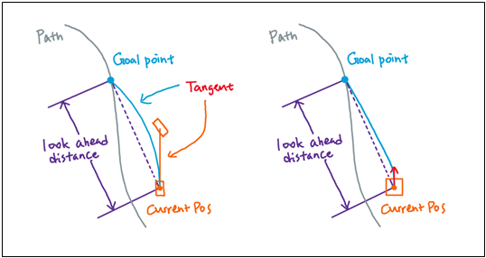

# DBSCAN과 베지어 곡선, 순수추종 알고리즘을 이용한 자율운항 시뮬레이션
<b>Autonomous Navigation Simulation using DBSCAN, Bézier Curve, and Pure Pursuit</b>

라이다 센서 데이터에 DBSCAN 군집화를 적용하여 장애물 사이 빈 공간(Gap)의 중심점을 찾고, 3차 베지어 곡선과 순수추종(Pure Pursuit) 알고리즘으로 부드럽게 경로를 추종하도록 구현한 2D 자율운항 시뮬레이션 프로젝트입니다.


4배속 주행 데모

---

## 주행 화면

### 1배속 주행


1배속 주행 화면

### 2배속 주행


2배속 주행 화면

---

## 프로젝트 개요

- <b>기존 방식의 한계</b>: 로봇 라인트레이서처럼 "장애물이 보이면 반대로 튼다"는 식의 단순 조건문은 장애물이 많은 곳에서 좌우로 심하게 떨거나 갇히기 쉬웠습니다.
- <b>SLAM 대신 가벼운 방식 시도</b>: SLAM을 쓰면 좋겠지만, 소형 보트 환경에서는 센서 비용도 크고 데이터 라벨링이나 연산량 부담이 큽니다. 그래서 SLAM의 70% 정도 성능을 내주는 가벼운 방식을 고민했습니다.
- <b>핵심 아이디어</b>: 라이다로 앞을 봤을 때 장애물이 없는 빈 공간의 가운데 점을 찍고, 그 점만 계속 따라가도 충분히 장애물 회피가 되지 않을까 하는 생각에서 출발했습니다.
- <b>장단점</b>: 튜닝해야 할 파라미터는 늘어났지만, 기존의 반사식 제어보다 훨씬 빠르고 다양한 장애물 배치에서도 안정적으로 주행합니다.


시뮬레이터 전체 화면: 보트와 라이다 감지선, 생성된 주행 곡선, 하단 센서 패널 및 상태창

---

## 1. 배경 및 문제 정의

### 1.1 단순 반사식 회피의 문제점
처음에는 장애물이 감지되면 단순히 반대 방향으로 조향각을 꺾는 방식을 썼습니다.
하지만 이 방식은 다음과 같은 문제가 있었습니다:
- <b>제자리 떨림 및 갇힘</b>: 양쪽에 장애물이 있거나 전방에 장애물이 나타나면 좌우 회피 명령이 번갈아 나와 제자리에서 지그재그로 떨거나 갇혔습니다.
- <b>속도 저하</b>: 앞 공간을 미리 내다보고 부드럽게 돌지 못해, 장애물 코앞에서 급하게 꺾거나 멈춰서 주행이 매우 느렸습니다.


초기 주행 화면: 연산이 비효율적이고 장애물 근처에서 불안정하게 흔들렸던 모습

### 1.2 SLAM의 제약과 첫 아이디어
이 문제를 해결하려면 보통 SLAM을 쓰고 전역 경로를 짜는 것이 정석입니다.
하지만 실제 소형 보트 환경에서는 제약이 많았습니다:
- 비싼 3D 라이다나 고정밀 센서를 쓰기 어려움
- 많은 데이터를 모으고 라벨링하기 어려움
- 저전력 보드에서 무거운 알고리즘을 돌리기 부담스러움

<b>"그렇다면 무거운 지도를 만들지 말고, 눈앞의 장애물 사이 빈 공간 가운데 점을 찍어서 거기로만 계속 따라가면 어떨까?"</b>

이 생각으로 시작했습니다. 지도를 전부 그리지 않아도 열린 공간의 중심만 차례대로 이어가면 기존 방식보다 훨씬 빠르고 유연하게 대처할 수 있다고 판단했습니다.

---

## 2. 센서 인지와 화면 구성

### 2.1 장애물 군집화 (DBSCAN)
매 순간 센서 값에 즉흥적으로 반응하지 않고, 라이다 점들을 모아 장애물 단위로 묶었습니다.


초기 방식: 매 프레임 즉흥적인 반응으로 불안정했던 구조

- 경기장 영역을 격자 지도로 나누고 감쇠 필터를 적용해 노이즈를 줄였습니다.
- `sklearn`의 DBSCAN 알고리즘을 사용해 흩어진 라이다 점들을 군집화하고 장애물의 중심 위치와 크기를 파악했습니다.



DBSCAN 적용 화면: 흩어진 점들을 장애물 단위로 묶어 위치와 크기를 추정한 모습

### 2.2 라이다 범위와 하단 패널 설명

보트에는 전방을 중심으로 최대 약 10m 거리를 탐색하는 180개 빔의 라이다가 장착되어 있습니다. 화면 하단에는 5개의 패널이 있고, 우측 상단에 상태 정보창이 있습니다.

#### 하단 1번째 패널 — LiDAR View (2D 평면 뷰)


보트를 중심으로 전방 180도 부채꼴 영역을 위에서 내려다본 2D 평면도입니다.
- 동심원 스케일(2m, 4m, 6m)과 방위각 가이드라인(30도 단위)이 표시되어, 장애물이 어느 방향에 얼마나 가까이 있는지 직관적으로 파악할 수 있습니다.
- 목적지 방향에 초록색 핀이 표시되고, 화면 밖에 있으면 테두리까지 방향선과 거리가 표시됩니다.

#### 하단 2번째 패널 — LiDAR Gauge View (핵심 화면)


<b>이 프로젝트에서 가장 중요하게 보는 화면입니다.</b>
- 전방 180도를 1도 단위(총 180개)로 나누어, 각 각도별 장애물까지의 거리(중간값/평균값)를 색상 막대로 옆으로 펼쳐 놓은 것입니다.
  - 빨강: 가까움 (~70px 이내) → 주황 → 노랑 → 청록: 멀거나 없음
- <b>핵심 착안점</b>: 복잡한 지도나 SLAM 없이, <b>이 180개 거리 데이터만 가지고 빈 공간(색이 없는 구간)의 중심을 찾아 웨이포인트를 찍고, 그것만 따라가도 장애물 회피가 잘 된다</b>는 것입니다.
- 상단에 수직선으로 1차 웨이포인트(시안), 2차 웨이포인트(보라), 최종 목적지(초록)의 각도 방향이 오버레이됩니다.

#### 하단 3번째 패널 — LiDAR 1st View (1인칭 뷰)


운전석 시점에서 정면을 바라보는 1인칭 화면입니다.
- 수평선을 기준으로 위에는 하늘, 아래에는 해수면 그라데이션이 깔리고, 장애물이 감지된 방향에 거리 반비례 높이의 색상 기둥이 솟아오릅니다.
- 가까운 장애물일수록 기둥이 높고 빨간색, 먼 장애물은 낮고 청록색으로 표시되어 체감 거리를 직관적으로 보여줍니다.
- 웨이포인트와 목적지가 핀 마커로 오버레이됩니다.

#### 하단 4번째, 5번째 패널 및 상태 정보창
- <b>4번째 패널 (Bezier Curve 2D)</b>: 보트 위치에서 목표 웨이포인트까지 이어지는 3차 베지어 곡선을 2D 그래프로 보여줍니다. (→ 3.2절 참조)
- <b>5번째 패널 (WP Score Weights)</b>: 빈 공간이 여러 개 있을 때 어디로 갈지 점수를 매기는 6가지 가중치 비율을 보여줍니다. (→ 3.3절 참조)
- <b>우측 상단 상태 정보창</b>: 현재 주행 상태(일반/회피/긴급 회피), 속도, 조향값, 진행 각도, 목적지까지 남은 거리를 표시합니다.

---

## 3. 경로 생성 및 주행 제어

### 3.1 3차 베지어 곡선 주행
장애물 사이 빈 공간의 중심을 찍더라도, 배의 관성 때문에 직선으로만 꺾으면 미끄러지거나 밖으로 밀려납니다. 그래서 3차 베지어 곡선과 Pure Pursuit 방식을 함께 사용했습니다.



Pure Pursuit와 베지어 곡선을 결합해 앞쪽 목표점을 부드럽게 따라가도록 구성

- <b>부드러운 선회</b>: 배가 급격히 꺾이지 않도록 속도와 각도 오차에 맞춰 곡선의 제어점을 안쪽으로 미리 배치해 완만하게 돌도록 했습니다.
- <b>장애물 회피 보정</b>: 계산된 경로가 장애물 안전거리 안쪽으로 들어가면 제어점을 장애물 반대편으로 밀어내어 충돌을 피합니다.

### 3.2 2D 궤적 그래프


실시간 곡선 패널: 보트 기준 좌표계에서 계산된 3차 다항식 곡선과 경로 길이, 측방 편차 표시

하단 패널에서 실시간으로 계산되는 3차 다항식 수식($y = ax^3 + bx^2 + cx$)과 경로 길이, 편차를 확인할 수 있습니다.

### 3.3 빈 공간(Gap) 평가 방식


빈 공간 평가 가중치: 목적지 정렬, 전진 성분, 경로 안전도, 직교성, 근접도, 밀집도 비율 표시

단순히 제일 넓은 틈만 찾아가면 목적지와 멀어지거나 막다른 길에 빠질 수 있습니다. 그래서 아래 6가지 기준을 종합해 가장 적절한 웨이포인트를 고릅니다:
1. <b>Align</b>: 목적지 방향과 얼마나 일치하는가
2. <b>Forward</b>: 목적지를 향해 앞으로 나아가는가
3. <b>Clear</b>: 틈새 주변 장애물과 충분히 떨어져 있는가
4. <b>Perpend</b>: 장애물 사이를 비스듬하지 않고 수직에 가깝게 통과하는가
5. <b>Proxim</b>: 보트와 너무 멀거나 가깝지 않고 적당한 거리인가
6. <b>Cluster</b>: 주변에 다른 장애물이 빽빽하게 몰려있지는 않은가

---

## 4. 주행 성능 및 테스트 기록

### 4.1 초기 방식과의 비교

| 비교 항목 | 초기 단순 반사 방식 | 빈 공간 추종 (베지어 곡선) |
| :--- | :--- | :--- |
| <b>평균 주행 시간</b> | 약 50초 내외 (실패 잦음) | <b>약 10초 내외 (최대 5배 단축)</b> |
| <b>주행 움직임</b> | 좌우 떨림 및 급선회 | <b>부드러운 곡선 주행</b> |
| <b>장애물 대처</b> | 복잡한 배치에서 갇힘 발생 | <b>빈 틈을 찾아 유연하게 우회</b> |


주행 테스트 화면 1


주행 테스트 화면 2: 장애물 사이를 안정적으로 통과하는 모습

### 4.2 주행 테스트 기록

파라미터 조정과 회피 로직을 개선하면서 기록한 연속 주행 테스트 결과입니다.

| 파일명 | 주행 횟수 | 성공 | 충돌 | 성공률 |
| :--- | :--- | :--- | :--- | :--- |
| `success_rate_10000_20260901.txt` | 50회 | 48회 | 2회 | 96.00% |
| `success_rate_10000_20260902.txt` | 7,501회 | 7,353회 | 148회 | 98.03% |
| `success_rate_10000_20260903.txt` | 8,410회 | 8,291회 | 119회 | 98.59% |

---

## 5. 결론 및 의의

- <b>시도의 의의</b>: 무거운 SLAM 없이도, 라이다 거리 데이터로 빈 공간 중심점을 찍고 따라가는 단순한 아이디어로 기존 방식의 고질적인 문제였던 지그재그 떨림과 속도 저하를 크게 개선했습니다.
- <b>한계점</b>: 빈 공간을 평가하고 경로를 다듬는 과정에서 튜닝해야 할 파라미터가 늘어났습니다.
- <b>정리</b>: 완벽한 무충돌 시스템을 만든 것은 아닙니다. 다만 센서와 컴퓨팅 파워가 제한된 환경에서 가벼운 기하학적 연산만으로 SLAM의 약 70% 수준 역할을 해낼 수 있음을 확인해 본 시도였습니다.

---

## 6. 설치 및 실행 방법

### 6.1 저장소 복제

```bash
git clone https://github.com/hi-shp/data_science.git
cd data_science
```

---

### 6.2 가상환경 설정

- <b>Windows (PowerShell)</b>:
```powershell
python -m venv venv
.\venv\Scripts\Activate.ps1
```

- <b>Linux / macOS</b>:
```bash
python3 -m venv venv
source venv/bin/activate
```

---

### 6.3 라이브러리 설치

```bash
pip install --upgrade pip
pip install pygame numpy scikit-learn pillow imageio-ffmpeg
```

---

### 6.4 프로그램 실행

#### 1) 실시간 시뮬레이터 실행
```bash
python main.py
```
대시보드와 센서 패널이 포함된 2D 시뮬레이터 창이 실행됩니다.

#### 2) 성공률 자동 테스트 실행
```bash
python test_success_rate.py
```
연속 자율운항 테스트를 수행하고 결과 리포트 파일(`success_rate_{회차}_{YYYYMMDD}.txt`)을 저장합니다.

---

### 6.5 시뮬레이터 조작법

- <b>스페이스바</b>: 일시정지 / 재생
- <b>마우스 좌클릭</b>:
  - 수면 위 빈 공간 클릭: 해당 위치에 새 장애물 추가
  - 하단 배속 버튼 클릭: 배속 변경 (`1x`, `2x`, `4x`, `8x`, `16x`)
- <b>하단 표시 설정 토글</b>:
  - `Show 1st & 2nd Paths`: 1차/2차 베지어 추종 경로 표시
  - `Show Candidate WPs`: 후보 웨이포인트 위치 표시
  - `Show LiDAR Hits`: 라이다 충돌 지점 표시
  - `Show LiDAR Range`: 라이다 탐색 반경 및 레이 라인 표시
