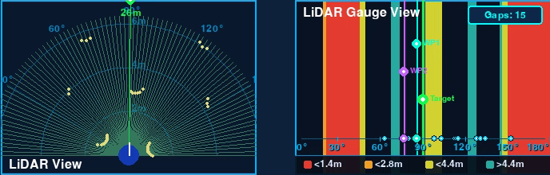

# 자율운항 보트 시뮬레이터

Autonomous Boat Navigation — Learning through Simulation

조선해양공학을 공부하면서 배가 장애물을 어떻게 피하는지 직접 이해해 보고 싶어 만든 개인 프로젝트입니다. 처음에는 가까운 장애물의 반대쪽으로 조향하는 방식부터 시작했습니다. 이후 장애물 사이 공간을 찾고, 경로를 만들고, 관성을 고려해 앞으로의 움직임을 비교하는 방법까지 하나씩 시험해 봤습니다.

현재 `main`의 실제 주행 화면입니다. 선박의 움직임과 센서, 경로를 함께 보면서 어떤 판단이 나오고 있는지 확인할 수 있습니다.


LiDAR 광선, 장애물 사이 GAP, 경로 위 waypoint와 분홍색 Pure Pursuit 표시점을 함께 볼 수 있습니다.


ModernGL 추종 카메라로 본 선박·부표·해수면입니다. 수동 조종이 아니라 같은 자율주행을 다른 화면으로 본 모습입니다.

두 GIF는 현재 코드의 실제 X11 창을 seed `2069`, 표시 `1x`로 실행해 촬영한 8초 발췌입니다. 원본 1840×920 화면을 1280×640, 25 FPS로 변환했습니다. 완주 전체 영상이나 성공률을 대표하는 표본은 아닙니다. [촬영 조건](images/readme/capture_metadata.json)도 함께 남겼습니다.

## 처음에는 장애물을 하나씩 피했습니다

처음에는 목적지를 향해 가다가 가까운 장애물이 보이면 반대쪽으로 꺾었습니다. 구조는 이해하기 쉬웠지만, 양쪽에 장애물이 있으면 회피 방향이 번갈아 바뀌었습니다. 배가 바로 방향을 바꿀 수 없다는 점도 생각보다 크게 작용했습니다.

아래는 현재 프로그램에서 실행할 수 있는 Line Tracing 비교 모드입니다. 목적지 방향 조향과 전방의 가까운 LiDAR hit에 대한 회피를 조합합니다. 현재 호환 구현은 전방 약 ±65°에서 회피 대상을 찾습니다. 모든 방향의 hit를 무조건 하나로 줄이는 방식은 아닙니다.


가까운 부표가 바뀔 때 조향 방향이 어떻게 달라지는지 보면 됩니다. 거칠게 움직이는 특성까지 포함해 단순한 비교 기준으로 남겨 두었습니다.

이 영상도 seed `2069`의 같은 초기 부표 배치입니다. 다만 Line Tracing은 이전 MAIN의 물리·제어를 재현하는 호환 모드라, 현재 자율주행과 물리 모델이 다릅니다. 두 영상만으로 동일 물리 조건의 성능 우열이나 시간 차이를 계산하지는 않습니다.

## 장애물보다 통과할 공간을 먼저 보면 어떨까

장애물마다 따로 반응하는 대신 두 장애물 사이 빈 공간을 찾는 방법을 시도했습니다. 초기 구현은 GAP 후보에 점수를 매겨 waypoint를 고르고, Bezier 곡선을 만든 뒤 Pure Pursuit로 따라갔습니다. 이 방식은 `main_light`에 남아 있습니다.

그런데 길이 그림상으로 열려 있어도 관성이 큰 배가 그 길을 그대로 따라갈 수 있는 것은 아니었습니다. 그래서 현재 `main`에서는 실제 주행 판단과 화면의 GAP 설명을 분리했습니다.

### 현재 실제 조종 경로

```text
LiDAR 관측 + 짧게 유지하는 관측맵 + 알려진 경기장 경계
    ↓
A* 경로 안내와 통로 정보
    ↓
추력·관성을 반영한 후보 trajectory rollout
    ↓
방향을 고려한 실제 선체와 관측 장애물·벽의 안전 검사
    ↓
진행 시간·명령 연속성 등을 비교하여 후보 선택
    ↓
전진 속도 / yaw rate 명령 → 좌우 추력 → 선박 이동
```

현재 기본 제어는 CODEX 계열의 `eta_continuity_forward`입니다. 안전한 전진 해법이 있으면 전진을 우선하고, 필요한 경우에는 회복 동작도 사용합니다. 모든 상황에서 후진하지 않는다는 뜻은 아닙니다.

관측맵은 장애물 관측과 자유 공간 정보를 잠시 기억합니다. 현재 코드는 장애물 관측을 2.2초, 자유 공간 관측을 5초 동안 유지합니다. 반면 선박 위치·자세는 시뮬레이터 상태에서 가져옵니다. 위치 추정이나 loop closure를 함께 하는 SLAM 구현은 아니며, SLAM과 성능 비교도 하지 않았습니다.

### GAP·Bezier·Pure Pursuit는 무엇을 보여주나


선택된 GAP의 점은 두 장애물의 정중앙이 아니라, 표시 경로가 GAP 선분을 지나는 위치입니다.

현재 화면은 먼저 선택된 예측 경로를 Bezier로 표현하고, 그 경로가 통과하는 기존 전방 GAP 후보에서 1차·2차 waypoint를 표시합니다. 한 번 선택한 장애물 쌍은 가능한 한 유지합니다. 유효한 다음 통로가 없으면 2차를 억지로 채우지 않습니다.

분홍색 Pure Pursuit 표시점은 화면의 곡선을 따라 부드럽게 이동하는 설명용 점입니다. 현재 기본 모드의 실제 제어 입력으로 되돌아가지 않습니다. 오른쪽 아래 `WP Score Weights`도 선택 이후 계산하는 설명용 값이며, 기본 모드의 GAP 선정 점수가 아닙니다.

즉 현재 `main`은 단순히 “GAP → Bezier → Pure Pursuit로 조종”하는 이전 버전과 다릅니다. 화면에는 그 흐름을 읽기 쉽게 남겼지만, 실제 조종은 물리 예측을 사용하는 제어가 맡습니다.

## 센서와 화면 읽기



왼쪽은 장애물의 방향과 위치, 오른쪽은 전방 각도별 거리를 펼친 화면입니다.

- 센서는 180개 빔으로 주변 360°를 관측합니다. 현재 기본 모델의 범위는 320 px, 물리 좌표로 6.4 m입니다.
- 하단 LiDAR View와 Gauge는 전방 180°를 보여줍니다. Gauge의 `0° / 90° / 180°`는 왼쪽 / 정면 / 오른쪽입니다.
- 장애물 군집화는 초기 DBSCAN 접근에서 출발했지만, 현재 화면용 구현은 격자의 연결 요소를 묶습니다. 기본 실행에서 `sklearn.DBSCAN`을 호출하지 않습니다.
- 실제 제어의 관측맵은 LiDAR 표면점에서 장애물 형상을 추정합니다. 화면용 군집과 제어용 관측 표현은 별도입니다.
- 벽은 내부 안전 검사에 포함되지만, 기본 GAP 화면에서 벽과 부표를 새 GAP으로 연결하지 않습니다.


하단에는 LiDAR, 거리 Gauge, 3D 미니뷰, Bezier 그래프, GAP 설명값이 있습니다. 체크박스로 경로와 관측 표시를 켜고 끌 수 있습니다.

3D 화면은 별도 렌더러 프로세스의 결과를 실제 pygame 창에 표시합니다. `V`로 큰 3D 화면과 기본 2D 화면을 전환하고, `C`로 카메라를 바꿀 수 있습니다. 3D 화면이 별도의 항법 알고리즘을 실행하는 것은 아닙니다.

## 기록은 측정 조건과 함께 봅니다

현재 리더보드에 고정된 값은 다음과 같습니다.

| 표시 이름 | 저장된 주행시간 |
| --- | ---: |
| GAP NAVI AVG | 13.2048 s |
| GAP NAVI BEST | 9.7339 s |

출처는 [leaderboard_benchmarks.json](leaderboard_benchmarks.json)입니다. seed `3000~3999`, 실제 X11 fullscreen 3D, 표시 `1x`에서 측정한 이전 CODEX 1,000회 결과를 복사해 이름만 GAP NAVI로 바꾼 기록입니다. metadata에는 성공 1,000회, 충돌 0회, timeout 0회와 best seed `3181`이 저장되어 있습니다. 현재 `main`을 다시 1,000회 측정한 결과로 소개하지 않습니다.

시간은 해당 실행 환경의 실제 경과시간입니다. 컴퓨터나 렌더링 부하, playback 설정이 다른 기록과는 그대로 비교할 수 없습니다. 현재 `main`의 표시 `1x`는 simulation 2.4초 / wall-clock 1초를 목표로 하며, `dt=0.04` 기준 60 physics steps/s입니다.

일반 기록과 고정 기록은 충돌 횟수 → 시간 → 누적 회전각 순으로 정렬합니다. 고정 기록은 Top 10 밖에서도 실제 전체 순위로 계속 표시됩니다. 사람의 RC 기록은 `.kaboat_runtime/`에 따로 저장되고, 고정 값은 실행할 때마다 다시 측정하지 않습니다.

<details>
<summary>이전 방식의 비교 결과와 보고서</summary>

[보고서 2의 저장된 요약](report/report2/benchmark_5000_summary.json)에는 아래 값이 있습니다.

| 당시 비교 방식 | 시행 | 성공 | 충돌 | Timeout |
| --- | ---: | ---: | ---: | ---: |
| Line Tracing | 5,000 | 4,256 | 726 | 18 |
| Gap Navigation | 5,000 | 4,811 | 189 | 0 |

이것은 과거 모델의 요약입니다. [당시 보고서](report/report2/README.md)의 물리·시간 조건은 현재 `main`과 다르고, 이 폴더에는 episode별 원본 전체가 함께 들어 있지 않습니다. 현재 버전의 성공률이나 실선 성능으로 읽으면 안 됩니다.

- [report1](report/report1/README.md): 이전 GAP 가중치와 파라미터 분석
- [report2](report/report2/README.md): 당시 Line Tracing / GAP 비교
- [report3](report/report3/README.md): ROS2 이식 검토와 템플릿. 실선에서 검증된 성능 기록은 아닙니다.
- [report4](report/report4/README.md): 개발 과정과 전시 자료

보고서는 작성 당시 설명을 보존한 자료입니다. 현재 기본 동작은 이 README와 실제 소스를 기준으로 확인하는 편이 맞습니다.

</details>

## 시행착오와 남아 있는 한계

GAP을 잘 고르는 것만으로는 충분하지 않았습니다. 관성과 추력 응답을 반영하면서 “갈 수 있어 보이는 경로”와 “배가 실제로 갈 수 있는 경로”를 나누어 보게 됐습니다. 또 경로 표시를 실제 조종과 분리해야 화면을 다듬다가 주행까지 달라지는 일을 피할 수 있었습니다.

아직 실제 자율운항 시스템으로 볼 수는 없습니다.

- 위치·자세는 시뮬레이터에서 주어집니다. 센서 오차를 포함한 상태 추정과 실선 검증은 하지 않았습니다.
- 장애물은 단순한 부표 형상으로 모델링합니다. 실제 LiDAR 잡음·누락, 복잡한 물체, 실제 해류와 파도의 영향을 검증한 모델은 아닙니다. 3D 해수면 표현과 선박 물리도 구분해야 합니다.
- 0.20 m는 예측 후보를 검사하는 안전 여유입니다. 관측 모델과 실제 움직임 차이까지 포함한 무충돌 보장은 아닙니다.
- 일부 HUD 속도 표기는 이전 픽셀 기반 환산이 남아 있습니다. 화면의 `kt` 숫자를 실선 속도로 해석하지 않습니다. 물리 파라미터는 [vessel_config.json](vessel_config.json)에서 확인할 수 있습니다.
- FPS와 완주시간은 하드웨어·화면 모드에 영향을 받습니다. 고정 기록이나 짧은 데모만으로 모든 배치에서 같은 성능을 주장하지 않습니다.

앞으로는 실제 센서 기록을 넣어 보고, 상태 추정을 붙여 보고, 소형 보트에서 시뮬레이션과 다른 점을 확인해 보고 싶습니다.

## 브랜치와 구현 구성

| 브랜치 | 역할 |
| --- | --- |
| `main` | 현재 주 구현. CODEX 계열 예측 제어와 GAP/Bezier 화면 설명을 결합한 버전 |
| `main_light` | 이전의 GAP 평가 → Bezier → Pure Pursuit 제어를 보존한 경량 비교 버전 |
| `codex` | A* 안내와 예측 trajectory 선택을 사용하는 비교 버전 |

현재 `main`에는 이전 이름인 `MAIN_HEAVY_*` 환경변수가 개발용으로 남아 있지만, 기본 실행에는 필요하지 않습니다.

```text
main.py / environment.py      실행 루프, 물리 상태, 모드 전환
ui_renderer.py / engine_3d.py  2D 대시보드와 3D 화면
heavy/                       현재 motion core, worker, GAP 화면 설명
vessel_dynamics.py           선박 운동 및 추력 배분
vessel_config.json           물리·제어 설정
main_line_compat.py          이전 MAIN Line Tracing 호환 모드
tests/                       단위·회귀 테스트
experiments/                 성공률·성능·진단·benchmark 도구
data/                        저장된 평가 결과
report/report1~4/            과거 분석과 전시 자료
images/readme/               이 README의 실제 화면 자료
```

## 설치와 실행

Python 3.10 / Ubuntu X11 환경에서 실행을 확인했습니다. 3D 화면에는 OpenGL 3.3 컨텍스트를 만들 수 있는 그래픽 환경이 필요합니다. 현재 기본 실행의 직접 외부 의존성은 NumPy, pygame, Numba, ModernGL입니다.

```bash
git clone --branch main https://github.com/hi-shp/data_science.git
cd data_science
python3 -m venv .venv
source .venv/bin/activate
python3 -m pip install numpy pygame numba moderngl
python3 main.py
```

첫 실행에서는 Numba 컴파일과 렌더러 준비에 시간이 걸릴 수 있습니다. 보고서 그림 생성 도구의 추가 의존성은 기본 실행과 별개입니다.

| 조작 | 기능 |
| --- | --- |
| Space | 일시정지 / 재생 |
| V / C | 2D·큰 3D 화면 전환 / 카메라 전환 |
| M | RC 수동 조종 진입 / 자율주행 복귀 |
| WASD / 방향키 | RC 전진·후진·선회 |
| B / R | RC 블라인드 모드 / RC 재시작 |
| F11 / ESC | 전체화면 전환 / 종료 |
| 하단 버튼·체크박스 | 1x~16x 배속, 경로·LiDAR 표시 설정 |
| 모드 전환 버튼 | Line Tracing 비교 모드 전환 |

테스트와 작은 평가 예시는 저장소 루트에서 실행합니다.

```bash
python3 -m unittest discover -s tests -t .
python3 experiments/success_rate/evaluate_main_heavy.py \
  --seeds 2000,2069 --output data/readme_smoke.jsonl
```

평가 도구는 물리·제어 결과 확인용입니다. 실제 GUI 경과시간을 재는 리더보드 benchmark와는 다른 실행 조건입니다.
