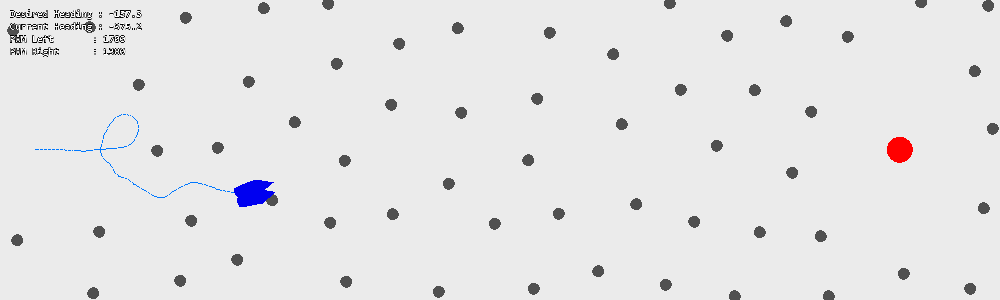
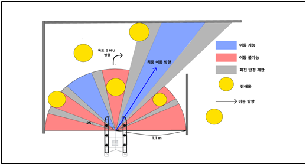
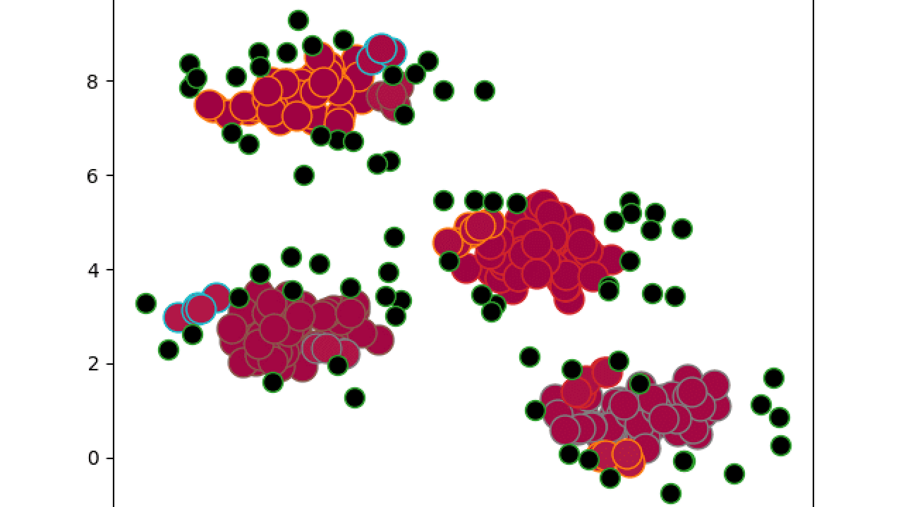
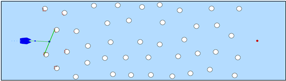
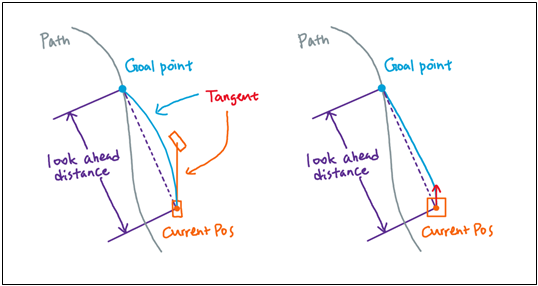
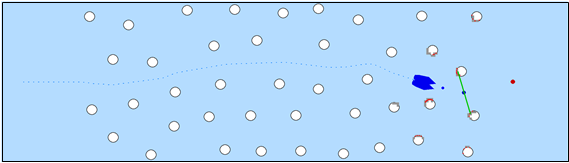
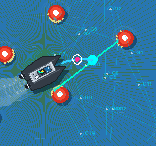
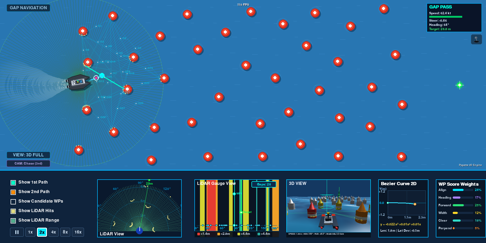

# LiDAR 기반 자율운항 보트 시뮬레이션

Gap Navigation · Bezier · 2D/3D Simulation

조선해양공학을 공부하면서 자율운항 제어를 직접 이해해 보고 싶어 만든 프로젝트입니다. 처음에는 가까운 장애물을 피하는 단순한 방식으로 시작했고, 문제가 보일 때마다 LiDAR 처리, 통과 공간 선택, 경로 생성과 추종 방식을 하나씩 추가했습니다.

2D 시뮬레이션 · 2x

LiDAR가 보는 장애물과 앞으로 지나갈 경로를 한 화면에서 확인할 수 있습니다. 같은 주행을 3D 추종 카메라로도 볼 수 있습니다.

3D 시뮬레이션 · 2x

## 시작

처음에는 목적지를 향해 가다가 가까운 장애물이 보이면 반대쪽으로 꺾었습니다. 장애물이 많아지면 회피 방향이 계속 바뀌면서 좌우로 흔들렸고, 다음 장애물에 바로 부딪히기도 했습니다.

초기 2D 화면에서 조향과 궤적을 확인하던 모습입니다.

처음 구현한 방식은 지금의 Line Tracing 비교 모드로 남겨 두었습니다. 현재는 이전 MAIN의 물리와 제어를 함께 사용하는 호환 모드입니다.

Line Tracing · 2x

## LiDAR를 보기 쉽게 만들기

센서 값을 숫자로만 보면 어느 쪽이 막혔는지 알아보기 어려웠습니다. 먼저 거리와 방향을 화면에 그려 보고, 장애물을 피할 때 센서가 무엇을 보고 있는지 확인했습니다.

처음 정리했던 센서 범위와 장애물 인지 개념도입니다.

LiDAR View에서는 장애물이 어느 방향에 얼마나 가까이 있는지 볼 수 있습니다.

거리값을 옆으로 펼치면 빈 구간이 더 잘 보였습니다. “이 빈 공간의 가운데를 찍고 따라가면 어떨까?”라는 생각이 Gauge와 GAP 방식으로 이어졌습니다.

전방 거리값과 waypoint 방향을 함께 보여주는 Gauge입니다. 현재 센서는 180개 빔으로 주변 360°를 관측하고, Gauge는 전방 180°를 표시합니다.

## 장애물보다 통과할 공간 보기

흩어진 LiDAR 점 사이에서 바로 틈을 찾기는 어려웠습니다. 초기에는 가까운 점을 DBSCAN으로 묶어 장애물의 위치와 크기를 정리했습니다.

점을 장애물 단위로 묶었던 과정입니다. 현재 화면용 군집화는 격자의 연결 요소를 묶는 방식으로 바뀌었습니다.

장애물을 하나씩 피하는 대신, 두 장애물 사이에서 지나갈 공간을 찾았습니다. 초기에는 그 공간의 중심을 다음 waypoint로 삼았습니다.

장애물 사이의 목표점을 이어가던 초기 테스트 화면입니다.

## 경로를 만들어 따라가기

통과할 점을 정해도 그쪽으로 바로 꺾으면 움직임이 거칠었습니다. 그래서 Bezier 곡선으로 경로를 만들고, 경로의 앞쪽 점을 따라가는 Pure Pursuit를 함께 사용했습니다.

선박 앞쪽의 추종점을 잡는 방식을 정리한 도식입니다.

곡선 모양과 경로 길이를 바로 볼 수 있도록 하단에 경로 그래프도 넣었습니다.

GAP 사이를 곡선으로 이어 주행하던 화면입니다. 이 GAP → Bezier → Pure Pursuit 구현은 main_light 브랜치에 남아 있습니다.

## GAP 선택 방식 바꾸기

처음에는 목적지 정렬, 선수 방향, 전진 성분, 폭, 이격거리, 수직도에 가중치를 주어 GAP을 골랐습니다. 파라미터를 바꾸면서 잘 되는 배치와 잘 안 되는 배치를 반복해서 확인했습니다.

시기마다 평가 항목도 바뀌었습니다. 위 패널에는 정렬·전진·안전거리·수직도·근접도·군집 관련 값이 남아 있습니다.

지금은 순서가 바뀌었습니다. 배의 관성과 추력 응답을 반영해 예상경로를 먼저 고르고, 그 경로가 지나가는 GAP을 화면에 표시합니다.

~~~text
LiDAR 관측 → 관측맵과 A* 경로 안내 → 후보 움직임 예측
          → 선체 안전 검사 → 속도·회전 명령 → 좌우 추력
~~~

현재 waypoint는 장애물 사이 정중앙 대신 경로와 GAP 선분의 교점에 놓입니다. 같은 통로를 지나가는 동안에는 선택한 GAP을 유지합니다.

Bezier와 분홍색 Pure Pursuit 점은 예상경로를 읽기 쉽게 보여줍니다. 실제 조종은 CODEX 계열 예측 제어가 맡고, 오른쪽 아래 가중치 패널은 선택된 GAP의 특성을 설명하는 용도로 남겼습니다.

## 선박 움직임과 화면 다듬기

처음에는 단순한 운동 모델로 시작했습니다. 이후 질량과 회전 관성, 저항, 추력 응답을 조정하면서 방향을 틀어도 배가 바로 돌아가지 않는 상황을 더 많이 다뤘습니다. 현재 설정은 [vessel_config.json](vessel_config.json)에 있습니다.

LiDAR, Gauge, 경로, GAP 정보와 선박 상태를 한 화면에 모았습니다.

경로와 센서 표시를 켜고 끄면서 판단과 실제 움직임을 함께 볼 수 있습니다.

배속을 올리자 그리는 작업과 반복 계산도 부담이 됐습니다. 바뀐 영역만 다시 그리는 Dirty Rect, 텍스트 캐시, 반복 계산 재사용을 적용했습니다. 물리 진행은 화면 FPS와 분리한 시간 누적 방식으로 처리합니다.

## 이전 주행 기록

초기 대시보드에서 경로와 센서 표시를 함께 확인하던 1x 화면입니다.

배속을 올려 반복 주행과 화면 갱신을 확인했던 2x 화면입니다.

당시 4x로 저장했던 개발 데모도 남겨 두었습니다.

## 3D로 보고 직접 조종하기

2D에서 동작을 확인한 뒤, 선박이 부표 사이를 지나가는 모습을 더 직관적으로 보고 싶어 ModernGL 3D 화면을 추가했습니다. 상단 영상처럼 추종 카메라로 볼 수 있고, V와 C로 화면과 시점을 바꿀 수 있습니다.

M을 누르면 RC 모드로 들어가 직접 조종할 수 있습니다. WASD나 방향키를 사용하고, 목적지에 도착하면 시간·충돌 횟수·누적 회전각이 리더보드에 저장됩니다. B는 센서 범위 밖을 가리는 블라인드 모드, R은 수동 주행 재시작입니다.

## 테스트 기록

현재 리더보드에는 GAP NAVI AVG 13.2048 s, GAP NAVI BEST 9.7339 s가 고정되어 있습니다. 이전 CODEX의 실제 fullscreen 3D 1,000회 측정값을 가져와 이름을 바꾼 기록입니다. [저장된 조건과 결과](leaderboard_benchmarks.json)는 다음과 같습니다.

| 원본 측정 | 시행 | 성공 | 충돌 | Timeout |
| --- | ---: | ---: | ---: | ---: |
| CODEX · seed 3000~3999 · 1x | 1,000 | 1,000 | 0 | 0 |

개발 과정에서는 회피 로직과 파라미터를 바꿀 때마다 반복 실행해 결과를 남겼습니다. 각 기록은 당시 버전과 조건을 기준으로 보관하고 있습니다.

### 이전 테스트 기록

[보고서 2의 요약](report/report2/benchmark_5000_summary.json)에는 이전 물리 모델에서 비교한 결과가 있습니다.

| 당시 방식 | 시행 | 성공 | 충돌 | Timeout |
| --- | ---: | ---: | ---: | ---: |
| Line Tracing | 5,000 | 4,256 | 726 | 18 |
| Gap Navigation | 5,000 | 4,811 | 189 | 0 |

개발하면서 버전별로 남겨둔 주행 기록입니다. 진행 중 저장된 파일은 실제 완료 횟수를 적었습니다.

| 기록 | 완료 | 성공 | 충돌 | 성공률 |
| --- | ---: | ---: | ---: | ---: |
| [2026-09-01](data/success_rate/success_rate_10000_20260901.txt) | 50 | 48 | 2 | 96.00% |
| [2026-09-02](data/success_rate/success_rate_10000_20260902.txt) | 7,501 | 7,353 | 148 | 98.03% |
| [2026-09-03](data/success_rate/success_rate_10000_20260903.txt) | 8,410 | 8,291 | 119 | 98.59% |
| [2026-09-09](data/success_rate/success_rate_10000_20260909.txt) | 1,083 | 1,074 | 9 | 99.17% |
| [2026-09-10](data/success_rate/success_rate_10000_20260910.txt) | 10,000 | 9,716 | 284 | 97.16% |

[report1](report/report1/)에는 가중치 분석, [report2](report/report2/)에는 당시 비교 실험, [report3](report/report3/)에는 ROS2 이식 검토, [report4](report/report4/)에는 전시 자료가 있습니다.

## 아직 남아 있는 점

현재는 시뮬레이터가 선박의 위치와 자세를 알려줍니다. 실제 센서와 선박에 적용하려면 상태 추정과 물리 모델 보정이 필요합니다. 장애물·센서 모델도 단순해서 복잡한 배치나 관측 오차를 더 시험해 보고 싶습니다.

완주시간은 화면 모드와 컴퓨터 성능의 영향을 받습니다. 일부 HUD 속도 표기도 이전 픽셀 환산이 남아 있어 정리가 필요합니다.

## 실행 방법

Python 3.10 / Ubuntu X11에서 실행했습니다. 3D 화면에는 OpenGL 3.3이 필요합니다.

~~~bash
git clone --branch main https://github.com/hi-shp/data_science.git
cd data_science
python3 -m pip install numpy pygame numba moderngl
python3 main.py
~~~

첫 실행에는 Numba 컴파일과 3D 렌더러 준비 시간이 들어갑니다.

| 조작 | 기능 |
| --- | --- |
| Space | 일시정지 / 재생 |
| V / C | 2D·3D 전환 / 카메라 전환 |
| M / WASD·방향키 | RC 모드 전환 / 수동 조종 |
| B / R | RC 블라인드 모드 / 재시작 |
| 하단 버튼 | 배속·Line Tracing·표시 설정 |
| F11 / ESC | 전체화면 / 종료 |

~~~bash
python3 -m unittest discover -s tests -t .
~~~

## 프로젝트 구조

- main: 현재 주 구현. 예측 제어와 GAP/Bezier 화면 표시
- main_light: 이전 GAP → Bezier → Pure Pursuit 구현
- codex: A*와 예측 제어 비교 버전

~~~text
main.py / environment.py   실행 루프와 선박 상태
heavy/                     예측 제어와 GAP 표시
ui_renderer.py             2D 화면
engine_3d.py                3D 화면
experiments/ · tests/       평가 도구와 테스트
data/ · report/            실험 기록과 보고서
~~~

[최신 영상 촬영 조건](images/readme/capture_metadata.json)
