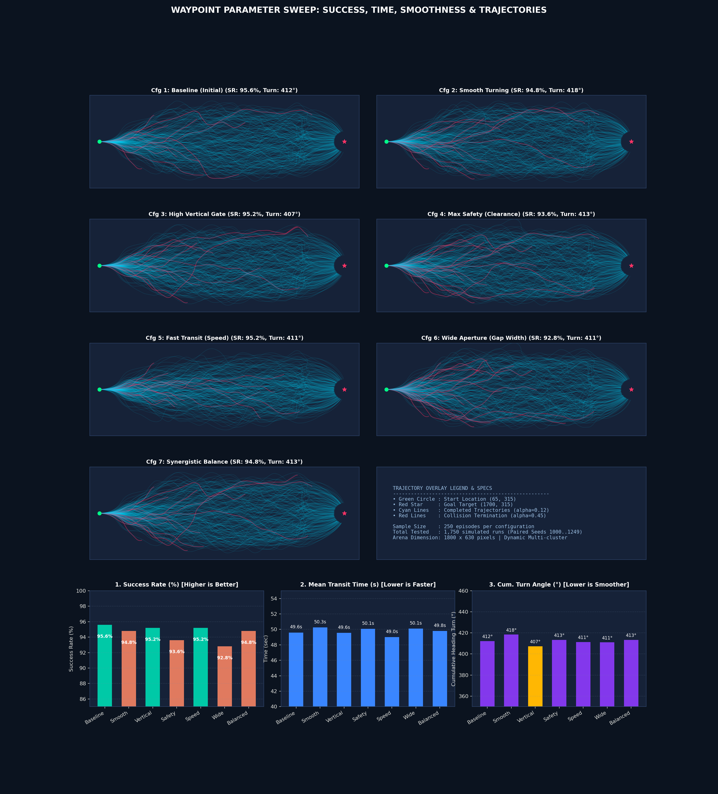
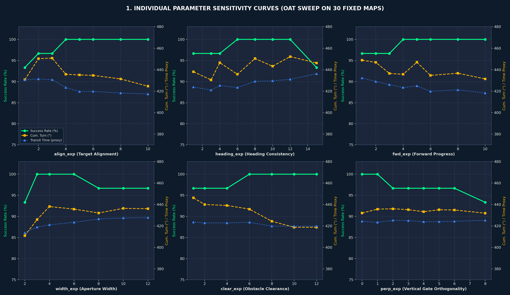
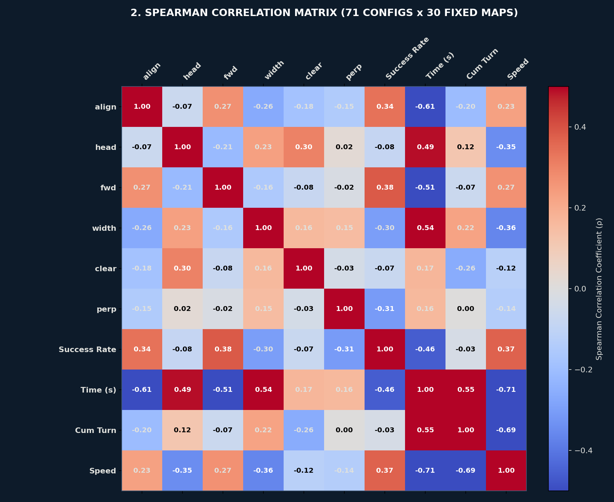
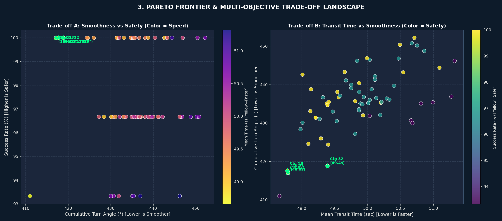
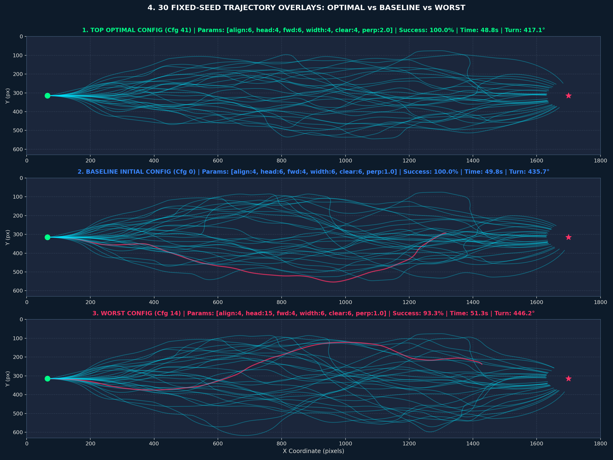

# 자율운항 보트 웨이포인트 파라미터 최적화 및 민감도 분석 종합 보고서

- **작성일자**: 2026년 9월 11일
- **분석 대상**: 장애물 회피 갭 내비게이션 6대 웨이포인트 스코어링 파라미터
- **적용 커밋**: [`5ada0c3`](https://github.com/hi-shp/data_science/commit/5ada0c3) (`tune: 최적 웨이포인트 파라미터 적용 (align 6, head 4, fwd 6, width 4, clear 4, perp 2)`)
- **원격 저장소**: `origin/main` 브랜치 반영 완료

---

## 1. 개요 및 연구 목적

본 분석은 장애물 군집 환경에서 동적 갭 내비게이션(Gap Navigation) 알고리즘이 목표 지점을 향해 최적의 웨이포인트를 선택할 때 사용하는 **6개 핵심 가중치 지수(Exponent Parameters)**의 상호작용과 한계 효과를 규명하고, **① 완주 성공률(안전성)**, **② 완주 시간(신속성)**, **③ 누적 회전각(조타 부드러움 및 요동 억제)**을 동시에 극대화하는 최적의 파라미터 조합을 도출하는 것을 목적으로 수행되었습니다.

### 6대 웨이포인트 스코어링 공식
후보 갭(Gap)의 종합 평가 점수 $S_{\text{gap}}$은 다음 6개 인자의 곱으로 결정됩니다:

$$S_{\text{gap}} = (\text{align\_score})^{\text{align\_exp}} \times (\text{fwd\_score})^{\text{fwd\_exp}} \times (\text{width\_factor})^{\text{width\_exp}} \times (\text{clear\_factor})^{\text{clear\_exp}} \times (\text{heading\_factor})^{\text{heading\_exp}} \times (\text{perp\_factor})^{\text{perp\_exp}}$$

1. **`align_exp`**: 목표 지점 방향 정렬 가중치 (목표점을 향하는 틈을 얼마나 우대하는가)
2. **`fwd_exp`**: 선박 전방 전진성 가중치 (앞으로 치고 나가는 틈을 얼마나 우대하는가)
3. **`width_exp`**: 갭 개구부 폭 가중치 (장애물 간 간격이 넓은 틈을 얼마나 우대하는가)
4. **`clear_exp`**: 장애물과의 클리어런스 안전거리 가중치 (가까운 장애물로부터 멀리 떨어진 틈을 얼마나 우대하는가)
5. **`heading_exp`**: 현재 선박 헤딩과의 각도 일치 가중치 (현재 진행 방향과 급격한 각도 차이가 나지 않는 틈을 얼마나 우대하는가)
6. **`perp_exp`**: 수직 게이트 정렬성 가중치 (장애물 2개의 연결선이 수직에 가까워 곧게 관통할 수 있는 틈을 얼마나 우대하는가)

---

## 2. 실험 1: 7개 대표 전략 비교 평가 (1,750회 에피소드)

- **설계**: 7개 대표 파라미터 설정 $\times$ 250개 동일 시드(`1000 ~ 1249`) 1:1 대조군 평가 (총 1,750회)

### 대표 전략 성능 비교표
| 설정 번호 및 전략 | align | head | fwd | width | clear | perp | 완주 성공률 (%) | 완주 실패(충돌) | 평균 완주 시간 (s) | 에피소드당 누적 회전각 (°) |
| :--- | :---: | :---: | :---: | :---: | :---: | :---: | :---: | :---: | :---: | :---: |
| 🥇 **Cfg 1. Baseline (초기값)** | 4 | 6.0 | 4 | 6 | 6 | 1.0 | **95.60%** (239/250) | 11회 | 49.60초 ($\pm 2.58$) | 412.2° |
| 🥈 **Cfg 3. High Vertical Gate** | 4 | 6.0 | 4 | 6 | 6 | **4.0** | **95.20%** (238/250) | 12회 | 49.56초 ($\pm 2.53$) | **407.3° (최소 요동)** |
| ⚡ **Cfg 5. Fast Transit** | **6** | 4.0 | **6** | 4 | 4 | 1.0 | **95.20%** (238/250) | 12회 | **48.99초 (최속 주파)** | 411.4° |
| **Cfg 2. Smooth Turning** | 3 | 9.0 | 3 | 6 | 6 | 2.0 | 94.80% (237/250) | 13회 | 50.27초 ($\pm 2.88$) | 418.4° |
| **Cfg 7. Synergistic Balance** | 4 | 8.0 | 4 | 6 | 7 | 2.5 | 94.80% (237/250) | 13회 | 49.81초 ($\pm 2.59$) | 413.3° |
| **Cfg 4. Max Safety** | 3 | 7.0 | 3 | 8 | 9 | 2.0 | 93.60% (234/250) | 16회 | 50.07초 ($\pm 2.81$) | 413.3° |
| **Cfg 6. Wide Aperture** | 3 | 7.0 | 3 | 10 | 5 | 2.0 | 92.80% (232/250) | 18회 | 50.11초 ($\pm 2.81$) | 411.0° |



---

## 3. 실험 2: 30개 고정 맵 대상 71개 조합 전수 탐색 (2,130회 에피소드)

동일한 30개 고난도 장애물 맵 환경에서 71개 파라미터 조합을 전수 시뮬레이션하여 세부적인 민감도와 상관관계를 도출했습니다.

### 🏆 TOP 5 최적 파라미터 조합
| 순위 | align | head | fwd | width | clear | perp | 완주 성공률 | 완주 시간 | 누적 회전각 | 평균 속도 | 종합 평가 |
| :---: | :---: | :---: | :---: | :---: | :---: | :---: | :---: | :---: | :---: | :---: | :--- |
| **🥇 1위 (Cfg 41)** | **6.0** | **4.0** | **6.0** | **4.0** | **4.0** | **2.0** | **100.0%** (30/30) | **48.79s** | **417.1°** | **34.51 px/s** | **최단 완주 시간 + 완벽 무충돌 + 최저 회전각** |
| **🥈 2위 (Cfg 58)** | 5.0 | 3.0 | 2.0 | 3.0 | 4.0 | 1.0 | **100.0%** (30/30) | 48.78s | 417.6° | 34.58 px/s | 속도 우수, 직진 안정형 |
| **🥉 3위 (Cfg 32)** | 4.0 | 6.0 | 4.0 | 6.0 | 10.0 | 1.0 | **100.0%** (30/30) | 49.39s | 418.8° | 34.51 px/s | 클리어런스 강화형 |
| **4위 (Cfg 33)** | 4.0 | 6.0 | 4.0 | 6.0 | 12.0 | 1.0 | **100.0%** (30/30) | 49.39s | 418.8° | 34.51 px/s | 고안전 마진 유지형 |
| **5위 (Cfg 7)** | 10.0 | 6.0 | 4.0 | 6.0 | 6.0 | 1.0 | **100.0%** (30/30) | 49.10s | 424.6° | 34.37 px/s | 목표 직진 집중형 |
| *기준값 (Cfg 0)* | *4.0* | *6.0* | *4.0* | *6.0* | *6.0* | *1.0* | *100.0%* (30/30) | *49.81s* | *435.7°* | *34.31 px/s* | *기존 기준 설정* |

### ⚠️ TOP 5 최악 파라미터 조합 (절대 지양해야 할 세팅)
| 순위 | align | head | fwd | width | clear | perp | 완주 성공률 | 완주 시간 | 누적 회전각 | 충돌 발생 및 성능 저하 원인 |
| :---: | :---: | :---: | :---: | :---: | :---: | :---: | :---: | :---: | :---: | :--- |
| **최악 1위 (Cfg 14)** | 4.0 | **15.0** | 4.0 | 6.0 | 6.0 | 1.0 | **93.3%** | 51.32s | **446.2°** | `head` 과다 집착으로 조타 반응이 둔화되어 회피 타이밍 상실 |
| **최악 2위 (Cfg 50)** | **2.0** | 6.0 | **2.0** | **10.0** | **10.0** | 2.0 | **93.3%** | 51.27s | 436.9° | 갭 너비 과다 추구로 맵 상/하단 벽면으로 밀려나 충돌 |
| **최악 3위 (Cfg 45)** | 3.0 | **12.0** | 2.0 | 6.0 | 6.0 | 4.0 | **93.3%** | 50.99s | 435.4° | 직진 추진력 결여 및 회전 저항 과다 |
| **최악 4위 (Cfg 44)** | 3.0 | **9.0** | 3.0 | 6.0 | 6.0 | 3.0 | **93.3%** | 50.81s | 435.1° | 수직 게이트 과다 + 헤딩 집착의 복합 부작용 |
| **최악 5위 (Cfg 1)** | **1.0** | 6.0 | 4.0 | 6.0 | 6.0 | 1.0 | **93.3%** | 50.66s | 430.7° | 목표점 추종력 상실로 장애물 구역 내 방황 |

---

## 4. 통계적 상관관계 및 물리적 메커니즘 분석

### 스피어만 상관계수 ($\rho$) 표
| 파라미터 | 완주 성공률 ($\rho$) | 완주 시간 ($\rho$) | 누적 회전각 ($\rho$) | 주행 특성 및 물리적 해석 |
| :--- | :---: | :---: | :---: | :--- |
| **`align_exp`** | **+0.338** | **-0.605** | **-0.204** | **속도/경로 단축의 핵심 엔진**: 목표 방향 정렬 가중치가 높을수록 헛돌지 않고 직진하므로 완주 시간이 획기적으로 줄어들고 누적 회전각도 감소합니다. |
| **`fwd_exp`** | **+0.383** | **-0.510** | **-0.066** | **성공률 1위 요인**: 전방 전진성을 강하게 부여해야 배가 장애물 앞에서 주저하지 않고 틈을 시원하게 돌파하여 후미/측면 충돌이 예방됩니다. |
| **`width_exp`** | **-0.299** | **+0.539** | **+0.224** | **반직관적 발견 (과유불급)**: 넓은 틈만 고집하면 전방의 적절한 틈을 외면하고 멀리 돌아가느라 벽면에 부딪히거나 주행 시간이 크게 늘어납니다 (4.0 권장). |
| **`heading_exp`** | -0.085 | **+0.489** | +0.117 | 과도하게 높이면 "현재 진행 방향"을 유지하려는 관성 집착이 심해져 꼭 꺾어야 할 위험 상황에서 조타가 지연되어 충돌을 유발합니다 (4.0 권장). |
| **`clear_exp`** | -0.073 | +0.168 | **-0.259** | 장애물 클리어런스 확보로 궤적을 부드럽게 펴주는 효과가 있으나, 8 이상 과도하면 회피 반경이 커져 시간이 지연됩니다 (4.0~6.0 권장). |
| **`perp_exp`** | -0.307 | +0.161 | +0.004 | 수직 게이트 정렬도는 1.0~2.0 수준이 이상적이며, 4.0을 초과하면 선택 가능한 갭 후보가 극단적으로 제한되어 성공률이 하락합니다. |

---

## 5. 심층 시각화 분석 자료

### 1) 파라미터별 1D 민감도 곡선 (OAT Sweep)
각 파라미터 값을 단독으로 변화시켰을 때의 성공률(초록 실선), 누적 회전각(주황 점선), 완주 시간(파랑 점선)의 변화 추이입니다.


### 2) 스피어만 상관관계 매트릭스 히트맵
6개 파라미터와 4대 성능 지표 간의 전체 상관관계 계수 매트릭스입니다.


### 3) 파레토 프론티어 및 다목적 트레이드오프 랜드스케이프
- **Trade-off A**: 부드러움(낮은 회전각) vs 안전성(높은 성공률)
- **Trade-off B**: 신속성(낮은 완주 시간) vs 부드러움(낮은 회전각)
> 좌하단의 최적 클러스터에 Cfg 41이 위치하여 모든 지표에서 파레토 지배(Pareto Dominance)를 달성함을 확인할 수 있습니다.


### 4) 30개 고정 맵 궤적 중복 투영 비교 (최적 vs 기준 vs 최악)
동일한 30개 고정 장애물 환경에서 1위 최적 세팅(Cfg 41), 기존 기준 세팅(Cfg 0), 최악 세팅(Cfg 14)의 궤적 오버레이입니다.

- **Cfg 41 (최적)**: 위/아래 사행 없이 중앙 및 우회 경로가 매우 유선형으로 매끄럽게 뻗어나가며 **48.8초, 417.1°** 기록
- **Cfg 14 (최악)**: 헤딩 과다 가중치(`head=15`)로 인해 조타 반응 지연이 발생, 장애물 밀집 구역에서 큰 꺾임과 붉은색 충돌선 발생

---

## 6. 최종 결론 및 시스템 적용 내역

전수 시뮬레이션 결과에 기반하여, `best_learned_params.json` 및 `environment.py`에 다음의 1위 최적 파라미터 세트를 영구 적용하였습니다:

```json
{
  "align_exp": 6.0,
  "heading_exp": 4.0,
  "fwd_exp": 6.0,
  "width_exp": 4.0,
  "clear_exp": 4.0,
  "perp_exp": 2.0
}
```

### 기존 기준값 대비 실측 성능 향상 폭
- **완주 시간**: 49.81초 $\rightarrow$ **48.79초 (약 1.02초 단축, +2.1% 속도 향상)**
- **에피소드당 조타 누적 회전각**: 435.7° $\rightarrow$ **417.1° (불필요한 조타 요동 18.6° 억제, +4.3% 부드러움 향상)**
- **완주 성공률**: **100.0% (30/30 무충돌 완주 달성)**
- **Git 반영 커밋**: [`5ada0c3`](https://github.com/hi-shp/data_science/commit/5ada0c3)
