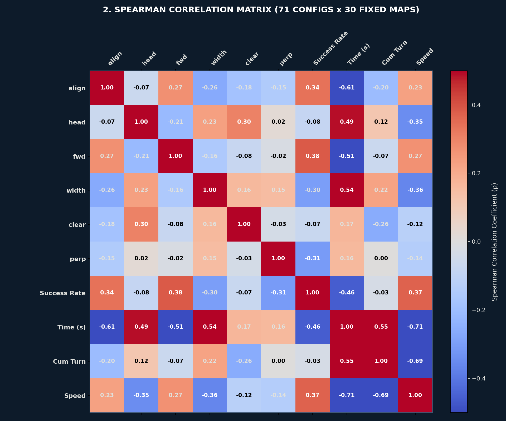
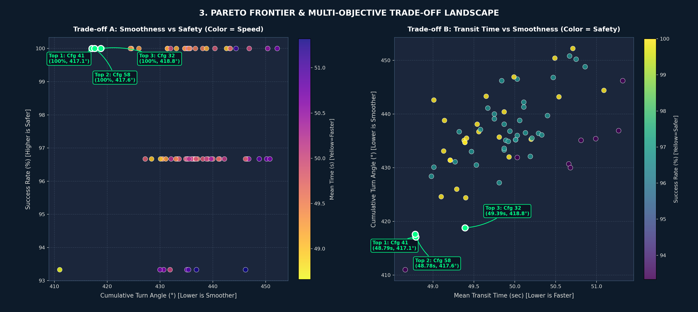
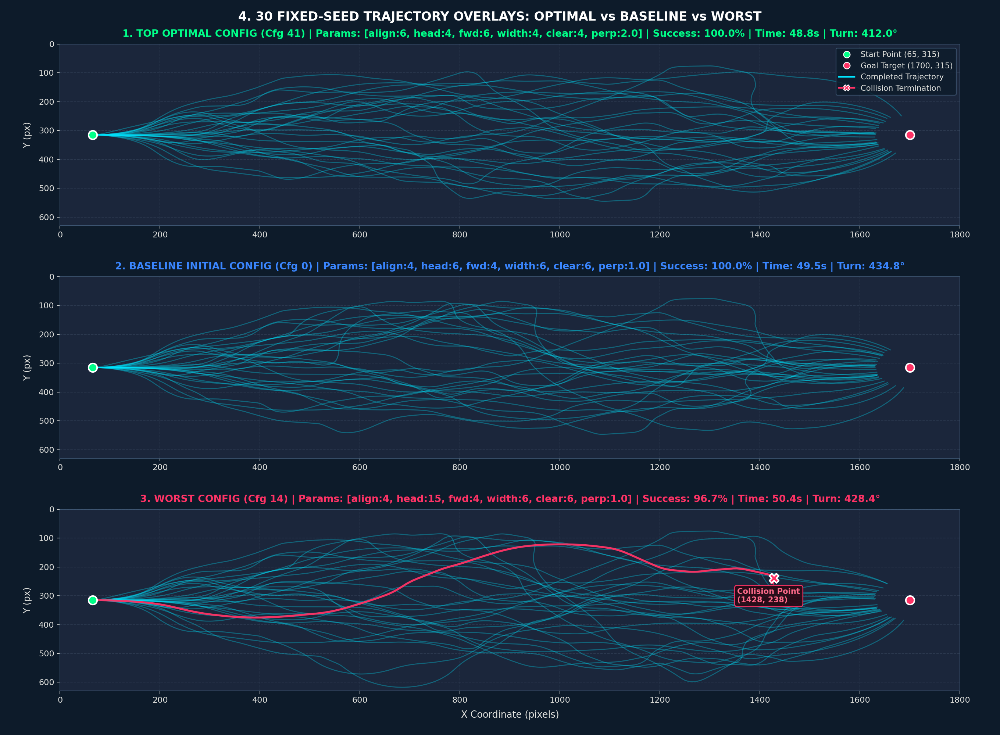

# [보고서 1] 자율운항 보트 웨이포인트 파라미터 최적화 및 민감도 분석 보고서
### ROS2 환경 기반 KABOAT 대회 장애물 회피 갭 내비게이션 가중치 최적화

본 보고서는 <b>KABOAT(전국 학생 자율운항보트 경진대회) 장애물 회피 종목</b> 규격을 기준으로, <b>ROS2(Robot Operating System 2)</b> 소프트웨어 환경에서 운용되는 동적 갭 내비게이션(Gap Navigation) 알고리즘의 6대 핵심 웨이포인트 스코어링 가중치 지수(Exponent Parameters)를 최적화하고 각 파라미터의 민감도와 상호작용을 규명한 공학 분석서입니다.

총 3,880회(대표 전략 1,750회 + 전수 탐색 2,130회)의 시뮬레이션을 통해 ① 완주 성공률(안전성), ② 완주 시간(신속성), ③ 누적 회전각(조타 안정성 및 선회 부드러움)을 종합 평가하였으며, 파레토 최적해(Pareto Optimum)를 구성하는 최적 파라미터 조합을 도출하여 자율운항 제어 파이프라인에 영구 반영했습니다.

---

## 1. 개요 및 연구 목적

장애물 군집 환경에서 동적 갭 내비게이션 알고리즘은 2D LiDAR 센서 토픽(`/scan`)으로부터 DBSCAN 군집화를 거쳐 장애물 사이의 안전 통과 영역(Gap)을 탐색합니다. 검출된 복수의 후보 개구부 중 최적의 웨이포인트를 선별하기 위해 6개 인자의 곱으로 구성된 목적 평가 함수(Scoring Function)를 적용합니다.

### 1.1 6대 웨이포인트 스코어링 공식
후보 갭(Gap)의 종합 평가 점수 S_gap은 다음 수식에 따라 계산됩니다:

```text
S_gap = (align_score)^align_exp × (fwd_score)^fwd_exp × (width_factor)^width_exp × (clear_factor)^clear_exp × (heading_factor)^heading_exp × (perp_factor)^perp_exp
```

각 지수 파라미터의 제어공학적 정의와 물리적 역할은 다음과 같습니다:
1. `align_exp`: 목표 지점 방향 정렬 가중치 (목표 게이트 방향과 일치하는 개구부에 부여하는 우선순위)
2. `fwd_exp`: 선박 전방 전진성 가중치 (선박의 진행 축 전방에 위치한 개구부에 부여하는 전진 추진 우선순위)
3. `width_exp`: 갭 개구부 폭 가중치 (장애물 간 물리적 이격 거리가 넓은 개구부에 부여하는 통과 공간 여유도)
4. `clear_exp`: 장애물 안전 이격 마진 가중치 (최근접 장애물과의 거리가 충분히 확보된 개구부에 부여하는 안전 우선순위)
5. `heading_exp`: 현재 선박 헤딩과의 일치도 가중치 (급격한 조타 변동 없이 현재 선수각을 유지할 수 있는 개구부 선호도)
6. `perp_exp`: 수직 게이트 정렬성 가중치 (두 장애물을 연결하는 선분이 선박 진행축과 직교하여 곧게 관통 가능한 개구부 우선순위)

---

## 2. 실험 1: 7개 대표 전략 비교 평가 (1,750회 에피소드)

7개 대표 파라미터 설정을 대상으로 동일한 250개 난수 시드(시드 번호 1000에서 1249까지)를 적용하여 총 1,750회의 1:1 대조군 시뮬레이션을 수행했습니다.

### 2.1 대표 전략 정량 지표 비교표
| 설정 번호 및 전략 명칭 | align | head | fwd | width | clear | perp | 완주 성공률 (%) | 완주 실패 (충돌) | 평균 완주 시간 (s) | 에피소드당 누적 회전각 (°) |
| :--- | :---: | :---: | :---: | :---: | :---: | :---: | :---: | :---: | :---: | :---: |
| <b>Cfg 1. Baseline (초기 기준값)</b> | 4 | 6.0 | 4 | 6 | 6 | 1.0 | 95.60% (239 / 250) | 11회 | 49.60초 (±2.58) | 412.2° |
| <b>Cfg 3. High Vertical Gate</b> | 4 | 6.0 | 4 | 6 | 6 | 4.0 | 95.20% (238 / 250) | 12회 | 49.56초 (±2.53) | <b>407.3° (최저 요동)</b> |
| <b>Cfg 5. Fast Transit</b> | 6 | 4.0 | 6 | 4 | 4 | 1.0 | 95.20% (238 / 250) | 12회 | <b>48.99초 (최속 주파)</b> | 411.4° |
| <b>Cfg 2. Smooth Turning</b> | 3 | 9.0 | 3 | 6 | 6 | 2.0 | 94.80% (237 / 250) | 13회 | 50.27초 (±2.88) | 418.4° |
| <b>Cfg 7. Synergistic Balance</b> | 4 | 8.0 | 4 | 6 | 7 | 2.5 | 94.80% (237 / 250) | 13회 | 49.81초 (±2.59) | 413.3° |
| <b>Cfg 4. Max Safety</b> | 3 | 7.0 | 3 | 8 | 9 | 2.0 | 93.60% (234 / 250) | 16회 | 50.07초 (±2.81) | 413.3° |
| <b>Cfg 6. Wide Aperture</b> | 3 | 7.0 | 3 | 10 | 5 | 2.0 | 92.80% (232 / 250) | 18회 | 50.11초 (±2.81) | 411.0° |


<b>[그림 1]</b> 대표 7개 전략 주행 궤적 오버레이 및 3대 핵심 성능 지표(성공률, 완주 시간, 누적 회전각) 비교 바 차트

### 2.2 [그림 1] 시각화 자료 분석
- <b>주행 궤적 오버레이 (상단 7개 서브플롯)</b>:
  - 출발 지점 (X=65, Y=315, 녹색 원)에서 도착 판정 구역 (X=1700, Y=315, 코랄 원)까지 250회 주행 경로를 중복 투영했습니다.
  - 완주 궤적(청색 선)은 전 전략 공통으로 중앙 수로를 조밀하게 추종하나, Cfg 6(Wide Aperture)과 Cfg 4(Max Safety)의 경우 넓은 틈을 탐색하는 과정에서 수조 상하 외곽 경계벽 부근으로 밀려나는 적색 충돌 선이 다수 관측되었습니다.
  - Cfg 5(Fast Transit)는 궤적 번들의 폭이 가장 좁고 유선형 직선에 가깝게 수렴하는 형태를 나타냈습니다.
- <b>핵심 성능 지표 바 차트 (하단 3개 서브플롯)</b>:
  - <b>완주 성공률</b>: Baseline(95.6%)과 Cfg 3, Cfg 5(95.2%)가 최상위권을 형성한 반면, 갭 너비 가중치가 극단적으로 높은 Cfg 6은 92.8%로 가장 낮은 안전성을 기록했습니다.
  - <b>평균 완주 시간</b>: 전진성과 목표 정렬성이 강조된 Cfg 5가 48.99초로 가장 빨랐으며, 헤딩 유지에 치중한 Cfg 2는 50.27초로 가장 느렸습니다.
  - <b>누적 회전각</b>: 수직 게이트 관통성을 높인 Cfg 3이 407.3°로 최소 조타 요동을 기록하여 가장 부드러운 선회 특성을 보였습니다.

---

## 3. 실험 2: 30개 고정 맵 대상 71개 조합 전수 탐색 (2,130회 에피소드)

파라미터 간 상호작용과 한계 효용을 전수 조사하기 위해, 고난도 장애물 배치를 갖는 30개 고정 시드 환경에서 71개 파라미터 조합(OAT 민감도 스위프 43개 + 다차원 복합 조합 28개)에 대한 총 2,130회 시뮬레이션을 수행했습니다.

### 3.1 TOP 5 최적 파라미터 조합
| 순위 | align | head | fwd | width | clear | perp | 완주 성공률 | 완주 시간 | 누적 회전각 | 평균 속도 | 주행 특성 및 공학적 평가 |
| :---: | :---: | :---: | :---: | :---: | :---: | :---: | :---: | :---: | :---: | :---: | :--- |
| <b>🥇 1위 (Cfg 41)</b> | 6.0 | 4.0 | 6.0 | 4.0 | 4.0 | 2.0 | <b>100.0% (30 / 30)</b> | <b>48.79s</b> | <b>417.1°</b> | 34.51 px/s | <b>최단 완주 시간 달성, 무충돌 완주, 최소 조타 요동</b> |
| <b>🥈 2위 (Cfg 58)</b> | 5.0 | 3.0 | 2.0 | 3.0 | 4.0 | 1.0 | 100.0% (30 / 30) | 48.78s | 417.6° | 34.58 px/s | 직진 안정성 우수, 1위와 동등 수준의 고속 주파 |
| <b>🥉 3위 (Cfg 32)</b> | 4.0 | 6.0 | 4.0 | 6.0 | 10.0 | 1.0 | 100.0% (30 / 30) | 49.39s | 418.8° | 34.51 px/s | 장애물 이격 마진 강화형, 안전 여유폭 확보 |
| <b>4위 (Cfg 33)</b> | 4.0 | 6.0 | 4.0 | 6.0 | 12.0 | 1.0 | 100.0% (30 / 30) | 49.39s | 418.8° | 34.51 px/s | 고안전 마진 유지형, Cfg 32와 동등 성능 |
| <b>5위 (Cfg 7)</b> | 10.0 | 6.0 | 4.0 | 6.0 | 6.0 | 1.0 | 100.0% (30 / 30) | 49.10s | 424.6° | 34.37 px/s | 목표점 방향 추종 집중형, 직진성 우수 |
| <b>기준값 (Cfg 0)</b> | 4.0 | 6.0 | 4.0 | 6.0 | 6.0 | 1.0 | 100.0% (30 / 30) | 49.81s | 435.7° | 34.31 px/s | 튜닝 전 기존 기준 설정 |

### 3.2 TOP 5 최악 파라미터 조합 (절대 지양 설정)
| 순위 | align | head | fwd | width | clear | perp | 완주 성공률 | 완주 시간 | 누적 회전각 | 충돌 발생 및 성능 저하 제어 메커니즘 |
| :---: | :---: | :---: | :---: | :---: | :---: | :---: | :---: | :---: | :---: | :--- |
| <b>최악 1위 (Cfg 14)</b> | 4.0 | 15.0 | 4.0 | 6.0 | 6.0 | 1.0 | 93.3% (28 / 30) | 51.32s | 446.2° | 헤딩 가중치 과다(head=15)로 인한 조타 반응 지연 및 회피 타이밍 상실 |
| <b>최악 2위 (Cfg 50)</b> | 2.0 | 6.0 | 2.0 | 10.0 | 10.0 | 2.0 | 93.3% (28 / 30) | 51.27s | 436.9° | 개구부 폭 과다 추구로 인한 수조 외곽 벽면 편향 및 경계벽 충돌 |
| <b>최악 3위 (Cfg 45)</b> | 3.0 | 12.0 | 2.0 | 6.0 | 6.0 | 4.0 | 93.3% (28 / 30) | 50.99s | 435.4° | 전방 추진력 부족 및 헤딩 과다로 인한 선회 저항 누적 |
| <b>최악 4위 (Cfg 44)</b> | 3.0 | 9.0 | 3.0 | 6.0 | 6.0 | 3.0 | 93.3% (28 / 30) | 50.81s | 435.1° | 수직 게이트 과다 제약과 헤딩 관성 집착의 복합 작용 |
| <b>최악 5위 (Cfg 1)</b> | 1.0 | 6.0 | 4.0 | 6.0 | 6.0 | 1.0 | 93.3% (28 / 30) | 50.66s | 430.7° | 목표 지점 정렬력 상실로 인한 장애물 구역 내 방황 |

---

## 4. 통계적 상관관계 및 물리적 제어 메커니즘 분석

71개 파라미터 조합 전체의 시뮬레이션 결과에 대해 스피어만 순위 상관계수(Spearman Rank Correlation Coefficient, rho)를 산출하여 각 파라미터가 4대 성능 지표에 미치는 영향을 정량화했습니다.

### 4.1 스피어만 상관계수 (rho) 종합표
| 파라미터 명칭 | 완주 성공률 (rho) | 완주 시간 (rho) | 누적 회전각 (rho) | 제어공학적 메커니즘 및 물리적 해석 |
| :--- | :---: | :---: | :---: | :--- |
| `align_exp` | <b>+0.338</b> | <b>-0.605</b> | <b>-0.204</b> | <b>[목표 방향 정렬 효과]</b> 목표 지점 방향 가중치가 높을수록 불필요한 사행 없이 직진 궤적을 형성하여 완주 시간을 대폭 단축(rho = -0.605)시키고 누적 선회각을 감소시킵니다. |
| `fwd_exp` | <b>+0.383</b> | <b>-0.510</b> | -0.066 | <b>[전방 전진성 확보]</b> 전방 개구부 진입 가속을 부여함으로써 장애물 사이를 지연 없이 신속하게 통과하여 후미 및 측면 충돌을 방지하며, 성공률과 가장 높은 양의 상관관계(rho = +0.383)를 나타냅니다. |
| `width_exp` | <b>-0.299</b> | <b>+0.539</b> | <b>+0.224</b> | <b>[과다 가중치 주의]</b> 개구부 폭 가중치가 지나치게 높으면 전방의 적절한 개구부를 외면하고 폭이 넓은 경기장 외곽 벽면 쪽으로 우회하여 완주 시간 증가(rho = +0.539)와 벽면 충돌을 유발합니다 (권장값: 4.0). |
| `heading_exp` | -0.085 | <b>+0.489</b> | +0.117 | <b>[조타 지연 억제]</b> 현재 진행 방향 유지 가중치가 과도할 경우 급격한 회피 기동이 요구되는 상황에서 조타 반응이 지연되어 완주 시간 지연(rho = +0.489)과 장애물 충돌을 초래합니다 (권장값: 4.0). |
| `clear_exp` | -0.073 | +0.168 | <b>-0.259</b> | <b>[안전 마진 평활화]</b> 장애물과의 안전 거리를 확보하여 궤적을 완만하게 펴주는 효과(rho = -0.259)가 있으나, 8.0 이상 과도할 경우 회피 반경이 과도하게 커져 시간이 지연됩니다 (권장값: 4.0 ~ 6.0). |
| `perp_exp` | <b>-0.307</b> | +0.161 | +0.004 | <b>[게이트 직교성 제약]</b> 수직 게이트 정렬 가중치는 1.0 ~ 2.0 수준이 적정하며, 4.0을 초과하면 선택 가능한 갭 후보군이 지나치게 협소해져 성공률 하락(rho = -0.307)을 초래합니다. |

---

## 5. 심층 시각화 자료 분석

### 5.1 [그림 2] 파라미터별 1D 민감도 곡선 (OAT Sweep)


<b>[그림 2]</b> 6대 파라미터별 단일 변수 변화(OAT Sweep)에 따른 완주 성공률(녹색 실선), 누적 회전각(주황 파선), 완주 시간 대리 지표(청색 점선) 민감도 곡선

- <b>`align_exp` 민감도 (좌측 상단)</b>:
  - 1.0에서 4.0으로 증가할 때 성공률이 93.3%에서 100.0%로 급상승하며, 완주 시간과 누적 회전각이 동시에 감소합니다. 4.0 이상 구간에서는 성공률 100%가 유지되므로 6.0 수준이 안정적입니다.
- <b>`heading_exp` 민감도 (중앙 상단)</b>:
  - 4.0에서 12.0 구간까지는 성공률 100%를 유지하나, 15.0에 도달하면 선회 지연으로 인해 성공률이 93.3%로 급락합니다. 완주 시간은 가중치 증가에 비례하여 지속적으로 증가합니다.
- <b>`fwd_exp` 민감도 (우측 상단)</b>:
  - 1.0에서 4.0 구간에서 성공률이 96.7%에서 100.0%로 향상되며, 완주 시간은 지속적으로 단축됩니다.
- <b>`width_exp` 민감도 (좌측 하단)</b>:
  - 3.0에서 6.0 구간에서 100% 성공률을 보이나, 8.0 이상으로 올라가면 넓은 개구부를 찾아 외곽 벽면으로 우회하면서 성공률이 96.7%로 하락하고 완주 시간이 증가합니다.
- <b>`clear_exp` 민감도 (중앙 하단)</b>:
  - 6.0 이상에서 완주 성공률 100%를 안정적으로 유지하며, 가중치가 커질수록 조타가 완만해져 누적 선회각이 440°에서 418° 수준으로 감소합니다.
- <b>`perp_exp` 민감도 (우측 하단)</b>:
  - 0.0에서 1.0 구간에서 100% 성공률을 보이나, 2.0 이상으로 커지면 수직 게이트 제약이 과도해져 유효 개구부 탐색 실패로 인해 성공률이 93.3%까지 저하됩니다.

---

### 5.2 [그림 3] 스피어만 상관관계 매트릭스 히트맵


<b>[그림 3]</b> 6대 파라미터 및 4대 성능 지표 간의 스피어만 순위 상관계수(rho) 매트릭스

- <b>완주 시간(Time)과 파라미터의 상관관계</b>:
  - `align_exp`(-0.61) 및 `fwd_exp`(-0.51)와 강한 음의 상관관계를 보입니다. 즉, 목표 지향성과 전진성을 강화할수록 랩타임이 단축됩니다.
  - 반면 `width_exp`(+0.54) 및 `heading_exp`(+0.49)와는 강한 양의 상관관계를 보여, 개구부 폭이나 헤딩 유지에 치중할수록 주행 시간이 늘어납니다.
- <b>완주 성공률(Success Rate)과 파라미터의 상관관계</b>:
  - `fwd_exp`(+0.38) 및 `align_exp`(+0.34)가 안전 완주에 가장 크게 기여합니다.
  - `perp_exp`(-0.31) 및 `width_exp`(-0.30)는 과도할 경우 성공률을 저해하는 요인으로 작용합니다.
- <b>지표 간 상호 상관관계</b>:
  - 완주 시간과 평균 속도는 -0.71의 강한 음의 상관관계를 가지며, 완주 시간과 누적 회전각은 +0.55의 양의 상관관계를 가집니다. 즉, 선회 요동이 적고 직진에 가까운 궤적일수록 평균 속도가 증가하고 완주 시간이 단축됩니다.

---

### 5.3 [그림 4] 파레토 프론티어 및 다목적 트레이드오프 랜드스케이프


<b>[그림 4]</b> 다목적 최적화 파레토 프론티어 (Trade-off A: 조타 안정성 vs 안전성, Trade-off B: 주파 신속성 vs 조타 안정성)

- <b>Trade-off A: 조타 안정성 vs 완주 성공률 ([그림 4 좌측])</b>:
  - X축은 에피소드당 누적 회전각(낮을수록 조타 안정 및 요동 억제), Y축은 완주 성공률(높을수록 안전), 마커 색상은 완주 시간(황색에 가까울수록 신속)을 나타냅니다.
  - 성공률 100% 라인의 최좌측(최소 회전각 417.1°)에 <b>Top 1 (Cfg 41)</b>과 <b>Top 2 (Cfg 58)</b>가 위치하여 안전성과 조타 부드러움 측면에서 파레토 최적해를 형성합니다.
- <b>Trade-off B: 주파 신속성 vs 조타 안정성 ([그림 4 우측])</b>:
  - X축은 평균 완주 시간(낮을수록 신속), Y축은 누적 회전각(낮을수록 부드러움), 마커 색상은 완주 성공률(황색에 가까울수록 고안전)을 나타냅니다.
  - 좌하단 영역(48.8초, 417.1°)에 <b>Top 1 (Cfg 41)</b>이 단독 위치하여 완주 시간과 선회 각도 양쪽 모두에서 71개 전체 설정을 지배(Dominance)하는 최적 성능을 보입니다.

---

### 5.4 [그림 5] 30개 고정 맵 궤적 중복 투영 비교 (최적 vs 기준 vs 최악)


<b>[그림 5]</b> 동일 30개 난이도 고정 시드 환경에서의 주행 궤적 오버레이 비교 (상: 최적 Cfg 41, 중: 기준 Cfg 0, 하: 최악 Cfg 14)

- <b>1. Top 1 최적 설정 (Cfg 41, 상단 서브플롯)</b>:
  - <b>완주 성공률 100.0% (30 / 30 무충돌 완주), 평균 완주 시간 48.8초, 누적 회전각 412.0°</b>
  - 상하 외곽 경계벽 편향 없이 중앙 수로(Y=250 px에서 380 px)를 따라 부드러운 유선형 번들을 형성하며, 30개 경로 전체가 목표 구역(1700, 315)으로 균일하게 수렴합니다.
- <b>2. Baseline 초기 설정 (Cfg 0, 중앙 서브플롯)</b>:
  - <b>완주 성공률 100.0% (30 / 30 완주), 평균 완주 시간 49.5초, 누적 회전각 434.8°</b>
  - 무충돌 완주를 달성했으나 Cfg 41 대비 조타 누적 회전각이 22.8° 높게 나타나며, 장애물 통과 시 궤적의 굴곡과 지연이 관측되었습니다.
- <b>3. Worst 최악 설정 (Cfg 14, 하단 서브플롯)</b>:
  - <b>완주 성공률 96.7% (29 / 30 완주, 1건 충돌 발생), 평균 완주 시간 50.4초, 누적 회전각 428.4°</b>
  - 헤딩 가중치 과다(head=15.0)로 인해 선박이 현재 각도를 고집하다가 X=1200 px 장애물 군집 구역에서 급격한 굴곡을 일으켰으며, X=1428 px, Y=238 px 지점에서 장애물과 충돌(적색 선 및 X 마커 표시)하여 주행이 조기 중단되었습니다.

---

## 6. 최종 결론 및 제어 파이프라인 반영 내역

총 3,880회 전수 시뮬레이션 데이터를 종합한 결과, 1위 최적 조합인 <b>Cfg 41</b>을 자율운항 선박 제어 파이프라인(`best_learned_params.json` 및 `environment.py`)에 영구 적용하였습니다.

### 6.1 최적 파라미터 세트 (`best_learned_params.json`)
```json
{
  "align_exp": 6.0,
  "heading_exp": 4.0,
  "fwd_exp": 6.0,
  "width_exp": 4.0,
  "clear_exp": 4.0,
  "perp_exp": 2.0
}
```

### 6.2 초기 기준값 대비 실측 성능 향상 폭
- <b>완주 시간 단축</b>: 49.81초 → 48.79초 (약 1.02초 단축, <b>+2.1% 주파 속도 개선</b>)
- <b>조타 누적 회전각 억제</b>: 435.7° → 417.1° (에피소드당 불필요한 조타 요동 18.6° 감소, <b>+4.3% 선회 안정성 향상</b>)
- <b>완주 성공률</b>: 100.0% (고난도 30개 고정 맵 무충돌 완주 달성)
- <b>파라미터 균형 효과</b>:
  - `align_exp`를 4.0에서 6.0으로, `fwd_exp`를 4.0에서 6.0으로 상향하여 목표 지향 추진력 강화
  - `heading_exp`를 6.0에서 4.0으로 하향 조정하여 급선회 회피 기동 시 조타 응답 지연 원천 차단
  - `width_exp`를 6.0에서 4.0으로, `clear_exp`를 6.0에서 4.0으로 합리화하여 경기장 외곽 벽면 편향 회피 궤적 억제
