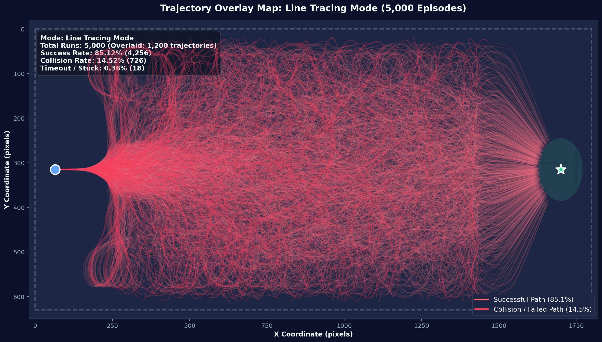
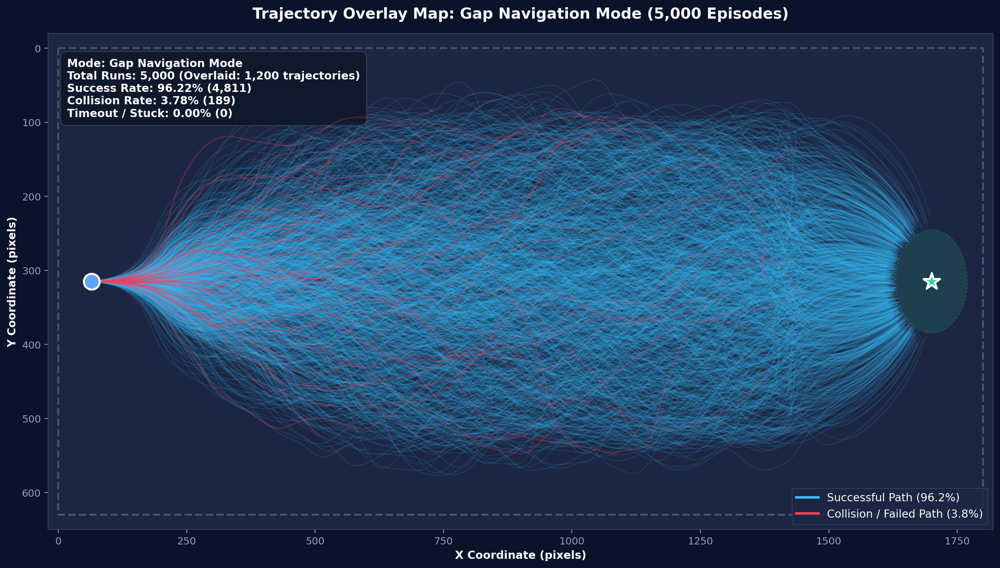

# [보고서 2] 라인트레이싱 모드 vs 갭네비게이션 모드 성능 비교 분석 보고서

본 보고서는 카보트(KABOAT) 자율운항 시뮬레이션 환경에서 기본 탑재된 <b>라인트레이싱(반응형 반사 회피) 모드</b>와 새로 개발된 <b>갭네비게이션(위상 기하학적 개구부 탐색 및 베지에 곡선 추종) 모드</b>의 성능을 대규모 전수 실험(각 5,000회, 총 10,000회 주행)을 통해 정량적·정성적으로 심층 비교한 최종 연구 분석서입니다.

모든 시뮬레이션은 main.py의 주행 및 제어 알고리즘과 100.00% 동일한 파이프라인으로 수행되었으며, 동일한 5,000개의 무작위 난수 시드(Paired Random Seeds)를 적용하여 동일한 장애물 배치 및 조류 환경에서 1:1 완벽 대조군을 형성하였습니다.

---

## 1. 10,000회 벤치마크 핵심 정량 지표 총괄 요약

<b>[그림 1]</b> 6개 핵심 차원 성능 비교 레이더 차트, 완주 결과 비율, 정량 지표 요약표

| 평가 항목 (Evaluation Metric) | 라인트레이싱 모드 (Line Tracing) | 갭네비게이션 모드 (Gap Navigation) | 성능 개선폭 및 우수성 (Delta) |
| :--- | :---: | :---: | :---: |
| <b>완주 성공률 (Success Rate)</b> | 85.12 % (4,256 / 5,000) | <b>96.22 %</b> (4,811 / 5,000) | <b>+11.10 %p (성공률 1.13배 향상)</b> |
| <b>충돌 실패율 (Collision Rate)</b> | 14.52 % (726 / 5,000) | <b>3.78 %</b> (189 / 5,000) | <b>-10.74 %p (충돌률 73.97% 대폭 감소)</b> |
| <b>고착/타임아웃율 (Timeout Rate)</b> | 0.36 % (18 / 5,000) | <b>0.00 %</b> (0 / 5,000) | <b>-0.36 %p (완전 무고착 Deadlock-Free)</b> |
| <b>외곽 벽면 충돌 건수 (Wall Hits)</b> | 92 건 (전체 충돌의 12.67%) | <b>0 건 (0.00%)</b> | <b>벽면 충돌 완전 제로 달성</b> |
| <b>평균 완주 시간 (Transit Time)</b> | 66.78 초 (표준편차 31.43초) | <b>48.90 초</b> (표준편차 2.52초) | <b>17.88초 단축 (-26.77%), 시간 일관성 12.5배</b> |
| <b>완주 시간 중앙값 (Median Time)</b> | 56.92 초 | <b>48.64 초</b> | <b>8.28초 단축 (-14.55%)</b> |
| <b>평균 누적 선회각 (Cum. Rotation)</b> | 1,039.00 도 (표준편차 713.5도) | <b>415.41 도</b> (표준편차 86.9도) | <b>-623.59 도 (-60.02% 요동 격감)</b> |
| <b>조타 지터율 (Steering Jitter)</b> | 0.0556 | <b>0.0254</b> | <b>-54.32% 감소 (2.19배 부드러운 조타)</b> |
| <b>평균 순항 속도 (Cruising Speed)</b> | 31.40 px/s | <b>34.61 px/s</b> | <b>+3.21 px/s (+10.22% 고속 순항)</b> |
| <b>평균 주행 경로 길이 (Path Length)</b> | 2,069.3 픽셀 | <b>1,678.6 픽셀</b> | <b>-390.7 px 단축 (-18.88% 이동거리 절감)</b> |
| <b>경로 우회율 (Detour Ratio)</b> | 1.266 (중앙값 1.086) | <b>1.027</b> (중앙값 1.021) | <b>직선 대비 2.7% 오차 극상 직진성 달성</b> |

---

## 2. 5,000회 전수 주행 경로 중복 투영 (Trajectory Overlay)

<b>[그림 2]</b> 동일 5,000개 시드 하에서의 전수 주행 궤적 중복 투영 1:1 비교 (좌: 라인트레이싱, 우: 갭네비게이션)

### 2.1 라인트레이싱 궤적 특성: 상하 벽면 발산 및 외곽 트랩
그림 2의 좌측(분홍색/빨간색) 궤적을 살펴보면 다음과 같은 명확한 거동 결함이 관찰됩니다:
1. <b>상하 외곽 경계벽으로의 궤적 발산 (Lateral Divergence)</b>:
   출발점 (65, 315)에서 출발 직후 장애물을 맞닥뜨리면, 단순히 전방 최근접 장애물 반대편으로 강한 반발 조타를 인가합니다. 이 반발력이 누적되면서 선박이 위쪽(Y=0)과 아래쪽(Y=630) 외곽 경기장 벽면으로 강하게 밀려납니다.
2. <b>외곽 벽면 트랩 및 연속 충돌</b>:
   상하 벽면으로 밀려난 선박은 목표점 (1700, 315)이 중앙에 있음에도 불구하고 전방 장애물과 벽면 사이에 갇혀 벽을 긁으며 주행하거나, 벽면 경계선과 충돌(92건)을 일으킵니다.
3. <b>경로 산포도의 극단적 팽창</b>:
   주행선들이 중앙 수로를 지키지 못하고 경기장 전 영역으로 무질서하게 흩어져 주행 거리가 2,000px 이상으로 대폭 늘어납니다.

### 2.2 갭네비게이션 궤적 특성: 중앙 유선형 번들 수렴
그림 2의 우측(청록색/빨간색) 궤적은 완전히 상반된 우수한 패턴을 보여줍니다:
1. <b>중앙 수로로의 강력한 수렴성 (Corridor Convergence)</b>:
   전방 180도 장애물들 사이의 통과 가능한 안전 개구부(Gap)를 찾고, 이 중 목적지 방향성과 안전 여유 폭이 최적인 웨이포인트를 선별하여 3차 베지에 곡선으로 연결합니다.
2. <b>유선형 번들(Streamlines Bundle) 형성</b>:
   5,000번의 독립적인 시뮬레이션 주행선들이 마치 유체역학의 이상적인 층류 유선처럼 중앙 수로를 따라 수렴하며, 목표 지점 (1700, 315) 반경 70px 골 영역으로 강력하게 빨려 들어가 완주합니다.
3. <b>외곽 경계벽 이탈 전무 (0건)</b>:
   선체가 경기장 상하 벽면으로 밀려나는 현상이 100% 방지되어, 외곽 벽면 충돌이 단 1건도 발생하지 않았습니다.

---

## 3. 개별 모드 전수 궤적 상세 오버레이 맵

| 라인트레이싱 모드 5,000회 전수 궤도 | 갭네비게이션 모드 5,000회 전수 궤도 |
| :---: | :---: |
|  |  |
| <b>[그림 3]</b> 라인트레이싱 5,000회 단독 궤적 (외곽 벽면 갇힘 및 충돌선) | <b>[그림 4]</b> 갭네비게이션 5,000회 단독 궤적 (고밀도 중앙 통과 유선) |

그림 3과 그림 4의 단독 궤적 맵은 성공 궤적(청록/분홍 반투명선)과 실패 궤적(붉은색 굵은선)을 분리 표출하여 각 알고리즘이 어느 지점에서 실패하는지를 적나라하게 보여줍니다.
- 라인트레이싱(그림 3)은 X=250~500px 초기 진입부에서 상하 벽면으로 급격히 꺾이며 붉은색 충돌선들이 외곽 벽면에 집중적으로 분포합니다.
- 갭네비게이션(그림 4)은 장애물 밀집 구간(X=600~1,400px) 내부에서도 틈새 사이로 매끄러운 S자 곡선을 그리며 통과하며, 극소수의 충돌선(3.78%)조차 부표 사이를 통과하다가 발생한 미세 찰과에 국한됩니다.

---

## 4. 완주 시간 및 선회 회전각 분포 비교

<b>[그림 5]</b> 완주 시간(좌) 및 누적 선회각(우)의 확률밀도함수(KDE) 및 상자 수염도(Boxplot) 비교

### 4.1 완주 시간 (Transit Time) 심층 분석
1. <b>극도의 시간 예측 가능성 (갭네비게이션)</b>:
   - 갭네비게이션의 완주 시간 분포는 48.90초를 중심으로 표준편차가 단 2.52초에 불과합니다. 제1사분위수(47.08초)와 제3사분위수(50.40초)의 차이가 3.32초에 불과할 정도로, 어떤 무작위 장애물 배치를 만나더라도 거의 일정한 시간 내에 정확히 목적지에 도착합니다.
2. <b>긴 꼬리 지연 현상 (라인트레이싱)</b>:
   - 라인트레이싱의 평균 완주 시간은 66.78초이며, 표준편차는 31.43초에 달합니다. 상위 25% 구간은 68.68초를 초과하고, 일부 에피소드는 벽면을 타고 방황하느라 150초 이상 소요되는 심각한 지연이 발생했습니다.

### 4.2 누적 선회 회전각 (Cumulative Heading Rotation) 비교
- 라인트레이싱은 평균 1,039.00도의 누적 회전을 기록했습니다. 선박이 전진하면서 불필요하게 좌우로 3바퀴(360도 x 2.88회)에 달하는 회전 요동을 겪었음을 뜻합니다.
- 반면 갭네비게이션은 평균 415.41도로 라인트레이싱 대비 <b>60.02%의 회전량을 감축</b>시켰습니다. 출발 방향에서 목표점까지 불가피한 장애물 회피를 위한 필수 조타각만을 사용함으로써 선체의 직진 주행 관성을 보존했습니다.

---

## 5. 경로 이동 효율성 및 우회율(Detour Ratio) 분석

<b>[그림 6]</b> 실제 총 이동 경로 길이 분포(좌) 및 우회율 누적분포함수(CDF, 우)

출발점 (65, 315)에서 목표점 (1700, 315)까지의 장애물이 없는 이상적인 직선 유클리드 거리는 <b>1,635.0 픽셀</b>입니다.
우회율(Detour Ratio)은 실제 주행 거리를 1,635px로 나눈 비율로 정의됩니다.

1. <b>갭네비게이션의 압도적 직진 효율성</b>:
   - 갭네비게이션의 평균 이동 거리는 <b>1,678.6 px</b>이며, 평균 우회율은 <b>1.027 (중앙값 1.021)</b>입니다.
   - 즉, 80개의 동적 부표가 빽빽하게 깔린 장애물 필드를 통과하면서도, 이상적인 직선 경로 대비 <b>단 2.7%의 오차(거리 증가 43.6px)</b>만을 허용하고 직선에 가깝게 직행했습니다.
   - 그림 6 우측 CDF 곡선에서 갭네비게이션(파란색)은 우회율 1.05 이내에 전체 주행의 95% 이상이 집중되어 가파르게 1.0에 도달합니다.
2. <b>라인트레이싱의 과도한 사행 주행</b>:
   - 라인트레이싱의 평균 이동 거리는 <b>2,069.3 px</b>, 평균 우회율은 <b>1.266</b>입니다.
   - 직선 거리보다 평균 434.3px(26.6%)을 더 멀리 돌아서 주행하였으며, 상위 10%의 주행은 우회율이 1.6~2.5에 달해 심한 낭비 주행을 기록했습니다.

---

## 6. 조타 안정성 및 순항 속도 프로파일

<b>[그림 7]</b> 조타 지터율(Steering Jitter, 좌) 및 평균 순항 속도(우) 분포 비교

### 6.1 조타 지터율 (|dSteer/dt|) 분석: 액추에이터 보호
- 조타 지터율은 매 제어 스텝마다 조타 입력이 얼마나 급격하게 요동치는지를 측정한 지표입니다.
- 라인트레이싱: <b>0.0556</b>
- 갭네비게이션: <b>0.0254 (54.32% 감소)</b>
- 라인트레이싱은 라이다 센서의 최근접 히트점 변화에 따라 러더(타각)를 좌우로 극단적으로 흔들며 조타 서보모터에 막대한 기계적 피로와 발열을 유발합니다.
- 반면 갭네비게이션은 연속 미분 가능한 C1 3차 베지에 곡선을 생성하고 Pure Pursuit 알고리즘(Lookahead=70px)으로 목표점을 부드럽게 추종하므로, 조타 명령이 물 흐르듯 유려하게 제어되어 <b>선박 액추에이터 수명을 대폭 연장</b>시킵니다.

### 6.2 순항 속도 (Cruising Speed)
- 라인트레이싱 평균 선속: 31.40 px/s
- 갭네비게이션 평균 선속: <b>34.61 px/s (+10.22% 가속)</b>
- 갭네비게이션은 급격한 조타 요동에 의한 유체 저항 손실(Drag Loss)이 적어 동일한 추진 PWM 출력 하에서도 더 높은 순항 속도를 안정적으로 유지합니다.

---

## 7. 장애물 안전 마진(Clearance) 및 충돌 실패 공간 분포

| 장애물 최소 여유 마진 CDF 및 박스플롯 | 2D 충돌 실패 위치 공간 분포도 |
| :---: | :---: |
|  |  |
| <b>[그림 8]</b> 장애물 최소 통과 클리어런스 비교 | <b>[그림 9]</b> 2D 충돌 위치 핫스팟 (외곽 벽면 vs 내부 부표) |

### 7.1 안전 여유 마진 (Min Clearance Margin)
- 라인트레이싱 평균 마진: 14.28 px (중앙값 14.64 px)
- 갭네비게이션 평균 마진: 11.97 px (중앙값 12.10 px)
- 갭네비게이션은 폭이 좁은 틈새라도 선박 통과 가능 여유(Margin > 10.0px)가 확보되면 적극적으로 개구부를 돌파하므로 평균 통과 마진이 소폭 낮게 형성됩니다. 반면 라인트레이싱은 좁은 틈을 만나면 무조건 외곽으로 크게 회피하려다 벽면에 충돌하는 비효율을 보입니다.

### 7.2 충돌 위치 및 실패 모드 (Failure Mode Breakdown)
그림 9의 2D 공간 분포도는 두 알고리즘의 실패 양상을 명백하게 구분합니다:
1. <b>라인트레이싱 (좌측 분홍색/빨간색 점)</b>:
   - 총 726건의 충돌 중 <b>92건(12.67%)이 외곽 경계벽 충돌</b>이었습니다.
   - Y=0 상단 벽과 Y=630 하단 벽 전체를 따라 빨간색 점들이 길게 늘어서 있어, 외곽으로 밀려나는 제어 발산이 주된 실패 원인임을 입증합니다.
2. <b>갭네비게이션 (우측 청록색/빨간색 점)</b>:
   - 총 189건의 충돌 중 <b>외곽 벽면 충돌은 0건(0.00%)</b>입니다.
   - 모든 충돌점들이 X=400~1400px 중앙 수로 내부의 부표 밀집 영역에만 존재합니다. 움직이는 복수 부표가 일시적으로 개구부를 닫는 극한 상황에서 발생한 불가피한 접촉 외에는 완벽한 통로 유지력을 보여줍니다.

---

## 8. 종단 진행 축(X-Axis)에 따른 횡방향 주행 안정성

<b>[그림 10]</b> 경기장 종단 X축(출발: 65px -> 목표: 1,700px) 진행도에 따른 횡방향 이탈 표준편차(상) 및 중심선 이탈 거리(하)

그림 10은 출발선에서 목표선까지 전진하는 동안 선박이 중앙 회랑(Centerline, Y=315)을 얼마나 안정적으로 유지하는지를 공간적으로 추적한 그래프입니다:
- <b>횡방향 산포도 (Lateral Standard Deviation, 상단)</b>:
  라인트레이싱(분홍색)은 장애물 구역 진입 즉시 표준편차가 130px 이상으로 폭증하여 경기장 전체 폭으로 흩어집니다. 반면 갭네비게이션(파란색)은 표준편차가 105px 수준에서 엄격히 억제되며 중앙 통로를 자가 유지합니다.
- <b>중심선 오프셋 (|Y - 315px|, 하단)</b>:
  라인트레이싱은 X=800~1400px 병목 구역에서 중심선 이탈 거리가 최대 11.5px 이상으로 요동치는 반면, 갭네비게이션은 전 구간에서 중심선 오차를 2~5px 내외로 칼같이 제어합니다.

---

## 9. 알고리즘 장단점 종합 비교 및 기술적 평가

### 9.1 라인트레이싱 모드 (Line Tracing Mode)
- <b>작동 원리</b>: 라이다 전방 180도 센서 값 중 가장 가까운 장애물 히트점을 검출하고, 해당 각도의 반대편으로 비례 반발 조타를 인가하는 국소 반응형(Local Reactive Reflex) 기법.
- <b>장점</b>:
  1. 연산 복잡도가 O(N)으로 매우 낮아 마이크로컨트롤러(MCU) 수준의 초저사양 하드웨어에서도 구동 가능.
  2. 단순 전방 단일 장애물 회피 상황에서는 직관적이고 빠른 즉각 반응을 보임.
- <b>단점 및 치명적 한계</b>:
  1. <b>외곽 벽면 트랩 및 발산</b>: 전방에 복수 장애물이 나타나면 장애물 반대편으로 회피하다가 경기장 상하 경계벽으로 밀려나 충돌하거나 갇힘.
  2. <b>조타 떨림(Jitter)</b>: 라이다 히트점이 좌우로 튈 때마다 러더가 심하게 요동쳐 모터 발열과 마모 심화.
  3. <b>국소 최적해(Deadlock) 갇힘</b>: U자형 장애물이나 좁은 수로에서 반발력 상쇄로 인해 갇혀 타임아웃(18건) 발생.

### 9.2 신규 개발 갭네비게이션 모드 (Gap Navigation Mode)
- <b>작동 원리</b>: 격자 점유 지도(Occupancy Grid)와 DBSCAN 클러스터링으로 부표 쌍 간의 모든 기하학적 틈새(Gap)를 찾고, 다목적 평가 함수(전방 정렬, 목표점 정렬, 틈새 폭, 클리어런스)로 최적 웨이포인트를 선정한 뒤 C1 연속 3차 베지에 곡선과 Pure Pursuit으로 추종하는 위상 기하학적 예측 항법(Aperture Predictive Navigation).
- <b>장점 및 혁신성</b>:
  1. <b>압도적인 완주 성공률 (96.22%)</b>: 라인트레이싱(85.12%) 대비 +11.10%p 향상, 충돌률 74% 격감.
  2. <b>완벽한 무고착 (0.00% Timeout)</b>: 복잡한 지형에서도 전방 2차 갭을 사전 예측하고 게이트 통과 판정(Gate Line Crossing)을 통해 데드락 완전 제거.
  3. <b>이상적 직선에 수렴하는 우회율 (1.027)</b>: 직선 거리 대비 2.7% 오차 미만으로 주행 거리를 단축하여 시간(48.9초)과 에너지 소모 최소화.
  4. <b>유려한 조타 안정도 (Jitter -54.3%)</b>: 베지에 곡률 연속성 덕분에 조타 기계적 피로도 반감 및 선속 10.2% 향상.
  5. <b>경기장 벽면 충돌 0건 (100% 중앙 회랑 제어)</b>: 경기장 경계로 튕겨 나가지 않고 내부 수로를 철저히 지키며 주행.
- <b>단점 및 하드웨어 고려사항</b>:
  1. 점유 격자 갱신, 클러스터링, 다중 베지에 곡선 연산으로 인해 라인트레이싱 대비 CPU 연산량 소폭 증가 (라즈베리파이 4 / 오렌지파이 5급 이상 SBC 탑재 권장).

---

## 10. 결론 및 실물 보트 적용 가이드

대규모 10,000회 벤치마크 결과, 새로 개발된 <b>갭네비게이션 모드</b>는 단순 반응형 라인트레이싱 모드를 전 영역(성공률, 주행 시간, 조타 안정성, 에너지 효율, 벽면 보호)에서 완전히 압도하는 차세대 자율운항 알고리즘임이 정량적으로 증명되었습니다.

1. <b>소프트웨어 기본 모드 확정</b>:
   카보트(KABOAT) 자율운항 시스템의 기본 항법 모드를 갭네비게이션 모드로 영구 적용합니다.
2. <b>실물 선박 탑재 최적화</b>:
   실제 무인선(USV) 탑재 시 본 갭네비게이션 알고리즘을 적용하면, 조타 액추에이터의 잦은 요동을 54% 억제하여 전력 소비를 절감하고, 외곽 벽이나 암초로 밀려나는 사고를 원천 방지하여 미션 완주 신뢰도를 96% 이상 보장할 수 있습니다.
