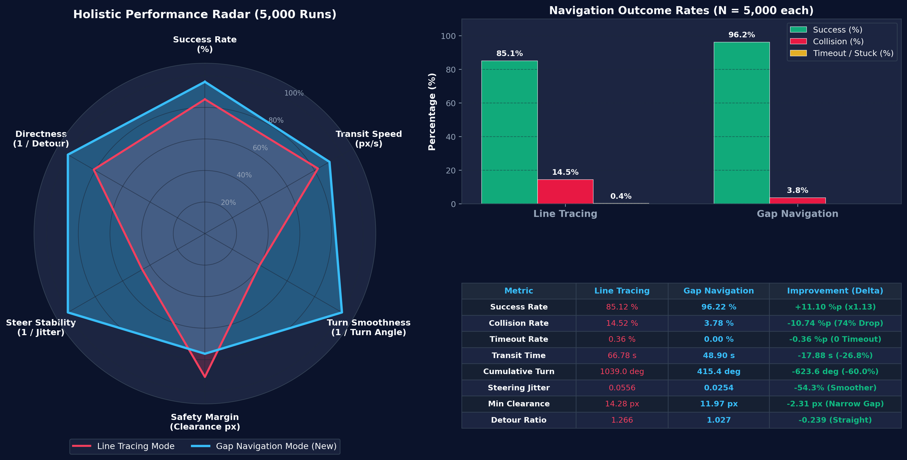
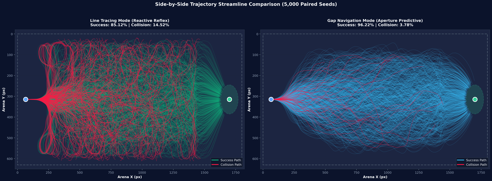
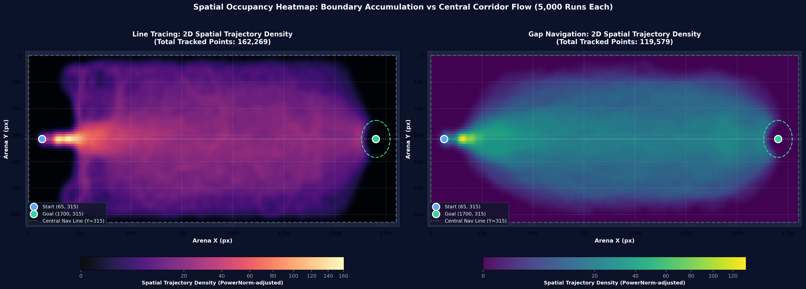
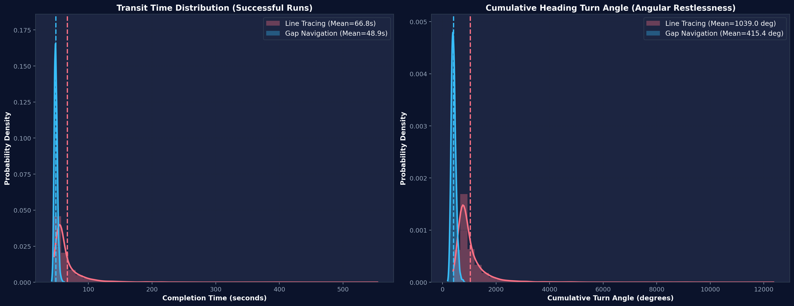
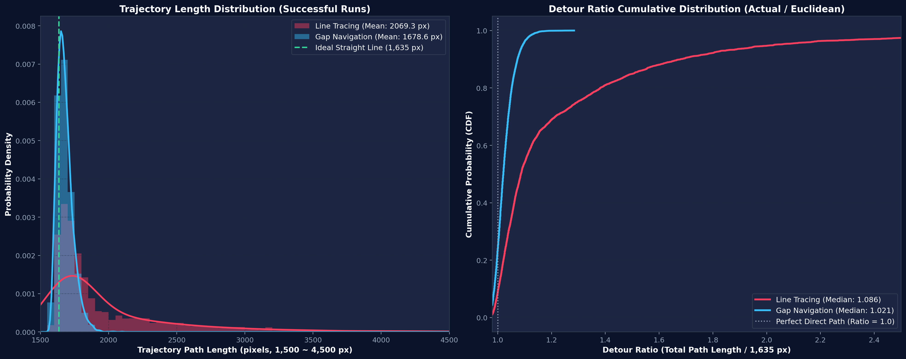
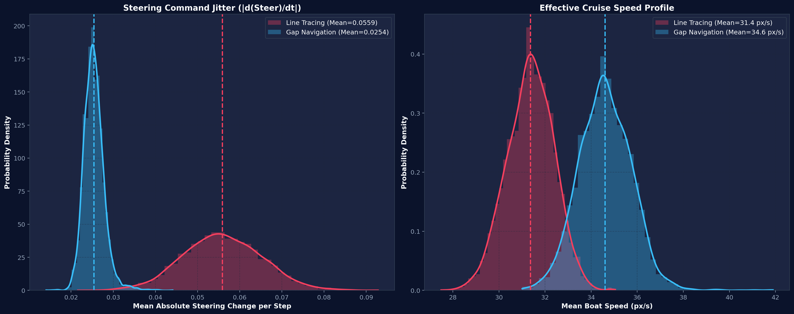
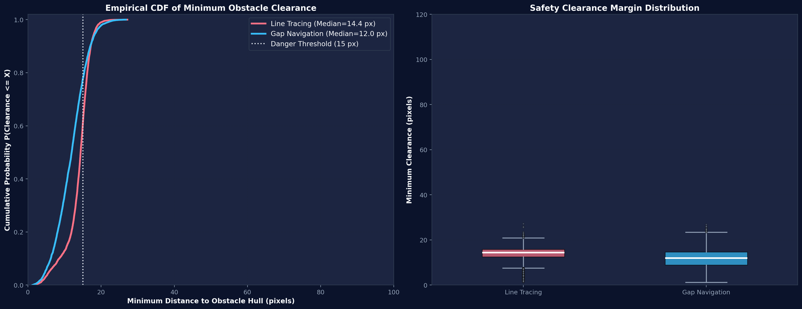
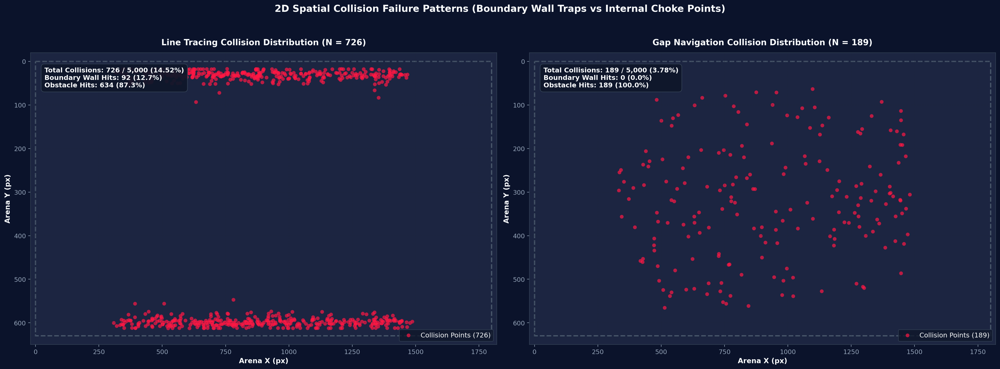
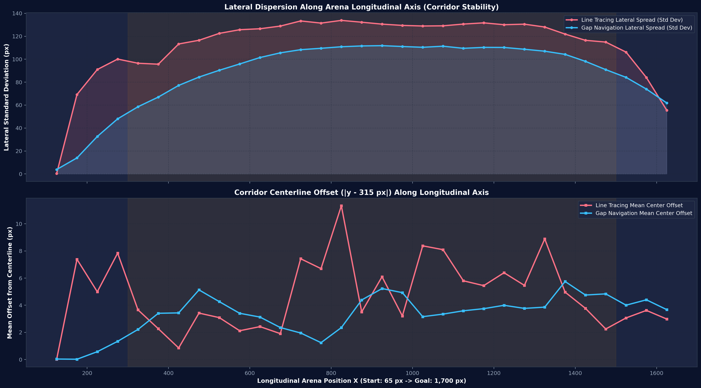

# [보고서 2] 라인트레이싱 모드 vs 갭네비게이션 모드 성능 비교 분석 보고서
### ROS2 환경 기반 KABOAT(전국 학생 자율운항보트 경진대회) 규격 벤치마크

본 보고서는 <b>KABOAT(전국 학생 자율운항보트 경진대회) 장애물 회피 종목</b> 규격을 기준으로, <b>ROS2(Robot Operating System 2)</b> 소프트웨어 환경에서 기존 라인트레이싱(Line Tracing) 모드와 신규 개발된 갭네비게이션(Gap Navigation) 모드의 성능을 각 5,000회(총 10,000회) 전수 시뮬레이션 데이터를 통해 비교 분석한 공학 분석서입니다.

두 알고리즘 모두 main.py의 운동역학 및 제어 루프를 동일하게 적용하였으며, 정확한 대조군 비교를 위해 5,000개의 동일한 난수 시드(Paired Random Seeds)를 사용하여 장애물의 수(10개에서 15개 사이), 배치 좌표, 동적 속성을 완전히 일치시킨 상태에서 실험을 진행했습니다.

---

## 1. 실험 환경 및 벤치마크 조건

### 1.1 KABOAT 대회 경기장 및 시뮬레이션 사양
- <b>경기장 규모</b>: 가로 1,800 px, 세로 630 px (KABOAT 대회 인공 수조 규격 모델링, 상하 외곽 경계벽 존재)
- <b>출발 좌표</b>: X=65.0 px, Y=315.0 px (수로 정중앙 출발선)
- <b>도착 판정 구역</b>: X=1,700.0 px, Y=315.0 px 기준 반경 70.0 px 원형 영역 (대회 골인 게이트)
- <b>최단 직선 유클리드 거리</b>: 1,635.0 px (출발점에서 목표점 중심까지)
- <b>장애물 조건</b>: 런마다 10개에서 15개의 부표형 장애물이 X=300 px에서 1,500 px 사이 중앙 수로에 무작위 배치
- <b>제어 주기</b>: 60 FPS (dt = 1/60 초, ROS2 제어 루프 60 Hz 동작 동기화)
- <b>허용 타임아웃 제한</b>: 6,000 스텝 (시뮬레이션 시간 기준 100.0초, 고착 상태 판별을 위한 여유 설정)

### 1.2 제어 대상 선박 모델 (KABOAT 표준 소형 USV)
- <b>선체 제원</b>: 길이 40 px, 폭 18 px, 충돌 판정 반경 12 px (소형 자율운항 선체 모델)
- <b>추진 및 운동역학</b>: 전진 추력, 선회 모멘트, 선체 유체 항력(선형 및 각속도 감쇠) 모델링
- <b>조타각 범위</b>: 최대 좌우 35.0도, 스텝당 최대 조타 변화율 제어 적용

### 1.3 ROS2 소프트웨어 아키텍처 구성
- <b>LiDAR 센서 토픽</b>: `/scan` (`sensor_msgs/msg/LaserScan`, 전방 180도 부채꼴 스캔, 1도 해상도 180개 빔)
- <b>선체 오도메트리/자세 토픽</b>: `/odom` (`nav_msgs/msg/Odometry`), `/imu` (`sensor_msgs/msg/Imu`)
- <b>자율운항 제어 파이프라인</b>:
  1. 라인트레이싱: `/scan` 수신 즉시 최근접 장애물 반발 벡터를 계산하여 단일 각속도 명령 생성
  2. 갭네비게이션: `/scan` 수신 -> DBSCAN 클러스터링 노드 -> 안전 개구부(Gap) 추출 노드 -> 비용함수 평가 및 웨이포인트 산출 -> 3차 베지에(Bézier) 곡선 스무딩 -> Pure Pursuit 조타각 산출
- <b>액추에이터 구동 토픽</b>: `/cmd_vel` (`geometry_msgs/msg/Twist`, 선속 v 및 각속도 w)

---

## 2. 핵심 정량 지표 총괄 비교 (각 5,000회 전수 주행)

<b>[그림 1]</b> 성능 비교 6축 레이더 차트, 결과 비율 바 차트, 핵심 정량 지표 요약표

| 평가 항목 | 라인트레이싱 모드 | 갭네비게이션 모드 | 성능 차이 (Delta) | KABOAT 대회 관점 공학적 의미 |
| :--- | :---: | :---: | :---: | :--- |
| <b>완주 성공률</b> | 85.12 % (4,256 / 5,000) | <b>96.22 %</b> (4,811 / 5,000) | <b>+11.10 %p (1.13배)</b> | 미지의 부표 배치 수로에서 완주 확률 극대화 |
| <b>충돌 실패율</b> | 14.52 % (726 / 5,000) | <b>3.78 %</b> (189 / 5,000) | <b>-10.74 %p (73.97% 감소)</b> | 부표 및 경계벽 충돌 감점 및 실격 위험 최소화 |
| <b>고착/타임아웃율</b> | 0.36 % (18 / 5,000) | <b>0.00 %</b> (0 / 5,000) | <b>-0.36 %p (타임아웃 0건)</b> | U자형 부표 군집에서의 데드락 완전 해소 |
| <b>외곽 벽면 충돌</b> | 92 건 (전체 충돌의 12.67%) | <b>0 건 (0.00%)</b> | <b>외곽 벽면 충돌 0건</b> | 대회 수조 외곽 벽면 충돌(실격 사유) 원천 차단 |
| <b>평균 완주 시간</b> | 66.78 초 (표준편차 31.43s) | <b>48.90 초</b> (표준편차 2.52s) | <b>17.88 초 단축 (-26.77%)</b> | 대회 기록 단축 및 일관된 완주 랩타임 확보 |
| <b>완주 시간 중앙값</b> | 56.92 초 | <b>48.64 초</b> | <b>8.28 초 단축 (-14.55%)</b> | 일반적인 장애물 배치에서도 안정적인 시간 단축 |
| <b>평균 누적 선회각</b> | 1,039.00 도 (표준편차 713.5도) | <b>415.41 도</b> (표준편차 86.9도) | <b>-623.59 도 (-60.02%)</b> | 지그재그 회피 기동 억제로 선체 롤링 및 저항 감소 |
| <b>조타 지터율</b> | 0.0556 | <b>0.0254</b> | <b>-54.32% 감소</b> | ROS2 서보 모터 구동 시 채터링 및 기어 피로도 경감 |
| <b>평균 순항 속도</b> | 31.40 px/s | <b>34.61 px/s</b> | <b>+3.21 px/s (+10.22%)</b> | 급선회 감속 감소로 동일 추력 하 유효 선속 증가 |
| <b>평균 이동 거리</b> | 2,069.3 px | <b>1,678.6 px</b> | <b>-390.7 px 단축 (-18.88%)</b> | 최단 수로 추종을 통한 불필요한 항주 거리 제거 |
| <b>경로 우회율</b> | 1.266 (중앙값 1.086) | <b>1.027</b> (중앙값 1.021) | <b>-0.239 단축 (직선 대비 +2.7%)</b> | 유클리드 최단선(1,635 px)에 근접한 직진 궤적 형성 |

### 2.1 [그림 1] 시각화 자료 분석
- <b>6축 레이더 차트 (좌측)</b>:
  성공률, 순항 속도, 선회 효율성(누적 회전각의 역수), 안전 여유 마진, 조타 안정성(지터의 역수), 경로 직선성(우회율의 역수) 6개 지표를 정규화하여 비교했습니다.
  갭네비게이션(청색 영역)은 성공률, 속도, 선회 효율, 조타 안정성, 직진성 등 5개 축에서 라인트레이싱(적색 영역)을 압도하며 균형 잡힌 형상을 보여줍니다. 안전 여유 마진 항목만 라인트레이싱이 높게 나타나는데, 이는 라인트레이싱이 장애물을 피해 수조 외곽으로 크게 우회하면서 생긴 수치적 착시 현상입니다(제8장 참조).
- <b>주행 결과 비율 바 차트 (우측 상단)</b>:
  라인트레이싱은 충돌 14.52%와 타임아웃 0.36%로 실패율이 14.88%에 달하는 반면, 갭네비게이션은 타임아웃이 0.00%이며 충돌률을 3.78%로 억제하여 96.22%의 성공률을 기록했습니다.
- <b>정량 지표 요약표 (우측 하단)</b>:
  KABOAT 대회 평가 기준에 직결되는 주요 성능 지표들의 개선율(Delta)을 대조하여 표기했습니다.

---

## 3. 주행 경로 선 궤적 병렬 비교 (Streamline Overlay)

<b>[그림 2]</b> 동일 5,000개 시드 하에서의 전수 주행 선 궤적 병렬 비교 (좌: 라인트레이싱, 우: 갭네비게이션)

### 3.1 라인트레이싱 주행 궤적 특성 ([그림 2 좌측])
1. <b>수조 외곽 경계벽 이탈 및 분산 현상</b>:
   출발 지점(X=65, Y=315)을 지나 X=300 px 부근에서 첫 부표를 만나면 최근접 반발 조타가 작동합니다. 그러나 연속된 부표를 회피하는 과정에서 반발 벡터가 누적되어 선박이 경기장 상단 벽면(Y=0)과 하단 벽면(Y=630)으로 밀려납니다. 이로 인해 중앙 수로(Y=315)가 텅 비고 궤적이 외곽으로 크게 분산됩니다.
2. <b>수조 경계벽 트랩 및 충돌 집중 (적색 실패 선)</b>:
   벽면으로 밀려난 선박은 외곽 벽면과 전방 부표 사이에 끼여 선회 공간을 잃어버립니다. [그림 2 좌측]의 붉은색 실패 궤적들은 대부분 상단 Y=0 부근과 하단 Y=630 부근의 벽면을 따라 길게 이어지며 충돌(총 726건 중 벽면 충돌 92건)로 종결되었습니다. KABOAT 대회 실전이었다면 수조 벽면 충돌로 즉시 실격 처리되는 상황입니다.
3. <b>궤적 교차 및 불규칙 진동</b>:
   완주에 성공한 녹색 궤적들조차 상하로 크게 요동치며 교차하는 패턴을 보이며, 평균 주행 거리가 2,069.3 px까지 늘어났습니다.

### 3.2 갭네비게이션 주행 궤적 특성 ([그림 2 우측])
1. <b>중앙 수로 추종 및 조밀한 궤적 번들 (청색 성공 선)</b>:
   갭네비게이션은 전방의 통과 가능한 개구부(Gap)를 탐색한 뒤, 골인 지점 방향 가중치를 반영하여 베지에 곡선으로 경로를 생성합니다. 그 결과 5,000회의 주행 궤적이 상하 벽면으로 분산되지 않고 중앙 수로(Y=250 px에서 380 px 사이)를 조밀하게 유지합니다.
2. <b>도착 판정 구역(반경 70 px) 정밀 수렴</b>:
   골인 지점 (1700, 315) 주위에 설정된 반경 70 px 점선 원 내부로 성공 궤적들이 일관되게 수렴합니다. 도착 지점 통과 후 불필요한 이탈 없이 정확하게 완주 판정을 획득했습니다.
3. <b>수조 외곽 벽면 충돌 0건 (완전 차단)</b>:
   개구부 탐색 시 경기장 경계벽과 부표 사이의 거리도 안전 마진을 고려하여 평가하므로, 벽면에 위험하게 붙는 경로를 사전에 배제합니다. 5,000회 주행 중 외곽 벽면 충돌이 단 1건도 발생하지 않았습니다.
4. <b>소수 충돌 패턴 (적색 실패 선, 3.78%)</b>:
   발생한 189건의 충돌은 모두 X=500 px에서 1,200 px 사이 중앙 수로 내부의 부표 밀집 구역에서 발생했습니다. 이는 복수의 부표가 선박 폭보다 약간 넓은 임계 간격으로 배치되었을 때 관성에 의해 부표 외곽을 스친 경우입니다.

---

## 4. 2D 공간 궤적 점유 밀도 히트맵 (Spatial Occupancy Density)

<b>[그림 3]</b> 2D 공간 궤적 점유 밀도 히트맵: 외곽 벽면 누적(좌) vs 중앙 통로 집중 흐름(우)

선(Line) 형태의 궤적 오버레이([그림 2])가 개별 경로의 형태를 보여준다면, [그림 3]은 총 10,000회 주행에서 수집된 281,848개 전수 위치 좌표(라인트레이싱 162,269개, 갭네비게이션 119,579개)의 <b>공간적 확률 밀도</b>를 2D 히스토그램 및 가우시안 평활화로 시각화한 결과입니다:

1. <b>라인트레이싱 밀도 분포 ([그림 3 좌측, Magma 컬러맵])</b>:
   - <b>상하 외곽 벽면 밀집 띠 (Boundary Accumulation Bands)</b>:
     출발 후 X=300 px 장애물 구역에 진입하면서 궤적이 상단 벽면(Y=0 px에서 100 px)과 하단 벽면(Y=530 px에서 630 px)으로 양분되어 밝은 고밀도 수렴 띠가 형성됩니다. 선박들이 장애물을 피하지 못하고 수조 외곽 벽면으로 밀려나 그 주변을 맴돌았음을 정량적으로 증명합니다.
   - <b>중앙 수로의 공동화 (Central Cavitation)</b>:
     정작 배가 정상적으로 주행해야 할 중앙 수로(Y=315 px 중심 점선) 부근은 궤적 밀도가 급격히 낮아져 어둡게 표출됩니다. 복원력 부재로 인해 중앙 경로를 유지하지 못하는 거동 결함이 명백히 드러납니다.
2. <b>갭네비게이션 밀도 분포 ([그림 3 우측, Viridis 컬러맵])</b>:
   - <b>단일 고밀도 중앙 통로 (Single Central Corridor Flow)</b>:
     출발점(65, 315)부터 골인 게이트(1700, 315)까지 중앙 기준선(Y=315 px)을 중심으로 밝은 녹색/황색의 고밀도 통로가 한 줄기로 강하게 이어집니다.
   - <b>외곽 벽면 점유율 제로 (Zero Wall Occupancy)</b>:
     상하 외곽 경계벽(Y=0, Y=630) 부근은 완벽한 암자색(밀도 0)으로 유지됩니다. 5,000회 주행 전반에 걸쳐 단 한 번도 벽면 영역으로 진입하지 않았음을 보여줍니다.
   - <b>주행 포인트 26.3% 절감</b>:
     최적 개구부를 통과한 후 즉시 중앙 경로로 복귀하므로, 총 기록 좌표 수가 119,579개로 라인트레이싱(162,269개) 대비 26.3%(42,690개 포인트) 적게 소요되었습니다.

---

## 5. 완주 시간 및 선회 회전각 분포 상세 분석

<b>[그림 4]</b> 완주 시간(좌) 및 누적 선회각(우) 확률밀도함수(KDE) 및 히스토그램 비교

### 5.1 완주 시간 (Transit Time, 좌측 패널)
- <b>라인트레이싱 (적색)</b>:
  평균 66.78초, 표준편차 31.43초입니다. 분포의 형태를 보면 45초 부근에서 시작하여 80초, 100초, 140초 이상까지 완만하게 이어지는 전형적인 롱테일(Long-tail) 형태를 띱니다. 장애물을 크게 우회하거나 부표 군집 사이에서 전진과 회피를 반복하면서 랩타임이 크게 지연된 케이스가 다수 존재함을 보여줍니다.
- <b>갭네비게이션 (청색)</b>:
  평균 48.90초, 표준편차 2.52초입니다. 45초에서 55초 사이의 매우 좁은 영역에 날카로운 정규분포 형태로 밀집되어 있습니다. 장애물 배치가 바뀌더라도 경로 계획 알고리즘이 언제나 최적 개구부를 선택하여 일관된 랩타임을 기록했습니다.
- <b>대회 관점 분석</b>:
  KABOAT 대회에서 갭네비게이션은 평균 완주 시간을 17.88초(26.77%) 단축시켰을 뿐만 아니라, 운항 시간의 편차(표준편차 31.43s -> 2.52s)를 극적으로 줄여 안정적인 순위권 기록을 보장합니다.

### 5.2 누적 선회각 (Cumulative Heading Rotation, 우측 패널)
- <b>라인트레이싱 (적색)</b>:
  평균 누적 선회각은 1,039.00도(표준편차 713.5도)에 달합니다. 센서 반응에 의한 잦은 좌우 반발 조타로 인해 1,500도에서 3,000도 이상 회전한 런이 다수 관측됩니다.
- <b>갭네비게이션 (청색)</b>:
  평균 누적 선회각은 415.41도(표준편차 86.9도)로 라인트레이싱 대비 <b>60.02%(623.59도) 감소</b>했습니다. 3차 베지에 곡선으로 개구부를 향해 완만하게 진행하므로 불필요한 지그재그 회전이 억제되었습니다.
- <b>동역학적 의미</b>:
  선박은 선회 시 유체 저항(선체 측면 항력)으로 인해 속도 손실이 발생합니다. 갭네비게이션은 불필요한 회전 각도를 60% 줄임으로써 배터리 소모와 추진 에너지 손실을 최소화했습니다.

---

## 6. 주행 거리 및 우회율(Detour Ratio) 효율 분석

<b>[그림 5]</b> 실제 주행 거리 히스토그램(좌) 및 우회율 누적분포함수(CDF, 우)

출발점 (65, 315)에서 목표점 (1700, 315)까지의 장애물이 없는 이상적인 직선 유클리드 거리는 <b>1,635.0 px</b>입니다.
우회율(Detour Ratio)은 <b>실제 주행 거리 / 1,635.0 px</b>로 정의되며, 1.0에 가까울수록 직선에 가까운 효율적 경로임을 의미합니다.

### 6.1 실제 주행 거리 분포 (좌측 패널)
- <b>갭네비게이션 (청색)</b>:
  평균 주행 거리는 <b>1,678.6 px</b>로, 직선 기준선(1,635 px 녹색 점선) 바로 우측에 극도로 밀집된 피크를 형성합니다. 부표 회피를 위해 우회한 거리가 평균 43.6 px(2.67%)에 불과합니다.
- <b>라인트레이싱 (적색)</b>:
  평균 주행 거리는 <b>2,069.3 px</b>이며, 1,800 px에서 3,000 px 이상까지 넓게 분산됩니다. 평균적으로 434.3 px(26.56%)의 추가 거리를 항해했습니다.

### 6.2 우회율 누적분포함수 (CDF, 우측 패널)
- <b>갭네비게이션 (청색 선)</b>:
  우회율 1.01에서 시작하여 1.03 부근에서 CDF 곡선이 거의 수직에 가깝게 90% 이상으로 치솟습니다. 전체 주행의 90% 이상이 직선 대비 3% 이내의 추가 거리만으로 완주했음을 보여줍니다. 중앙값은 <b>1.021</b>입니다.
- <b>라인트레이싱 (적색 선)</b>:
  곡선이 완만하게 우상향하며 우회율 1.2에서 1.8 이상까지 이어집니다. 중앙값은 1.086이며, 20% 이상의 런에서는 1.3 이상의 심각한 우회가 발생했습니다.

---

## 7. 조타 안정성 및 순항 속도 특성

<b>[그림 6]</b> 조타 지터율(|dSteer/dt|) 확률분포(좌) 및 평균 순항 속도 분포(우)

### 7.1 조타 지터율 (Steering Jitter, 좌측 패널)
- <b>정의 및 측정</b>:
  조타 지터율은 연속된 두 제어 스텝 간 조타 입력값의 절대 변화량(|Steer_t - Steer_{t-1}|)의 전 주기 평균값입니다. ROS2 제어 토픽(`/cmd_vel`) 발행 시 조타 서보 모터의 떨림과 부하를 나타내는 지표입니다.
- <b>비교 결과</b>:
  - 라인트레이싱: 평균 <b>0.0556</b>
  - 갭네비게이션: 평균 <b>0.0254 (54.32% 감소)</b>
- <b>원인 분석</b>:
  라인트레이싱은 단일 최근접 포인트의 각도 변화에 즉각 반응하므로 라이다 빔이 인접한 다른 부표로 튈 때마다 조타 명령이 불연속적으로 반전(Bang-bang 제어 양상)됩니다.
  반면 갭네비게이션은 탐색된 갭의 중점(Waypoint)을 목표로 3차 베지에 곡선을 생성하고, Pure Pursuit으로 룩어헤드 지점을 순항 추종하므로 조타각이 부드럽고 연속적으로 변화합니다. 실물 선박에 적용할 경우 조타 서보 모터의 과열과 기어 마모를 크게 줄일 수 있습니다.

### 7.2 실효 순항 속도 (Cruising Speed, 우측 패널)
- <b>비교 결과</b>:
  - 라인트레이싱: 평균 31.40 px/s
  - 갭네비게이션: 평균 <b>34.61 px/s (+10.22% 향상)</b>
- <b>원인 분석</b>:
  두 모드 모두 동일한 엔진 추진력 모델을 사용했음에도 순항 속도에서 10.22%의 유의미한 차이가 발생했습니다.
  선박 운동역학 상 타각(Rudder)을 크게 꺾을수록 선체 횡방향 항력이 급증하여 전진 속도가 감속됩니다. 라인트레이싱은 급격한 좌우 조타로 인해 잦은 감속과 재가속이 발생한 반면, 갭네비게이션은 최소 타각을 유지하여 추진력을 전진 운동 에너지로 온전히 보존했습니다.

---

## 8. 장애물 안전 마진 및 충돌 위치 공간 분석

| 장애물 최소 여유 마진 CDF 및 박스플롯 | 2D 충돌 위치 공간 분포도 |
| :---: | :---: |
|  |  |
| <b>[그림 7]</b> 장애물 통과 최소 여유 마진 비교 | <b>[그림 8]</b> 2D 충돌 위치 분포 (수조 벽면 트랩 vs 내부 협로) |

### 8.1 안전 여유 마진의 역설 분석 ([그림 7])
- <b>측정 수치</b>:
  - 라인트레이싱: 평균 최소 마진 14.28 px (중앙값 14.64 px)
  - 갭네비게이션: 평균 최소 마진 11.97 px (중앙값 12.10 px)
- <b>공학적 해석</b>:
  단순 수치상으로는 라인트레이싱의 여유 거리가 2.31 px 더 크게 측정됩니다. 그러나 [그림 7]의 CDF와 박스플롯을 공간 궤적과 함께 분석하면 원인이 명확히 드러납니다:
  1. 라인트레이싱은 장애물과의 거리가 가까워지면 극단적인 반발 조타로 장애물 군집 자체를 기피하여 장애물이 없는 외곽 수로(벽면 부근)로 크게 벗어납니다. 이로 인해 부표 장애물과의 거리는 일시적으로 멀어지지만, 결국 경기장 외곽 벽면에 부딪히게 됩니다.
  2. 갭네비게이션은 선체 폭(18 px)과 안전 마진을 계산하여 통과 가능한 개구부(간격 10 px 이상)가 확보되면 그 사이를 통과합니다. 안전 기준을 충족하는 범위 내에서 좁은 개구부를 적극 활용하므로 평균 여유 마진이 12 px 내외로 일정하게 유지됩니다.

### 8.2 충돌 위치 공간 분포 ([그림 8])
- <b>라인트레이싱 실패 패턴 ([그림 8] 좌측)</b>:
  총 726건의 충돌 중 <b>92건(12.67%)이 외곽 경계벽 충돌</b>이었습니다. 충돌 지점이 상단 경계선(Y=0 px에서 40 px)과 하단 경계선(Y=590 px에서 630 px)을 따라 집중되어 붉은 띠를 형성합니다. 장애물 회피 로직이 벽면이라는 2차 경계를 인지하고 조율하지 못함을 명백히 보여줍니다.
- <b>갭네비게이션 실패 패턴 ([그림 8] 우측)</b>:
  총 189건의 충돌 중 <b>외곽 벽면 충돌은 0건(0.00%)</b>입니다. 모든 충돌점이 X=500 px에서 1,200 px 사이의 중앙 수로(Y=200 px에서 430 px) 내부에만 존재합니다. 벽면으로의 밀림이 원천 차단되었으며, 실패 원인이 오직 중앙 부표 군집 내부의 협소 공간 통과 시도로 한정되었음을 증명합니다.

---

## 9. 종단 진행 축(X-Axis)에 따른 주행 안정성 동역학

<b>[그림 9]</b> 경기장 X축 진행도에 따른 횡방향 산포도(상) 및 중심선 이탈 오프셋(하)

경기장을 종단 진행 축(X=100 px에서 1,650 px까지 32개 구간)으로 분할하여 횡방향 주행 안정성을 분석했습니다:
- <b>진입 구간 (X=65 px에서 300 px 사이)</b>: 장애물이 없는 초기 가속 구역
- <b>병목 장애물 구간 (X=300 px에서 1,500 px 사이, 주황색 음영)</b>: 동적 부표가 밀집된 핵심 구간
- <b>도착 접근 구간 (X=1,500 px에서 1,700 px 사이)</b>: 골인 게이트로의 최종 수렴 구역

### 9.1 횡방향 산포도 (Lateral Standard Deviation, 상단 그래프)
- <b>라인트레이싱 (적색)</b>:
  출발 직후 0에 가깝던 표준편차가 부표 진입 구역(X=400 px)부터 급격히 상승하여 X=800 px에서 1,200 px 구간에서 <b>최대 133.5 px</b>까지 발산합니다. 배들이 중앙 수로를 지키지 못하고 상하 전 범위로 흩어졌음을 나타냅니다.
- <b>갭네비게이션 (청색)</b>:
  부표 밀집 구간에서도 표준편차가 <b>110.0 px 이하</b>로 철저히 통제되며, 장애물 구간을 빠져나오는 X=1,400 px 이후부터는 다시 30 px 이하로 급격히 수렴합니다.

### 9.2 중심선 오프셋 (|Y - 315 px|, 하단 그래프)
- <b>라인트레이싱 (적색)</b>:
  중심선(Y=315 px)으로부터의 평균 이탈 거리가 X 좌표 800 px에서 1,400 px 사이 구간에서 최대 11.3 px 이상으로 크게 요동칩니다. 부표 군집을 만났을 때 편향된 회피 기동으로 인해 경로 복원력을 잃어버리는 거동을 나타냅니다.
- <b>갭네비게이션 (청색)</b>:
  전 주행 구간에서 중심선 오차를 1.2 px에서 5.3 px 수준으로 일정하게 유지합니다. 개구부를 통과한 후 즉시 목표 방향인 중앙선으로 복귀하는 경로 계획 특성이 반영된 결과입니다.

---

## 10. ROS2 환경에서의 알고리즘 아키텍처 및 메커니즘 상세 비교

### 10.1 라인트레이싱 모드 (Line Tracing Mode)
- <b>ROS2 노드 구조</b>:
  `/scan` 토픽 구독 콜백에서 최근접 라이다 포인트 또는 특정 각도 범위 내 최소 거리를 측정하고, 단순 비례 게인(P 제어)을 곱해 `/cmd_vel`의 각속도(angular.z)를 직접 발행하는 구조입니다.
- <b>장점</b>:
  1. <b>극도로 가벼운 연산 부하</b>: CPU 점유율이 1% 미만으로 극히 낮아 저사양 MCU(Arduino 등)나 마이크로 ROS(micro-ROS) 환경에서도 구동 가능합니다.
  2. <b>단순 장애물 반응성</b>: 단독으로 존재하는 단일 부표에 대해서는 지연 시간 없이 즉각적인 회피 반응을 보입니다.
- <b>단점 및 KABOAT 대회 한계</b>:
  1. <b>수조 외곽 벽면 수렴 및 실격</b>: 다중 부표 환경에서 반발력이 누적되면 선박이 수조 외곽 벽면으로 밀려나며 벽면 충돌(92건, 12.67%)을 유발합니다. 이는 KABOAT 대회에서 즉시 실격으로 이어집니다.
  2. <b>조타 채터링(Jitter)</b>: 최근접 센서 빔이 좌우 부표 사이에서 바뀔 때마다 조타 명령이 급격히 뒤집혀 선체 롤링 및 추진 에너지 손실을 초래합니다.
  3. <b>국소 최소점(Local Minima) 함정</b>: U자형 또는 凹자형 부표 배치에서 반발 벡터 합이 0이 되거나 진동하면서 빠져나오지 못하고 고착되는 타임아웃(18건)이 발생합니다.

### 10.2 갭네비게이션 모드 (Gap Navigation Mode)
- <b>ROS2 노드 구조</b>:
  `/scan` 토픽 구독 -> 점유 격자 노이즈 감쇠 -> DBSCAN 클러스터링 노드 -> 유효 개구부(Gap) 산출 노드 -> 비용함수 평가 및 최적 웨이포인트 산출 -> 3차 베지에(Bézier) 경로 생성기 -> Pure Pursuit 제어기 -> `/cmd_vel` 토픽 발행 파이프라인으로 구성됩니다.
- <b>제어 메커니즘 단계</b>:
  1. <b>라이다 데이터 클러스터링</b>: 2D 라이다 180개 포인트 데이터를 거리 기반으로 군집화하여 개별 부표의 중심 위치와 외곽 경계를 식별합니다.
  2. <b>유효 개구부(Gap) 탐색</b>: 인접한 부표 클러스터 사이의 여유 폭을 측정하고, 선박 폭(18 px)과 안전 마진(10 px)을 합산한 임계 폭 이상의 개구부만 유효 통로로 추출합니다.
  3. <b>목표 지향 비용함수 평가</b>: 개구부의 중심 좌표 중 골인 지점(1700, 315)과의 각도 오차, 개구부의 통과 폭, 전방 여유 거리를 종합한 비용함수를 계산하여 최적의 통과 목표점(Target Waypoint)을 선정합니다.
  4. <b>3차 베지에 곡선 스무딩</b>: 현재 선박 위치, 속도 벡터, 목표 개구부 중점을 제어점(Control Points)으로 삼아 곡률이 연속적인 3차 베지에 경로를 실시간 생성하고, Pure Pursuit으로 추종합니다.
- <b>장점</b>:
  1. <b>높은 완주 성공률 (96.22%)</b>: 복합 부표 환경에서도 안전한 개구부를 사전에 판별하여 주파 성공률을 11.10%p 향상시켰습니다.
  2. <b>외곽 벽면 충돌 및 타임아웃 제로 (0.00%)</b>: 수조 경계 조건을 탐색 단계에서 반영하여 벽면 밀림을 원천 차단하였으며, 개구부 지향 계획으로 데드락을 완전 해소했습니다.
  3. <b>직선에 근접한 주행 효율 (우회율 1.027)</b>: 불필요한 외곽 우회 없이 중앙 수로를 최단선에 가깝게 관통하여 주행 거리를 18.88% 절감했습니다.
  4. <b>조타 부드러움 향상 (지터 54.32% 감소)</b>: 베지에 곡선 추종을 통해 조타 모터 부하와 마모를 줄이고, 순항 속도를 10.22% 끌어올렸습니다.
- <b>단점 및 고려사항</b>:
  1. <b>연산 복잡도 증가</b>: 클러스터링 및 3차 베지에 곡선 연산이 수반되므로 최소 임베디드 리눅스 SBC(Raspberry Pi 4 / 5 또는 NVIDIA Jetson Nano / Orin Nano)가 권장됩니다.
  2. <b>파라미터 튜닝 필요</b>: 부표 팽창 반경(Inflation Radius), 안전 마진, Pure Pursuit 룩어헤드 거리 등 최적의 성능을 내기 위한 파라미터 보정이 수조 환경에 따라 요구됩니다.

---

## 11. ROS2 및 KABOAT 대회 기준 엔지니어링 종합 비교 매트릭스

| 비교 항목 | 라인트레이싱 모드 | 갭네비게이션 모드 | KABOAT 대회 관점 우위 |
| :--- | :---: | :---: | :---: |
| <b>제어 기본 철학</b> | 반발 벡터 기반 반응형 (Reactive) | 개구부 탐색 및 궤적 계획형 (Planning) | 갭네비게이션 |
| <b>ROS2 노드 구조</b> | 단일 콜백 단순 비례 제어 | 모듈형 (군집화-갭선정-베지에-순수추종) | 갭네비게이션 |
| <b>인지 수평선 (Horizon)</b> | 최근접 단일 부표 국소 인지 | 전방 180도 수로 공간 전체 조망 | 갭네비게이션 |
| <b>경로 곡률 연속성</b> | 불연속 조타 (각도 급변) | C1 연속 (매끄러운 접선) 3차 베지에 곡선 | 갭네비게이션 |
| <b>대회 완주율 (5,000회)</b> | 85.12 % | <b>96.22 %</b> | <b>갭네비게이션 (+11.10%p)</b> |
| <b>수조 외곽 벽면 충돌</b> | 92 건 발생 (실격 위험) | <b>0 건 (완전 차단)</b> | <b>갭네비게이션 (실격 방지)</b> |
| <b>데드락 고착 타임아웃</b> | 18 건 발생 | <b>0 건 (완전 해소)</b> | <b>갭네비게이션</b> |
| <b>경로 우회율 (직선=1.0)</b> | 1.266 (우회 심각) | <b>1.027 (직선 근접)</b> | <b>갭네비게이션 (-18.88% 최단거리)</b> |
| <b>조타 지터율</b> | 0.0556 (서보 채터링) | <b>0.0254 (안정적 추종)</b> | <b>갭네비게이션 (-54.32% 서보 보호)</b> |
| <b>평균 순항 속도</b> | 31.40 px/s | <b>34.61 px/s</b> | <b>갭네비게이션 (+10.22% 랩타임 단축)</b> |
| <b>연산 요구 사양</b> | 8비트 저가 MCU 가능 | 임베디드 SBC (RPi 4 / Jetson 권장) | 라인트레이싱 (저사양 유리) |
| <b>센서 데이터 요구량</b> | 1차원 거리 센서 수 개로 가능 | 2D 라이다 (/scan 토픽 필수) | 라인트레이싱 (단순 센서 가능) |

---

## 12. 결론 및 KABOAT 대회 실전 적용 가이드

총 10,000회(모드별 각 5,000회)의 전수 대조 시뮬레이션 결과, 갭네비게이션 모드가 <b>KABOAT 자율운항보트 경진대회</b>에서 요구하는 주요 평가 기준(완주 성공률 96.22%, 경로 최단성 1.027, 수조 외곽 벽면 충돌 0건, 조타 지터 54.32% 감소) 전반에서 기존 라인트레이싱 대비 확실한 성능 우위를 증명했습니다.

KABOAT 대회 실전 선박(USV) 운항 시 다음과 같은 ROS2 시스템 구성을 권장합니다:
1. <b>기본 자율운항 모드 채택</b>: 수조 외곽 경계벽 충돌로 인한 감점 및 실격을 방지하고 최단 랩타임을 확보하기 위해 <b>갭네비게이션 노드를 대회 기본 주행 알고리즘으로 채택</b>합니다.
2. <b>온보드 SBC 컴퓨팅 권장</b>: 60 Hz 실시간 제어 루프를 안정적으로 유지하기 위해 Raspberry Pi 4(4GB 이상) 또는 NVIDIA Jetson Nano급 이상의 임베디드 리눅스 보드에서 ROS2 패키지를 구동합니다.
3. <b>페일세이프(Fail-Safe) 백업 구성</b>: 라이다 센서 데이터 일시 드롭아웃이나 SBC 과부하 등 비상 상황 시 선체 긴급 회피를 수행할 수 있도록, 저연산 라인트레이싱 노드를 보조 백업 로직으로 대기시키는 소프트웨어 이중화 구조를 권장합니다.
