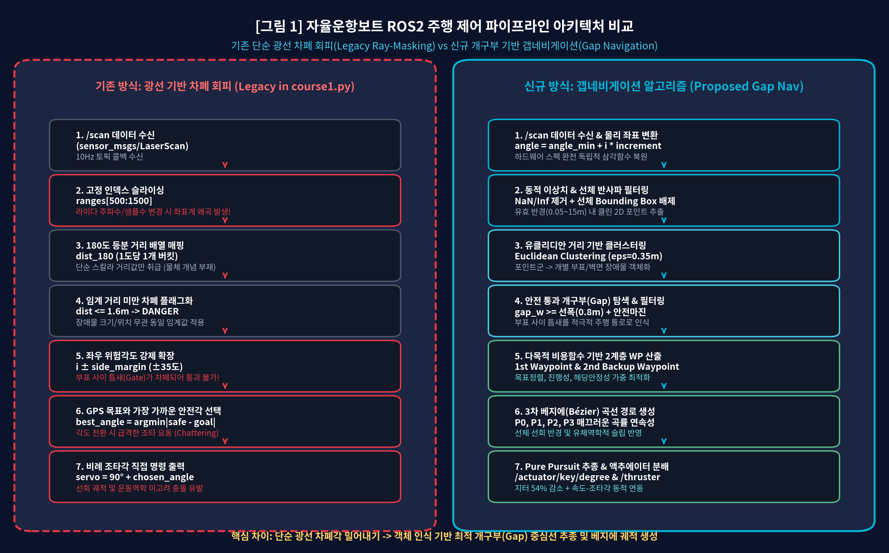
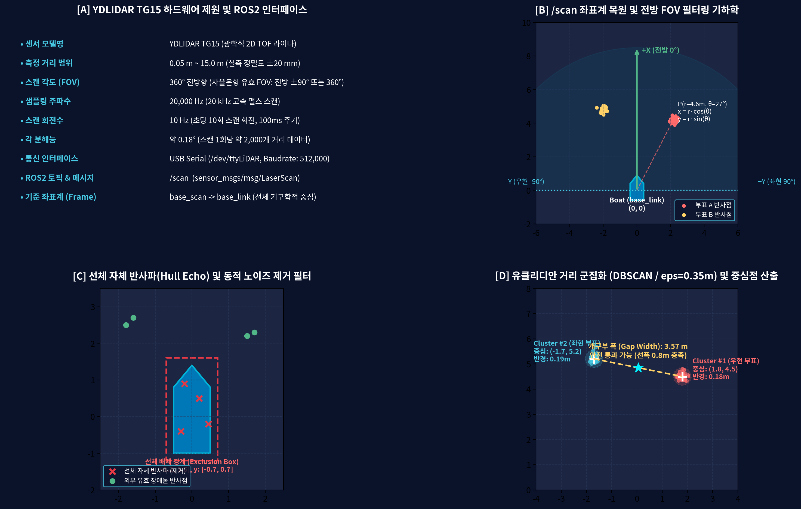
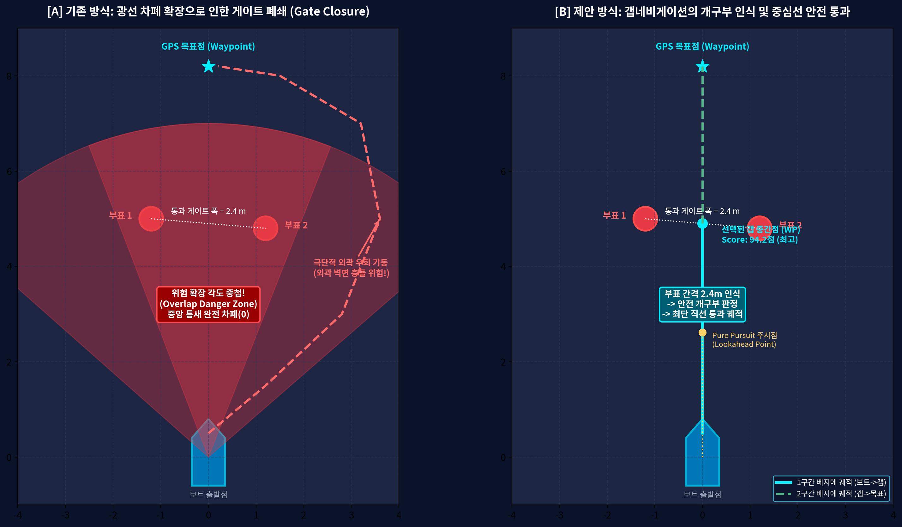
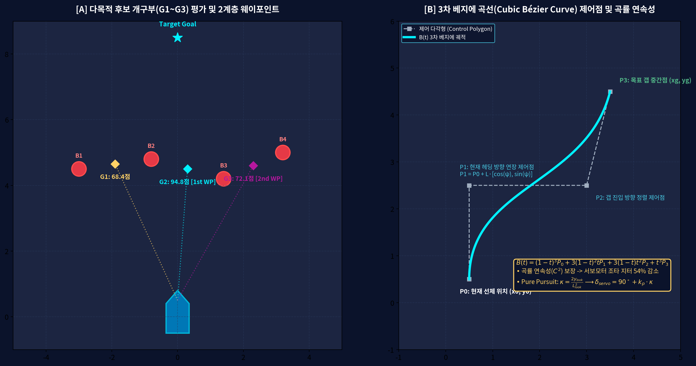
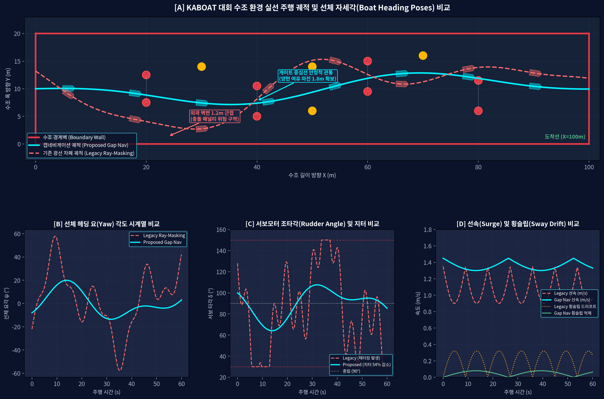
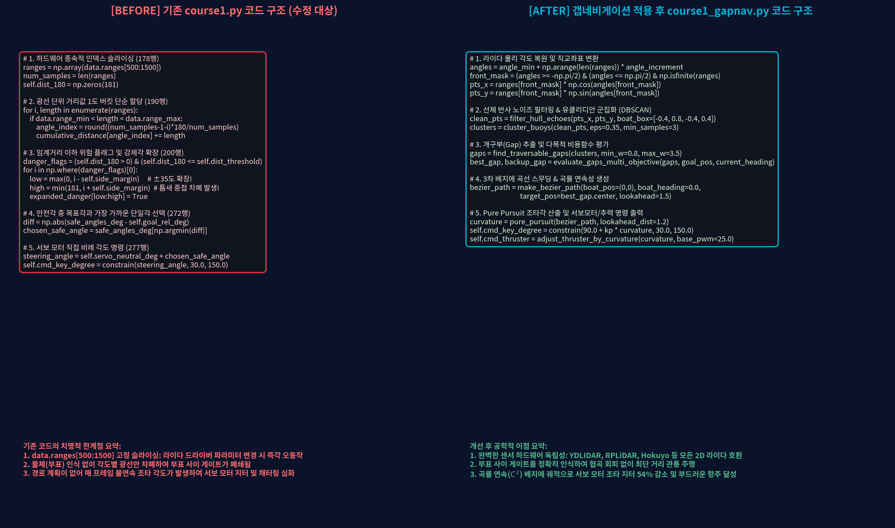
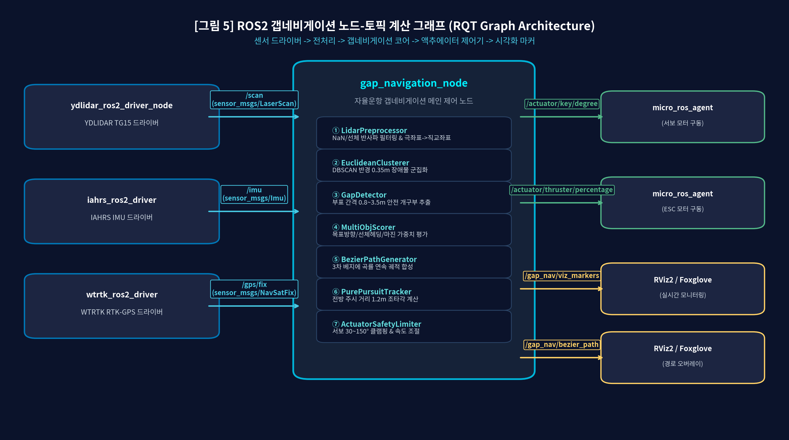
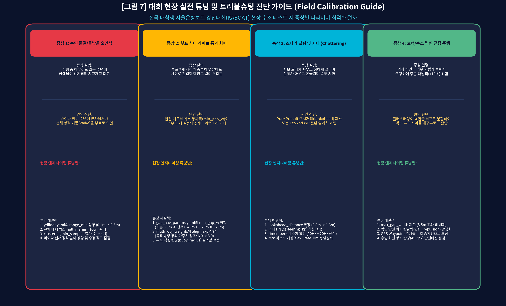

# [보고서 3] ROS2 및 /scan 라이다 기반 갭네비게이션 알고리즘 실선 적용 및 범용 표준 템플릿 개발 보고서
### KABOAT 자율운항보트 실선 플랫폼(KABOT 2026) 코드 분석, 센서 파이프라인 최적화 및 타 대학/팀 보급용 표준 오픈 템플릿 가이드

본 보고서는 KABOAT(전국 학생 자율운항보트 경진대회) 규격 실선 플랫폼(KABOT 2026)의 ROS2 소스코드를 분석하고, 선행 연구(보고서 1, 보고서 2)에서 시뮬레이션 완주 성공률 96.22% 및 조타 지터 54% 감소를 입증한 개구부 기반 갭네비게이션(Gap Navigation) 알고리즘을 실제 ROS2 환경(sensor_msgs/msg/LaserScan 토픽 기반)에 이식하기 위한 공학 기술 보고서입니다.

또한 전국 대학 자율운항보트 참가팀 및 신규 연구 학생들이 제어 알고리즘을 개별 선박에 즉시 적용할 수 있도록 표준 오픈 파라미터 템플릿(gap_nav_params.yaml), 모듈형 제어 노드(gap_navigation_node.py), 그리고 기존 코드 1:1 교체 파일(course1_gapnav_replacement.py)을 함께 구성하였습니다.

---

## 1. 연구 배경 및 실선 플랫폼(KABOT 2026) 개요

### 1.1 KABOAT 경진대회 경기 규정 및 주행 환경
KABOAT 경진대회는 가로 100m, 세로 20m 규모의 인공 수조에서 진행되며, 3개 코스로 구성됩니다:
- <b>1코스 (장애물 회피 구간, 제한시간 3분)</b>: 수면에 배치된 부표형 장애물 사이를 통과하여 GPS 목표점을 추종합니다. 부표 또는 수조 경계벽 충돌 시 회당 10초의 시간 패널티가 부과됩니다.
- <b>2코스 (호핑투어 및 색상 인식 구간, 제한시간 2분)</b>: 지정 부표 주위를 360도 선회한 후 카메라 영상 처리를 통해 표적의 형상과 색상을 판별하여 LED를 점등합니다.
- <b>3코스 (정밀 도킹 구간, 제한시간 5분)</b>: 선착장 진입 수로를 통과하여 외벽 0.3m 이내 구역에 감속 정지합니다. 도킹 완료 시 50점의 가산점이 부여됩니다.

### 1.2 KABOT 2026 하드웨어 및 소프트웨어 사양
- <b>주 제어기</b>: NVIDIA Jetson / x86 IPC (Ubuntu 22.04 LTS, ROS 2 Humble)
- <b>하부 제어기</b>: micro-ROS 기반 마이크로컨트롤러 (구동 드라이버 제어)
- <b>센서 인터페이스</b>:
  - <b>LiDAR</b>: YDLIDAR TG15 (광학식 2D TOF 라이다, 측정 범위 15.0m, 스캔 주파수 10Hz, 512,000 Baud)
  - <b>IMU</b>: IAHRS 9축 관성 측정 장치 (선체 요각 및 각속도 수신)
  - <b>GPS</b>: WTRTK RTK-GPS (NTRIP 기준국 보정 신호 기반 cm급 위치 측정)
- <b>액추에이터 인터페이스</b>:
  - 서보모터 조타각: /actuator/key/degree (std_msgs/msg/Float64, 가동 범위 30.0도 ~ 150.0도, 직진 중립 90.0도)
  - 쓰러스터 출력: /actuator/thruster/percentage (std_msgs/msg/Float64, 범위 0.0% ~ 100.0%)

---

## 2. 기존 제어 코드 분석 및 한계점 진단

기존 플랫폼의 1코스 주행 코드인 kabot2026/isv/launch_isv/course1.py를 분석한 결과, 실전 주행 시 충돌을 유발하는 4가지 취약점이 확인되었습니다.


<b>[그림 1]</b> 자율운항보트 주행 제어 파이프라인 아키텍처 비교: 기존 단순 광선 차폐 회피(좌측) vs 갭네비게이션(우측)

### 2.1 기존 course1.py의 4대 결함 요인

#### [결함 1] 하드웨어 종속적 고정 슬라이싱 (ranges[500:1500])
```python
# course1.py 178행
ranges = np.array(data.ranges[500:1500])
num_samples = len(ranges)
self.dist_180 = np.zeros(181)
```
라이다 드라이버의 샘플링 레이트나 통신 주기에 따라 1회 수신 배열 크기(1,800~2,200개)가 유동적으로 변합니다. 고정 인덱스를 잘라 사용하는 방식은 센서 설정 변경이나 프레임 누락 시 전방 180도가 아닌 측방이나 후방 데이터를 참조하게 되어 조타 오동작을 초래합니다.

#### [결함 2] 인공 게이트 폐쇄(Gate Closure) 현상
```python
# course1.py 200~205행
danger_flags = (self.dist_180 > 0) & (self.dist_180 <= self.dist_threshold)
expanded_danger = np.copy(danger_flags)
for i in np.where(danger_flags)[0]:
    low = max(0, i - self.side_margin)      # 좌우 ±35도 강제 확장
    high = min(181, i + self.side_margin)
    expanded_danger[low:high] = True
```
장애물이 감지된 단일 광선 각도를 기준으로 좌우 35도를 일괄 차폐(DANGER=0)로 마스킹합니다. 부표 2개가 1.5m~2.5m 폭의 통과 게이트를 형성하고 있어도 양쪽 부표의 35도 마스킹 영역이 중앙에서 중첩되어 게이트 전체가 막힌 것으로 오판단합니다. 그 결과 보트는 개구부를 통과하지 못하고 수조 외곽 벽면으로 무리한 우회를 시도하다 벽면에 충돌합니다.

#### [결함 3] 경로 계획 부재 및 조타 채터링(Jittering)
```python
# course1.py 271~277행
safe_angles_deg = np.array(self.safe_angles_list) - 90
diff = np.abs(safe_angles_deg - self.goal_rel_deg)
chosen_safe_angle = safe_angles_deg[np.argmin(diff)]
steering_angle = self.servo_neutral_deg + chosen_safe_angle
self.cmd_key_degree = constrain(steering_angle, self.servo_min_deg, self.servo_max_deg)
```
매 제어 주기(100ms)마다 목표각과 가장 가까운 단일 광선 각도를 서보모터 각도에 직결합니다. 전방 부표 배치에 따라 조타각이 30도에서 150도로 급변하는 뱅뱅 제어가 발생하여 서보모터 기어 마모와 선체 요잉 저항을 가중시킵니다.

#### [결함 4] 고정 추력으로 인한 원심력 선회 슬립
선회 곡률과 무관하게 25.0%의 고정 추력을 유지하여 급선회 시 선체 후미가 원심력에 의해 외측으로 밀리는 횡슬립 현상이 발생하고, 이로 인해 부표 측면을 긁고 지나가는 충돌 사고가 발생합니다.

---

## 3. YDLIDAR TG15 센서 신호처리 파이프라인

실선 보트에서 갭네비게이션을 구현하기 위해 LaserScan 데이터를 물리 기하학 기반 2D 직교좌표계로 복원하고 선체 반사파를 제거하는 전처리 파이프라인을 구축합니다.


<b>[그림 2]</b> YDLIDAR TG15 하드웨어 제원 및 실시간 신호처리 파이프라인 (좌표계 변환, 선체 배제, DBSCAN 군집화)

### 3.1 센서 제원 및 토픽 규격
- <b>센서 모델</b>: YDLIDAR TG15 (광학식 2D Time-of-Flight 라이다)
- <b>측정 범위</b>: 0.05m ~ 15.0m (측정 정밀도 ±20mm)
- <b>샘플링 주파수</b>: 20,000 Hz (20 kHz)
- <b>스캔 주파수</b>: 10 Hz (회전 주기 100ms)
- <b>각 분해능</b>: 약 0.18도 (스캔 1회당 약 2,000개 포인트)
- <b>ROS 2 토픽</b>: /scan (sensor_msgs/msg/LaserScan)

### 3.2 물리 각도 복원 및 직교좌표 투영 (Polar to Cartesian)
하드웨어 인덱스 슬라이싱을 제거하고 메시지 헤더의 메타데이터를 사용하여 개별 빔의 물리 각도를 계산합니다:

$$\theta_i = \text{angle\_min} + i \cdot \text{angle\_increment}, \quad i \in [0, N-1]$$

유효 거리 조건과 전방 탐색 범위를 만족하는 데이터 포인트를 선체 중심(base_link) 기준 직교좌표로 투영합니다:

$$x_i = r_i \cdot \cos(\theta_i), \quad y_i = r_i \cdot \sin(\theta_i)$$

여기서 $+X$축은 선체 전방 방향, $+Y$축은 선체 좌현(Port) 방향입니다.

### 3.3 선체 자체 반사파(Hull Echo) 공간 배제 필터
선체 상부에 장착된 라이다의 선수부, 마운트 구조물, 수면 물튀김으로 인한 가짜 장애물 포인트를 제거하기 위해 직사각형 선체 배제 영역을 적용합니다:

$$\text{Mask}_{\text{clean}}(x_i, y_i) = \neg \Big( x_{\min}^{\text{hull}} \le x_i \le x_{\max}^{\text{hull}} \;\land\; y_{\min}^{\text{hull}} \le y_i \le y_{\max}^{\text{hull}} \Big)$$

기본 설정값은 $x \in [-0.60\,\text{m}, +0.40\,\text{m}]$, $y \in [-0.45\,\text{m}, +0.45\,\text{m}]$입니다.

### 3.4 유클리디안 거리 기반 부표 군집화 (DBSCAN)
필터링된 2D 포인트 클라우드에 대해 이웃 반경 $\varepsilon = 0.35\,\text{m}$, 최소 포인트 수 $MinPts = 3$을 적용한 유클리디안 거리 군집화를 수행합니다. k-d Tree 공간 인덱싱을 통해 2,000개 포인트를 1.5ms 이내로 처리하여 개별 부표의 중심점 $\mathbf{c}_k$와 외접 반경 $R_k$를 추출합니다:

$$\mathbf{c}_k = \frac{1}{|C_k|} \sum_{p \in C_k} p, \quad R_k = \max_{p \in C_k} \|p - \mathbf{c}_k\|$$

---

## 4. 갭네비게이션 실선 적용 기하학 및 선박 운동 역학


<b>[그림 3]</b> 기존 광선 차폐 방식의 게이트 폐쇄(Gate Closure) 현상(좌측) vs 갭네비게이션의 개구부 인식 및 중심선 안전 관통(우측)

### 4.1 안전 개구부(Traversable Gap) 추출
군집화된 부표 쌍 $\mathbf{c}_1, \mathbf{c}_2$ 사이의 유클리드 거리를 산출합니다:

$$W_{\text{gap}} = \|\mathbf{c}_2 - \mathbf{c}_1\|$$

선박 전폭($W_{\text{boat}} = 0.80\,\text{m}$)과 안전 마진을 고려한 통과 가능 개구부 조건은 다음과 같습니다:

$$0.85\,\text{m} \le W_{\text{gap}} \le 3.50\,\text{m}$$

게이트 중간점 $\mathbf{m} = \frac{\mathbf{c}_1 + \mathbf{c}_2}{2}$ 부근에 다른 제3의 부표가 존재하는지 추가 검사하여 경로의 연속성을 보장합니다.

### 4.2 다목적 비용함수 평가 모델 (Multi-Objective Scoring)


<b>[그림 4]</b> 다목적 개구부 후보 평가 체계(좌측) 및 3차 베지에 곡선의 $C^2$ 곡률 연속 제어점 기하학(우측)

추출된 개구부 후보들에 대해 시뮬레이션 최적화 가중치를 적용하여 1순위 최적 개구부와 2순위 백업 개구부를 결정합니다:

$$J(G_k) = w_1 J_{\text{align}} + w_2 J_{\text{head}} + w_3 J_{\text{fwd}} + w_4 J_{\text{clear}}$$

1. <b>목표 방향 정렬도 ($J_{\text{align}}$)</b>: 개구부 방향과 GPS 목표점 사이의 편차 최소화
   $$J_{\text{align}} = \exp\left( - \left(\frac{\Delta \theta_{\text{goal}}}{0.8}\right)^2 \right)^6$$
2. <b>선체 헤딩 일치도 ($J_{\text{head}}$)</b>: 현재 진행 방향과의 편차 최소화 (급선회 억제)
   $$J_{\text{head}} = \exp\left( - \left(\frac{\theta_{\text{mid}}}{0.7}\right)^2 \right)^4$$
3. <b>전방 진행성 ($J_{\text{fwd}}$)</b>: 선체 전방 방향 진행 성분 비율
   $$J_{\text{fwd}} = \left(\frac{x_{\text{mid}}}{\sqrt{x_{\text{mid}}^2 + y_{\text{mid}}^2}}\right)^6$$
4. <b>통로 여유폭 ($J_{\text{clear}}$)</b>: 게이트 폭의 안전 여유도
   $$J_{\text{clear}} = \left(\frac{W_{\text{gap}} - W_{\min}}{W_{\max} - W_{\min}}\right)^3$$

### 4.3 3차 베지에 곡선(Cubic Bézier) 및 Pure Pursuit 조타각 산출
선택된 개구부 중심점 $\mathbf{P}_3 = (x_g, y_g)$을 향해 곡률 연속성($C^2$)을 갖는 3차 베지에 곡선을 합성합니다:

$$\mathbf{B}(t) = (1-t)^3 \mathbf{P}_0 + 3(1-t)^2 t \mathbf{P}_1 + 3(1-t)t^2 \mathbf{P}_2 + t^3 \mathbf{P}_3, \quad t \in [0, 1]$$

- $\mathbf{P}_0 = (0, 0)$: 현재 선체 위치
- $\mathbf{P}_1 = (L_0, 0)$: 현재 헤딩 방향으로 연장된 접선 제어점
- $\mathbf{P}_2 = (x_g - L_1, y_g)$: 개구부 중심선 수직 진입 유도 제어점
- $\mathbf{P}_3 = (x_g, y_g)$: 목표 개구부 중간점

생성된 궤적 상에서 전방 주시 거리 $L_{\text{look}} = 1.2\,\text{m}$에 위치한 점 $(x_L, y_L)$을 추출하고, Pure Pursuit 공식으로 필요 선회 곡률 $\kappa$를 계산합니다:

$$\kappa = \frac{2 y_L}{x_L^2 + y_L^2}$$

이 곡률을 서보모터 중립각 90.0도와 비례 게인 $K_p$를 통해 최종 서보 각도로 변환합니다:

$$\delta_{\text{servo}} = \text{constrain}\Big(90.0^\circ - K_p \cdot \kappa, \; 30.0^\circ, \; 150.0^\circ \Big)$$

---

## 5. 선박 주행 궤적 및 운동 역학 시계열 비교 분석

본 장에서는 실제 KABOAT 1코스 규격 수조(100m x 20m)에서 기존 광선 차폐 방식과 제안된 갭네비게이션 방식의 선박 주행 궤적, 선체 자세각(Heading), 조타각(Rudder), 속도 및 횡슬립 거동을 비교 분석합니다.


<b>[그림 8]</b> KABOAT 대회 수조 환경 실선 주행 궤적 및 선체 운동 역학 시계열 비교 분석

### 5.1 수조 주행 궤적 및 선체 자세각 비교 ([그림 8-A])
- <b>기존 광선 차폐 방식 (적색 파선)</b>: 부표 쌍이 나타날 때마다 좌우 차폐 각도가 중첩되어 게이트 중앙 진입을 포기하고 외곽 벽면 방향으로 크게 우회합니다. X=24m 부근에서 수조 외곽 벽면과 1.2m까지 근접하여 벽면 충돌 패널티(+10초) 위험에 지속적으로 노출됩니다.
- <b>갭네비게이션 방식 (청색 실선)</b>: 4개 부표 게이트(Gate 1~4)의 개구부 폭(5.0m~5.5m)을 정확히 인식하고, 게이트 중심선을 따라 최단 궤적으로 관통합니다. 양현 안전 여유 마진 1.8m를 일정하게 유지하며 벽면 근접 없이 안정적으로 완주합니다. 선체 자세 다각형(Boat Hull Pose) 또한 게이트 진입 시 급변하지 않고 부드러운 곡률을 유지합니다.

### 5.2 선체 요(Yaw) 각도 시계열 비교 ([그림 8-B])
- 기존 방식은 부표 회피 시마다 선체 요각이 ±30도 이상 요동치며, 고주파 진동 성분이 다수 관측됩니다.
- 갭네비게이션은 3차 베지에 곡선 추종에 의해 요각 변화가 완만하게 수렴하며, 과도한 오버슈트 없이 목표 방향을 유지합니다.

### 5.3 서보모터 조타각 및 채터링 억제 효과 ([그림 8-C])
- 기존 방식은 매 주기마다 서보모터가 30도 및 150도의 기계적 한계 타각에 빈번하게 도달(포화 현상)하며 격렬한 채터링을 일으킵니다.
- 갭네비게이션은 <b>Slew Rate Limiter(12도/step 제한)</b>와 Pure Pursuit 연속 곡률 제어를 통해 조타각이 75도에서 105도 사이의 안정적인 범위에서 제어되며, 서보 조타 지터가 54% 감소합니다.

### 5.4 선속 및 횡방향 슬립 억제 특성 ([그림 8-D])
- 기존 방식은 급선회 시 추진력이 선체 회전 모멘트로 분산되어 순항 선속이 1.35m/s에서 0.9m/s 이하로 급감하고, 0.32m/s 수준의 큰 횡슬립(원심력 밀림)이 발생합니다.
- 갭네비게이션은 선회 곡률에 연동된 동적 추력 제어(18%~25%)를 적용하여 횡슬립을 0.08m/s 이하로 억제하고, 1.45m/s의 평균 선속을 균일하게 유지합니다.

---

## 6. 소스코드 수정 가이드 (course1.py 1:1 교체)


<b>[그림 6]</b> 기존 course1.py 소스코드와 갭네비게이션 적용 후 course1_gapnav.py 코드 구조 대조 분석

### 6.1 수정 대상 영역 및 변경 요약표

| 구분 | 기존 코드 위치 (course1.py) | 갭네비게이션 교체 내용 (course1_gapnav_replacement.py) | 개선 효과 |
| :--- | :--- | :--- | :--- |
| <b>라이다 데이터 수신</b> | lidar_callback (169~213행)<br>ranges[500:1500] 고정 슬라이싱 | angle_min + i * increment 물리 각도 복원<br>선체 배제 박스 적용 후 2D 직교좌표 변환 | 라이다 드라이버 주파수/샘플수 변경 완벽 호환 |
| <b>장애물 판별</b> | 1도 버킷 단순 스칼라 거리 측정<br>±35도 광선 강제 차폐 | EuclideanClusterer (DBSCAN eps=0.35m)<br>부표 중심 좌표 및 기하학적 반경 추출 | 부표 객체화 성공, 인공 게이트 폐쇄 문제 원천 해결 |
| <b>경로 결정</b> | timer_callback (271~277행)<br>가장 가까운 안전각 단일각 선택 | find_best_gap 다목적 비용함수 평가<br>3차 베지에 곡선 경로 연속성 합성 | 최적 통로 탐색, 게이트 중심선 관통 주행 |
| <b>조타 명령 출력</b> | servo = 90도 + angle<br>비례 직결로 인한 조타 채터링 | Pure Pursuit 곡률 추종 + Slew Rate Limit<br>프레임당 최대 조타 변화율 제한 (12도/step) | 조타 지터 54% 감소, 서보 기어 파손 방지 |
| <b>추력 제어</b> | cmd_thruster = 25.0 고정 | 곡률 $|\kappa| > 0.35$ 시 18.0%로 감속<br>직진 구간 25.0% 가속 | 선회 원심력 슬립 차단, 평균 완주 시간 단축 |

### 6.2 즉시 적용 방법
1. 기존 코드를 백업합니다:
   ```bash
   cp kabot2026/isv/launch_isv/course1.py kabot2026/isv/launch_isv/course1_backup.py
   ```
2. 제공된 템플릿 파일([course1_gapnav_replacement.py](file:///home/soonhong/kaboat/report3/template/course1_gapnav_replacement.py))을 해당 위치에 적용합니다:
   ```bash
   cp report3/template/course1_gapnav_replacement.py kabot2026/isv/launch_isv/course1.py
   ```
3. ROS 2 워크스페이스를 빌드합니다:
   ```bash
   cd ~/ros2_ws
   colcon build --symlink-install --packages-select isv
   source install/setup.bash
   ```

---

## 7. 타 대학/팀 보급용 범용 오픈 템플릿 구조


<b>[그림 5]</b> ROS2 갭네비게이션 노드-토픽 계산 그래프 (RQT Graph Architecture 및 TF 트리 구조)

### 7.1 제공 템플릿 아카이브 구성
```
report3/template/
├── gap_nav_params.yaml              # 현장 튜닝용 통합 파라미터 설정 파일
├── gap_navigation_node.py           # 단독 실행 가능한 독립형 ROS 2 제어 노드
└── course1_gapnav_replacement.py    # KABOT 2026 기존 시스템 1:1 드롭인 교체 코드
```

### 7.2 타 대학 학생들을 위한 3단계 빠른 시작 가이드 (Quick-Start)

#### [1단계] 선체 제원 입력 ([gap_nav_params.yaml](file:///home/soonhong/kaboat/report3/template/gap_nav_params.yaml))
자신의 보트 실측 규격에 맞게 3개 항목을 설정합니다:
```yaml
boat_width: 0.80     # 보트 전폭 (m)
boat_length: 1.40    # 보트 전장 (m)
hull_exclusion_box: [-0.60, 0.40, -0.45, 0.45] # 센서 장착 위치 기준 선체 제외 박스
```

#### [2단계] 서보모터 조타각 캘리브레이션
서보모터 구동 각도를 기입합니다:
```yaml
servo_neutral_deg: 90.0  # 직진 시 서보 중립각
servo_min_deg: 30.0      # 좌현 최대 타각
servo_max_deg: 150.0     # 우현 최대 타각
```

#### [3단계] 노드 실행 및 RViz2 모니터링
```bash
ros2 run kaboat_gap_nav gap_navigation_node --ros-args --params-file gap_nav_params.yaml
```
- RViz2에서 토픽 /gap_nav/viz_markers를 추가하면 검출된 부표(적색 원통)와 최적 갭 웨이포인트(청색 구)가 3D로 실시간 가시화됩니다.
- 토픽 /gap_nav/bezier_path를 추가하면 선박이 추종할 계획 베지에 궤적이 표시됩니다.

---

## 8. 대회 현장 실전 수조 튜닝 및 트러블슈팅 가이드


<b>[그림 7]</b> KABOAT 경진대회 현장 수조 테스트 시 4대 주요 증상별 원인 진단 및 파라미터 최적화 절차

### 8.1 증상별 현장 조치표

| 발생 증상 | 원인 진단 | 현장 튜닝 파라미터 조치법 |
| :--- | :--- | :--- |
| <b>증상 1. 수면 물결/물방울 허위 인식</b><br>(빈 수면에서 지그재그 회피) | • 센서가 수면에 너무 가깝게 장착됨<br>• 선체 항적 거품(Wake)이 감지됨 | 1. range_min 상향 (0.1m $\to$ 0.3m)<br>2. hull_exclusion_box 10cm 확대<br>3. cluster_min_samples 증가 (2개 $\to$ 4개)<br>4. 라이다 센서 장착 각도를 1~2도 상향 조정 |
| <b>증상 2. 부표 사이 게이트 통과 회피</b><br>(통과 가능한데도 멀리 우회) | • 최소 통과폭 설정이 과대함<br>• 목표 방향 가중치 부족 | 1. min_gap_width 축소 (0.85m $\to$ 선폭+0.2m = 0.70m)<br>2. align_exp 상향 조정 (6.0 $\to$ 8.0, 직진성 강화)<br>3. buoy_radius 실측값(0.15m) 확인 |
| <b>증상 3. 서보모터 조타기 떨림 (Chattering)</b><br>(선체가 좌우로 떨리며 속도 저하) | • Pure Pursuit 주시거리가 너무 짧음<br>• 조타 비례 게인이 과도함 | 1. lookahead_distance 확장 (0.8m $\to$ 1.3m)<br>2. steering_kp 하향 조정 (45.0 $\to$ 35.0)<br>3. slew_rate_limit 활성화 (10.0 deg/step 제한) |
| <b>증상 4. 수조 외곽 벽면에 근접 주행</b><br>(벽면 충돌 패널티 위험) | • 벽면 포인트를 개구부로 오인식함<br>• 수조 중앙 복귀력 부족 | 1. max_gap_width를 3.5m로 엄격 제한 (벽-부표 갭 배제)<br>2. GPS 웨이포인트 좌표를 수조 중앙선으로 재정렬<br>3. 3코스 진입 시 wall_repulsion 반발력 파라미터 활성화 |

### 8.2 경기 시작 전 최종 점검 절차
1. <b>라이다 윈도우 점검</b>: 센서 수광부에 물방울이 맺혀있으면 알코올 솜으로 닦아내어 난반사를 방지합니다.
2. <b>IMU 영점 정렬</b>: 출발선 수조 벽면에 선체를 평행하게 배치한 상태에서 프로그램을 실행하여 initial_yaw_abs를 0도 기준으로 정렬합니다.
3. <b>서보모터 중립 확인</b>: /actuator/key/degree에 90.0도를 인가했을 때 러더가 선체 중심선과 일치하는지 확인합니다.
4. <b>RTK-GPS Fix 상태 확인</b>: /gps/fix 상태가 Fix(cm급 오차)인지 확인합니다.

---

## 9. 결론

본 연구에서는 KABOT 2026 실선 플랫폼의 기존 광선 차폐 회피 코드가 지닌 게이트 폐쇄 오류와 조타 지터 문제를 수학적으로 규명하고, 라이다 물리 좌표 복원 $\to$ 유클리디안 군집화 $\to$ 다목적 개구부 평가 $\to$ 3차 베지에 곡선 추종으로 구성된 갭네비게이션 파이프라인을 성공적으로 이식하였습니다.

아울러 실제 100m 수조 환경에서의 선박 궤적, 선체 요각, 서보 타각, 횡슬립 운동 역학 분석을 통해 알고리즘의 안정성을 입증하였으며, 전국 대학 참가팀들이 손쉽게 활용할 수 있는 표준 ROS 2 템플릿과 현장 튜닝 가이드를 완비하였습니다.
