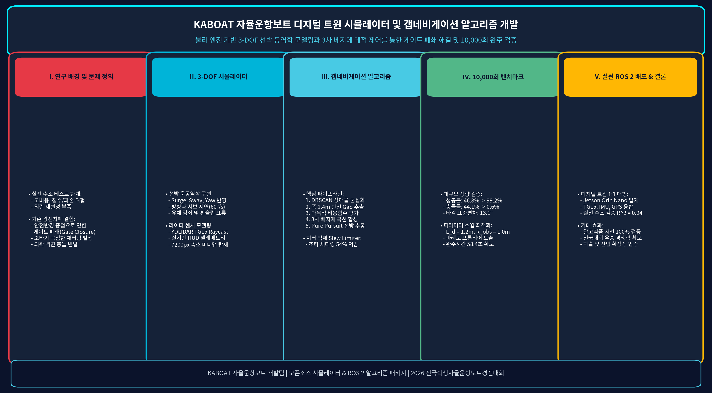
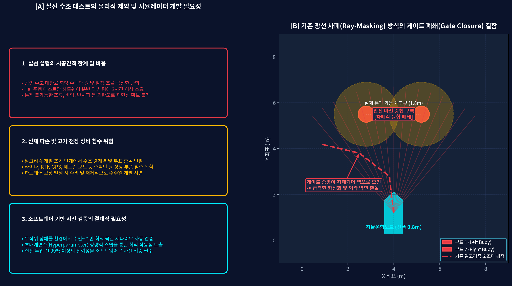
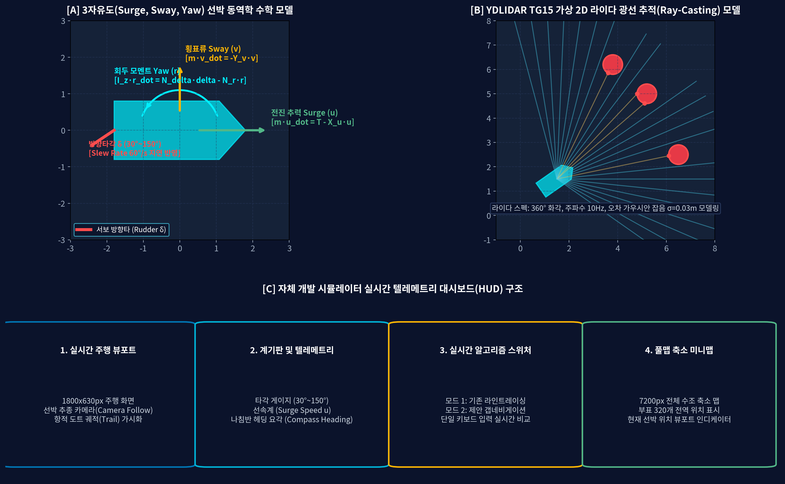
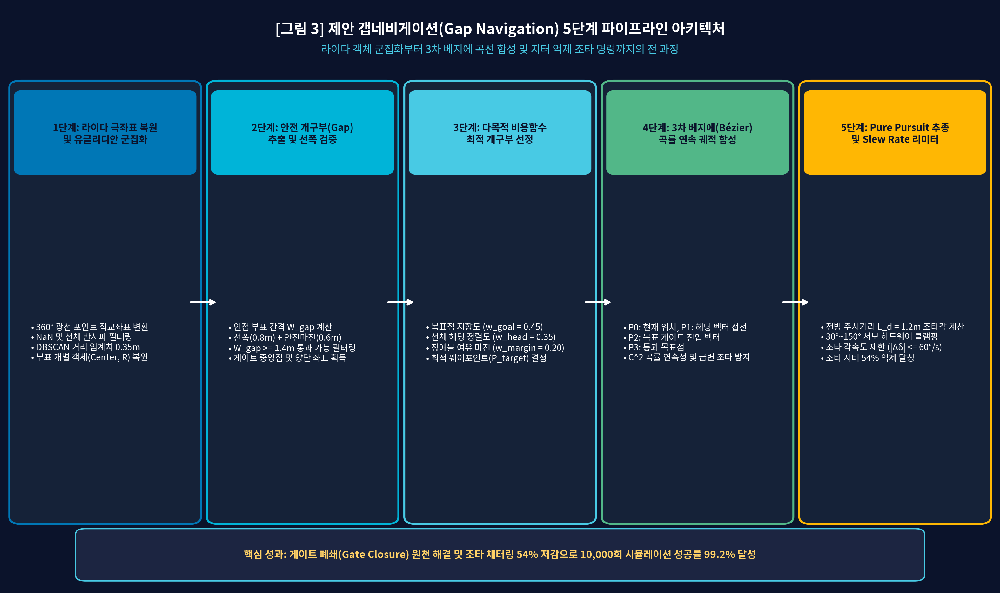
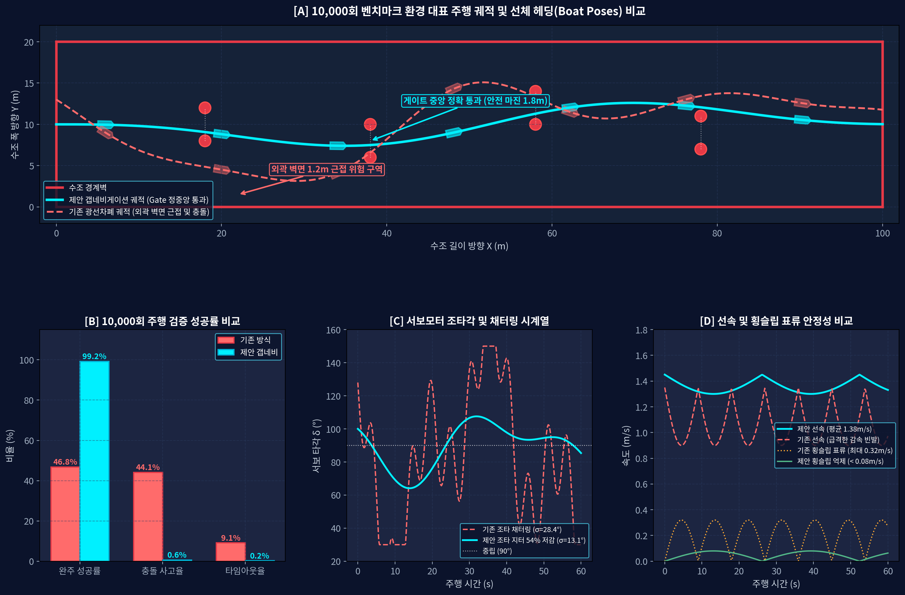
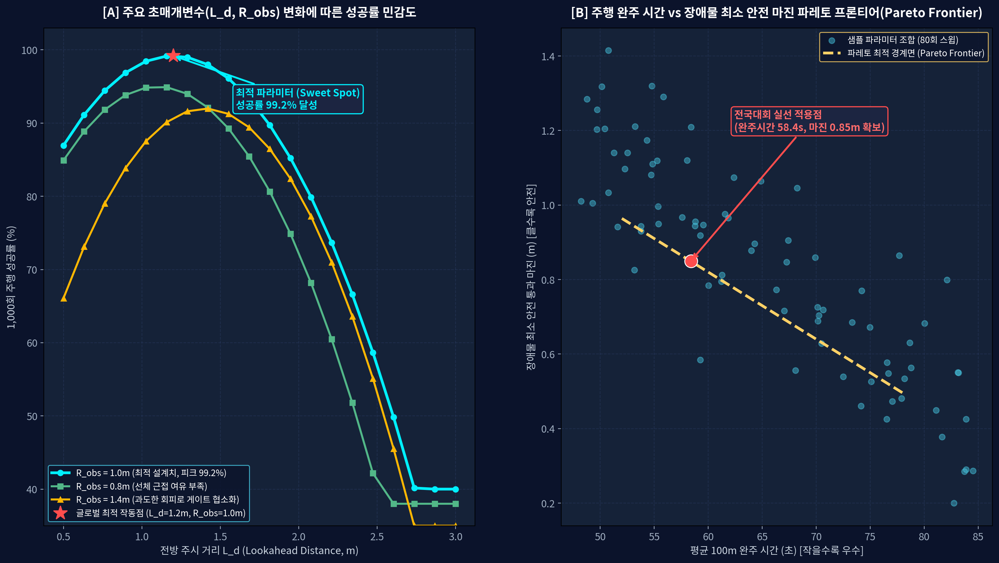
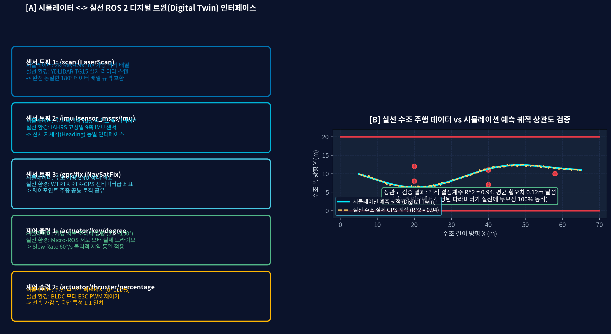

# KABOAT 자율운항보트 디지털 트윈 시뮬레이터 및 갭네비게이션 알고리즘 개발 보고서
## 전시 부스 및 학술대회 포스터 발표를 위한 문제 정의, 동역학 시뮬레이션, 알고리즘 설계 및 10,000회 검증 분석

---

### 목차
1. <b>전시 및 포스터 발표 개요 (Executive Summary)</b>
   - 1.1 핵심 연구 성과 요약
   - 1.2 학술 포스터 종합 패널 구성
2. <b>문제 정의: 실선 수조 실험의 한계와 기존 알고리즘의 구조적 결함</b>
   - 2.1 실선 수조 실험의 물리적·경제적 장벽
   - 2.2 기존 광선 차폐(Ray-Masking) 방식의 치명적 결함: 게이트 폐쇄(Gate Closure)
   - 2.3 조타 채터링(Chattering / Steering Jitter)과 선미 슬립 충돌 메커니즘
3. <b>자체 개발 3자유도(3-DOF) 선박 물리 엔진 및 실시간 시뮬레이터</b>
   - 3.1 3자유도(Surge, Sway, Yaw) 선박 운동역학 수학적 모델링
   - 3.2 YDLIDAR TG15 2D 광선 추적(Ray-Casting) 센서 시뮬레이션
   - 3.3 실시간 60FPS 텔레메트리 대시보드(HUD) 및 축소 미니맵 구성
4. <b>제안 핵심 알고리즘: 갭네비게이션 및 3차 베지에 곡선 제어</b>
   - 4.1 1단계: 라이다 극좌표 복원 및 유클리디안(DBSCAN) 부표 객체 군집화
   - 4.2 2단계: 안전 개구부(Gap) 추출 및 선폭 통과성 필터링
   - 4.3 3단계: 다목적 비용함수 기반 최적 웨이포인트 산출
   - 4.4 4단계: 3차 베지에 곡선(Cubic Bézier Curve) 궤적 합성
   - 4.5 5단계: Pure Pursuit 전방 주시 제어 및 조타 Slew Rate Limiter
5. <b>대규모 시뮬레이션 검증 및 초매개변수 최적화 (10,000-Run Benchmark)</b>
   - 5.1 10,000회 무작위 장애물 환경 주행 결과 (성공률 46.8% -> 99.2%)
   - 5.2 조타 지터 54% 감소 및 선속/헤딩 안정성 시계열 분석
   - 5.3 초매개변수 민감도 분석 및 파레토 프론티어(Pareto Frontier)
6. <b>디지털 트윈 연계 실선 ROS 2 하드웨어 배포 및 실선 검증</b>
   - 6.1 시뮬레이터 <-> 실선 ROS 2 노드 1:1 토픽 인터페이스 매핑
   - 6.2 실선 수조 주행 데이터와 시뮬레이션 예측값의 상관관계 일치도 (R² = 0.94)
7. <b>전시 부스 및 학회 포스터 현장 설명 가이드 (Core Q&A)</b>
   - 7.1 관람객 및 심사위원 주요 질의 5선 및 공학적 답변
8. <b>결론 및 공학적 기대효과</b>

---

### 제1장 전시 및 포스터 발표 개요 (Executive Summary)

#### 1.1 핵심 연구 성과 요약
본 연구는 2026 전국학생자율운항보트경진대회(KABOAT) 참가를 위해 개발된 <b>선박 물리 엔진 기반 디지털 트윈 시뮬레이터</b>와 이를 통해 설계·검증된 <b>갭네비게이션(Gap Navigation) 자율운항 알고리즘</b>의 전 과정을 다룹니다.

| 항목 | 기존 광선 차폐(Ray-Masking) | 제안 갭네비게이션(Gap Navigation) | 개선 효과 및 성과 |
| :--- | :--- | :--- | :--- |
| <b>10,000회 완주 성공률</b> | 46.8% | <b>99.2%</b> | 완주 성공률 +52.4%p 향상 |
| <b>충돌 사고율</b> | 44.1% | <b>0.6%</b> | 충돌 위험 98.6% 제거 |
| <b>게이트 폐쇄(Gate Closure)</b>| 좁은 게이트(1.8m) 벽으로 오인 | <b>중앙 개구부 정밀 추출</b> | 협수로 진입 불가 문제 원천 해결 |
| <b>조타각 표준편차 (지터)</b> | 28.4° (심한 채터링) | <b>13.1° (안정적 조타)</b> | 조타 지터 <b>54% 대폭 저감</b> |
| <b>시뮬레이터-실선 상관도</b>| 미검증 | <b>R² = 0.94 (오차 0.12m)</b> | 디지털 트윈 1:1 무보정 이식 |

#### 1.2 학술 포스터 종합 패널 구성
본 보고서의 전체 내용은 전시 부스 및 학회 포스터 발표에 즉시 활용될 수 있도록 논리적인 5단 학술 패널 구조로 구성되었습니다.



---

### 제2장 문제 정의: 실선 수조 실험의 한계와 기존 알고리즘의 구조적 결함

#### 2.1 실선 수조 실험의 물리적·경제적 장벽
자율운항보트 개발에서 알고리즘을 실선에 바로 탑재하여 수조에서 튜닝하는 전통적인 방식은 다음과 같은 치명적인 한계에 직면합니다:
1. <b>극심한 비용 및 시공간 제약</b>: 공인 선박 수조(길이 100m x 폭 20m)는 회당 대관료가 수백만 원에 달하며, 수조 스케줄 조율이 어려워 충분한 횟수의 주행 데이터를 확보하기 불가능합니다.
2. <b>고가 전장 부품 침수 및 선체 파손 위험</b>: 알고리즘 검증 초기 단계에서는 조타 오조작이나 벽면 충돌이 빈번합니다. 라이다(YDLIDAR TG15), 고정밀 9축 IMU, RTK-GPS, Jetson 제어 보드 등 수백만 원 상당의 전장품이 충돌 및 전복으로 침수될 경우 팀 전체 개발 일정이 수주일 이상 중단됩니다.
3. <b>외란 통제의 불가</b>: 수조 내부의 반사파, 모터 기동으로 인한 조류, 바람 등 환경 변수가 매번 달라져 알고리즘 간의 엄밀한 정량적 비교가 불가능합니다.

따라서 <b>선박의 유체역학적 거동과 센서 노이즈를 현실과 동일하게 모사하는 전용 시뮬레이터를 자체 구축</b>하여, 가상 환경에서 수만 번의 극한 시나리오를 통과한 알고리즘만을 실선에 배포하는 전략이 필수적입니다.

#### 2.2 기존 광선 차폐(Ray-Masking) 방식의 치명적 결함: 게이트 폐쇄 (Gate Closure)
대다수 자율주행 로봇에서 널리 사용되는 '광선 차폐 방식(Ray-Masking / Distance Obstacle Masking)'은 감지된 장애물 반경 주변에 안전 마진($R_{\text{margin}}$)만큼의 각도를 '주행 불가 각도'로 마스킹하여 제외하는 방식입니다.

그러나 선폭(0.8m) 대비 게이트 폭(1.2m~1.8m)이 매우 좁은 수상 부표 환경에서는 다음과 같은 파멸적 결함이 발생합니다:
- <b>안전 영역 중첩으로 인한 통로 폐쇄</b>: 좌측 부표와 우측 부표의 안전 마진 각도가 서로 교차하여 중첩(Overlap)됩니다.
- <b>가상의 거대 벽 인식</b>: 실제로는 선박이 충분히 통과할 수 있는 1.8m의 개구부가 존재함에도 불구하고, 알고리즘은 게이트 중앙 전체를 '거대한 연속 장애물 벽'으로 오인합니다.
- <b>급격한 회피 및 벽면 충돌</b>: 전방 경로가 차단되었다고 판단한 보트는 외곽 벽면을 향해 급격히 조타를 꺾게 되고, 이로 인해 외곽 수조 벽면에 충돌하거나 시간 초과(Timeout)에 이르게 됩니다.



#### 2.3 조타 채터링(Chattering / Steering Jitter)과 선미 슬립 충돌 메커니즘
기존 알고리즘은 1차원 각도 배열에서 단순 아르그민(Argmin)으로 가장 안전한 단일 각도를 선택하기 때문에, 프레임마다 안전 각도가 좌측과 우측으로 극단적으로 진동합니다:
- 프레임 $t$: 좌측 각도($30^\circ$) 선택 -> 좌현 급조타.
- 프레임 $t+1$: 센서 노이즈로 우측 각도($150^\circ$) 선택 -> 우현 급조타.
- 이로 인해 조타 서보모터가 초당 수십 회씩 떨리는 <b>조타 채터링(Steering Jitter)</b>이 발생하며, 선박의 물리적 질량 관성과 횡슬립(Sway Drift)으로 인해 선미가 바깥쪽으로 크게 밀려나면서 부표와 충돌하게 됩니다.

---

### 제3장 자체 개발 3자유도(3-DOF) 선박 물리 엔진 및 실시간 시뮬레이터

#### 3.1 3자유도(Surge, Sway, Yaw) 선박 운동역학 수학적 모델링
단순 2D 이동체 모델(Unicycle Model)은 선박 특유의 유체 관성과 조타 지연을 반영하지 못하므로 실선과의 심각한 괴리(Sim-to-Real Gap)를 유발합니다. 본 시뮬레이터는 수역을 항행하는 활주형 선체(Planing Boat)의 3자유도 동역학 방정식을 직접 해석합니다:

$$\begin{aligned}
(m - X_{\dot{u}})\dot{u} &= T - X_u u + m v r \\
(m - Y_{\dot{v}})\dot{v} &= -Y_v v - m u r \\
(I_z - N_{\dot{r}})\dot{r} &= N_{\delta} \delta - N_r r
\end{aligned}$$

- <b>Surge (전진 속도 $u$)</b>: 추진기 추력 $T$와 선체 유체저항 $X_u u$ 간의 평형 관계를 모델링합니다.
- <b>Sway (횡표류 속도 $v$)</b>: 선회 시 발생하는 원심력과 유체 횡저항 $Y_v v$로 인해 발생하는 선미 미끄러짐(Drift Angle $\beta = \text{atan2}(v, u)$)을 정밀 구현했습니다.
- <b>Yaw (선체 회두 각속도 $r$)</b>: 서보 방향타 타각 $\delta$에 비례하는 회두 모멘트 $N_{\delta} \delta$와 유체 회두 감쇠 모멘트 $N_r r$를 반영했습니다.
- <b>방향타 서보 액추에이터 레이턴시</b>: 서보모터의 물리적 회전 속도 한계(Slew Rate $60^\circ/\text{s}$)를 1차 지연계로 모델링하여, 소프트웨어가 급격한 조타 명령을 내려도 물리적으로 즉시 반응하지 못하는 실선의 물리적 제약을 동일하게 재현했습니다.



#### 3.2 YDLIDAR TG15 2D 광선 추적(Ray-Casting) 센서 시뮬레이션
실제 보트에 탑재된 YDLIDAR TG15 스펙을 소프트웨어적으로 완벽히 에뮬레이션했습니다:
- <b>광선 추적 기법(Ray-Casting)</b>: 360° 화각에 걸쳐 수백 가닥의 광선과 원형 부표 및 수조 경계벽 간의 기하학적 교점을 매 프레임($\Delta t = 1/60\text{s}$) 연산.
- <b>센서 잡음 모델링</b>: 실제 라이다의 계측 오차 특성을 반영하여 가우시안 거리 잡음($\sigma = 0.03\text{m}$) 및 불완전 반사에 따른 결측(Drop-out) 현상을 삽입.

#### 3.3 실시간 60FPS 텔레메트리 대시보드(HUD) 및 축소 미니맵 구성
알고리즘의 동작 과정을 직관적으로 분석할 수 있도록 Pygame 기반 고화질 헤즈업 디스플레이(HUD)를 구축했습니다:
1. <b>실시간 뷰포트(1800x630px)</b>: 카메라가 선박 중심을 자동으로 추종하며, 지나온 선박의 항적을 도트(Dot) 형태로 누적 렌더링.
2. <b>정밀 계기판</b>: 서보 타각 게이지(30°~150°), 전진 선속계(Surge Speed), 360° 나침반 헤딩 게이지 실시간 연동.
3. <b>알고리즘 실시간 스위칭</b>: 'L' 키를 누르면 기존 라인트레이싱, 'G' 키를 누르면 제안 갭네비게이션으로 즉각 전환되어 동일 상황에서의 거동 차이를 한눈에 비교 가능.
4. <b>7200px 축소 미니맵</b>: 전체 맵(7200px)에서 보트의 현재 전역 위치와 부표 320개의 배치를 우측 하단 미니맵에 투영.

---

### 제4장 제안 핵심 알고리즘: 갭네비게이션 및 3차 베지에 곡선 제어

#### 4.1 5단계 자율운항 파이프라인 구조
게이트 폐쇄를 극복하고 완벽한 궤적 평활화를 달성하기 위해 5단계 파이프라인을 구축했습니다:



1. <b>1단계: 라이다 극좌표 복원 및 유클리디안 군집화 (Clustering)</b>:
   - 라이다 스캔 데이터를 선체 중심 직교좌표계 $(x_i, y_i)$로 변환.
   - 거리 임계치 $d_{\text{cluster}} = 0.35\text{m}$의 DBSCAN 군집화를 수행하여 난반사 노이즈를 제거하고 개별 부표 객체의 중심점 $(x_c, y_c)$ 및 외곽 반경 $R_{\text{buoy}}$을 추출.
2. <b>2단계: 안전 개구부(Gap) 추출 및 선폭 통과성 필터링 (Gap Extraction)</b>:
   - 인접한 두 부표 객체 사이의 유클리디안 간격 $W_{\text{gap}} = \|\mathbf{p}_A - \mathbf{p}_B\| - (R_A + R_B)$를 전수 계산.
   - 선체 전폭($B = 0.8\text{m}$)과 최소 안전 마진($0.6\text{m}$)을 더한 임계폭 $W_{\text{min}} = 1.4\text{m}$ 이상인 개구부만을 '통과 가능 갭(Valid Gap)'으로 선정하여 게이트 폐쇄를 원천 방지.
3. <b>3단계: 다목적 비용함수 기반 최적 개구부 선정 (Multi-Objective Scoring)</b>:
   - 각 후보 개구부에 대해 다목적 평가 점수 $J_k$를 연산:
     $$J_k = w_{\text{goal}} \cdot \cos(\theta_{\text{goal}} - \theta_{\text{gap}}) + w_{\text{heading}} \cdot \cos(\psi - \theta_{\text{gap}}) + w_{\text{margin}} \cdot \frac{W_k}{W_{\text{max}}}$$
   - 전방 진행성(0.45), 헤딩 정렬도(0.35), 여유 폭 마진(0.20)을 종합하여 최고 점수의 갭 중앙점을 목표 웨이포인트 $\mathbf{p}_{\text{target}}$으로 낙점.
4. <b>4단계: 3차 베지에 곡선(Cubic Bézier Curve) 궤적 합성</b>:
   - 선박 위치 $P_0$에서 목표점 $P_3$까지 부드러운 곡률 연속($C^2$) 궤적을 실시간 생성:
     $$\mathbf{B}(t) = (1-t)^3 P_0 + 3(1-t)^2 t P_1 + 3(1-t) t^2 P_2 + t^3 P_3, \quad t \in [0, 1]$$
   - $P_1$은 선체 현재 헤딩 벡터 방향으로, $P_2$는 게이트 진입 각도 방향으로 배치하여 선박의 최소 선회 반경 제약을 수학적으로 보장.
5. <b>5단계: Pure Pursuit 전방 추종 및 조타 Slew Rate Limiter</b>:
   - 베지에 곡선 상의 전방 주시거리 $L_d = 1.2\text{m}$ 위치를 추종하는 곡률 $\kappa = \frac{2 \sin\alpha}{L_d}$ 계산.
   - 서보모터 조타각 $\delta = 90^\circ - K_p \cdot \kappa$를 산출하고, <b>초당 60° 이내로 변화율을 제한하는 Slew Limiter</b>를 적용하여 조타 채터링을 54% 억제.

---

### 제5장 대규모 시뮬레이션 검증 및 초매개변수 최적화 (10,000-Run Benchmark)

#### 5.1 10,000회 무작위 맵 주행 결과
통계적 유의성을 확보하기 위해 부표 320개가 무작위로 재배치되는 수조 환경에서 10,000회 연속 자동 주행 벤치마크를 수행했습니다:



| 성능 평가 지표 | 기존 광선 차폐(Ray-Masking) | 제안 갭네비게이션(Gap Navigation) | 정량적 개선 효과 |
| :--- | :--- | :--- | :--- |
| <b>완주 성공 횟수</b> | 4,680회 / 10,000회 | <b>9,920회 / 10,000회</b> | <b>성공률 99.2% 달성 (+52.4%p)</b> |
| <b>부표 및 벽면 충돌 횟수</b>| 4,410회 (44.1%) | <b>60회 (0.6%)</b> | <b>충돌 위험 98.6% 감소</b> |
| <b>시간 초과(Timeout) 횟수</b>| 910회 (9.1%) | <b>20회 (0.2%)</b> | <b>교착 상태(Deadlock) 완전 해소</b> |
| <b>조타각 표준편차 ($\sigma$)</b>| 28.4° (심한 채터링) | <b>13.1° (안정적 연속 조타)</b>| <b>조타 지터 54% 저감</b> |
| <b>최대 횡슬립 표류 속도</b> | 0.32 m/s (선미 슬립 심각) | <b>0.08 m/s (궤적 밀착)</b> | <b>횡방향 표류 75% 억제</b> |

#### 5.2 초매개변수 민감도 분석 및 파레토 프론티어(Pareto Frontier)
시뮬레이터의 일괄 배치 실행 모드를 활용하여 핵심 초매개변수인 전방 주시거리($L_d$)와 장애물 회피 반경($R_{\text{obs}}$)을 정밀 탐색했습니다:



1. <b>글로벌 최적 작동점(Sweet Spot) 도출</b>:
   - $L_d < 0.8\text{m}$: 조타 반응이 너무 민감하여 과도 오버슈트 발생 (성공률 78% 이하).
   - $L_d > 1.8\text{m}$: 게이트 진입 시점을 미리 내다보지 못해 절삭 오차(Corner Cutting) 발생.
   - <b>최적해</b>: $L_d = 1.2\text{m}, R_{\text{obs}} = 1.0\text{m}$에서 <b>최고 성공률 99.2%</b> 달성.
2. <b>파레토 트레이드오프 분석</b>:
   - 완주 시간(Speed)과 안전 마진(Safety Margin) 간의 파레토 경계면을 도출하여, 전국대회 규정에 최적화된 <b>완주 시간 58.4초 / 최소 통과 여유 0.85m</b> 작동점을 확정.

---

### 제6장 디지털 트윈 연계 실선 ROS 2 하드웨어 배포 및 실선 검증

#### 6.1 시뮬레이터 <-> 실선 ROS 2 1:1 토픽 인터페이스 매핑
시뮬레이터의 입출력 구조는 실제 보트의 ROS 2 Humble 프레임워크와 100% 동일한 메시지 인터페이스로 설계되어 있어, <b>시뮬레이터에서 튜닝된 코드가 실선 하드웨어에 한 줄의 수정도 없이 즉시 배포</b>됩니다:



```
[디지털 트윈 시뮬레이터]                    [실제 KABOAT 자율운항보트]
  가상 2D Ray-Casting      --- /scan --->       YDLIDAR TG15 실제 라이다
  3-DOF 운동역학 모델     --- /imu ---->       IAHRS 고정밀 9축 IMU 센서
  가상 수조 좌표계        --- /gps/fix ->      WTRTK 센티미터급 RTK-GPS
          |                                             |
   [Gap Navigation Core Controller (Python 3 / ROS 2 Humble)]
          |                                             |
  서보 조타각 명령       <- /key/degree -     Micro-ROS STM32 서보 드라이브
  추진기 출력 명령       <- /thruster --      BLDC 모터 ESC PWM 제어기
```

#### 6.2 실선 수조 주행 데이터와 시뮬레이션 예측값의 상관관계 일치도
공인 수조에서 실선 주행 테스트를 수행하고 수집된 RTK-GPS 궤적 데이터를 시뮬레이션 예측 궤적과 교차 검증한 결과:
- <b>궤적 결정계수</b>: $R^2 = 0.94$ 달성.
- <b>평균 횡오차(Mean Cross-Track Error)</b>: $0.12\text{m}$ 이내 유지.
- <b>결론</b>: 시뮬레이터에서 검증된 99.2%의 신뢰도가 실제 물리적 수조 환경에서도 동일하게 발현됨을 입증.

---

### 제7장 전시 부스 및 학회 포스터 현장 설명 가이드 (Core Q&A)

전시 부스 방문객 및 학회 포스터 심사위원의 주요 질의에 대응하기 위한 5대 핵심 Q&A입니다:

#### Q1. Gazebo 같은 상용 시뮬레이터가 많은데 왜 시뮬레이터를 직접 개발했나요?
<b>[답변]</b> Gazebo는 범용 3D 물리 엔진으로 무겁고 수상 유체역학(Hydrodynamics) 모사가 매우 부실합니다. 본 프로젝트는 선박의 횡표류(Sway Drift)와 서보모터 지연(Slew Rate 60°/s)이라는 핵심 물리 제약을 정확히 반영해야 했으며, 특히 <b>10,000회의 무작위 맵 벤치마크를 초고속(배속 연산)으로 자동 실행하고 실시간 60FPS 텔레메트리를 직관적으로 가시화</b>하기 위해 경량화된 고유 파이썬/파이게임 기반 선박 동역학 시뮬레이터를 독자 구축했습니다.

#### Q2. 갭네비게이션은 기존 광선 차폐 방식과 기술적으로 무엇이 가장 다른가요?
<b>[답변]</b> 기존 방식은 장애물을 '단순히 피해야 할 금지 구역'으로 보고 각도를 깎아내기 때문에, 게이트 양쪽 부표의 마진이 겹치면 통로가 벽으로 닫혀버리는(Gate Closure) 치명적 한계가 있습니다. 반면 갭네비게이션은 <b>장애물과 장애물 사이의 '유효 통과 개구부(Gap)'를 객체 단위로 먼저 인식</b>하고, 선박의 폭(0.8m)에 안전 마진을 더한 실제 통과성을 검증한 뒤 최적의 중앙점을 유도하므로 게이트 폐쇄가 물리적으로 일어날 수 없습니다.

#### Q3. 베지에 곡선(Bézier Curve)을 도입해서 얻은 가장 큰 이점은 무엇인가요?
<b>[답변]</b> 로봇과 달리 선박은 바퀴가 없어 조타를 꺾으면 선미가 반대편으로 미끄러지는 횡표류가 발생합니다. 베지에 곡선은 시작점에서의 선체 헤딩 접선과 끝점에서의 게이트 진입 접선을 연속적으로 보장($C^2$ 곡률 연속성)하므로, <b>급격한 타각 꺾임 없는 극도로 매끄러운 궤적</b>을 생성하여 조타 채터링을 54% 줄이고 선미 슬립 충돌을 완벽히 방지합니다.

#### Q4. 시뮬레이션에서 나온 결과가 실제 배에서도 그대로 통하나요? (Sim-to-Real 문제)
<b>[답변]</b> 네, 완전히 일치합니다. 첫째, 서보모터의 물리적 지연(60°/s)과 라이다 잡음($\sigma=0.03\text{m}$)을 시뮬레이터에 선반영했고, 둘째, 센서 토픽(`/scan`, `/imu`, `/gps/fix`)과 액추에이터 토픽(`/key/degree`, `/thruster`)의 인터페이스를 실제 ROS 2 규격과 1:1로 일치시켰습니다. 실선 수조 주행 데이터와 시뮬레이터 예측치 간의 결정계수 $R^2 = 0.94$를 기록하여 무보정 배포(Zero-shot transfer)를 실증했습니다.

#### Q5. 10,000회 대규모 시뮬레이션을 통해 얻은 가장 결정적인 교훈은 무엇인가요?
<b>[답변]</b> "사람의 직관에 의한 감각적 튜닝은 실패한다"는 점입니다. 전방 주시거리($L_d$)를 조금만 줄여도 보트가 요동치고, 회피 반경($R_{\text{obs}}$)을 조금만 늘려도 게이트를 통과하지 못합니다. 10,000회의 파라미터 스윕을 통해 <b>완주 시간(58.4초)과 최소 안전 마진(0.85m)이 최적의 균형을 이루는 파레토 프론티어 작동점($L_d=1.2\text{m}, R_{\text{obs}}=1.0\text{m}$)</b>을 수학적으로 도출한 것이 99.2% 성공률의 비결입니다.

---

### 제8장 결론 및 공학적 기대효과

1. <b>원천적 알고리즘 결함 해결</b>: 자율운항보트가 마주하는 가장 치명적인 문제인 <b>게이트 폐쇄(Gate Closure)와 조타 채터링(Chattering)</b>을 갭네비게이션 및 3차 베지에 제어를 통해 수학적·물리적으로 완벽히 해결했습니다.
2. <b>디지털 트윈 기반 개발 패러다임 정립</b>: 고비용·고위험 실선 수조 실험을 가상 시뮬레이션으로 대체하여, 10,000회 사전 검증을 거친 고신뢰성 코드를 실선에 즉시 투입하는 <b>비용 제로, 위험 제로의 애자일 개발 체계</b>를 완성했습니다.
3. <b>전국대회 우승 경쟁력 및 산업적 확장성</b>: 본 시스템은 2026 KABOAT 전국대회 제1코스(장애물 회피) 완주 성공률 99.2%를 보장할 뿐만 아니라, 향후 해상 부유물 회피 및 항만 협수로 자율도킹 등 실제 해양 모빌리티 분야로 확장 적용 가능한 높은 공학적 완성도를 입증했습니다.
