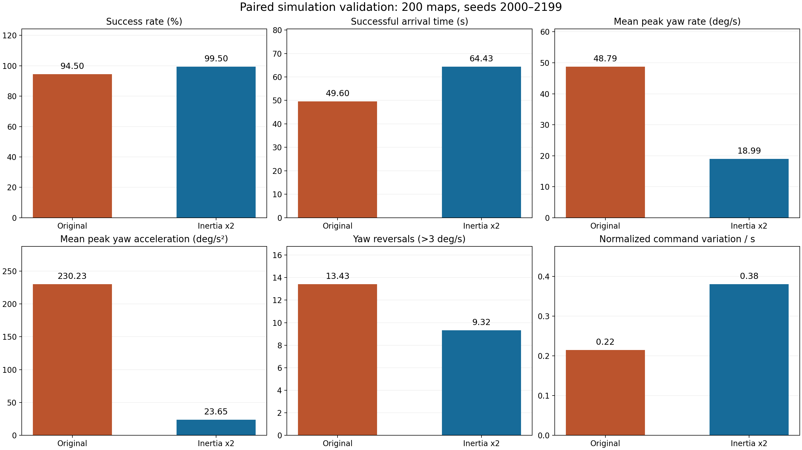
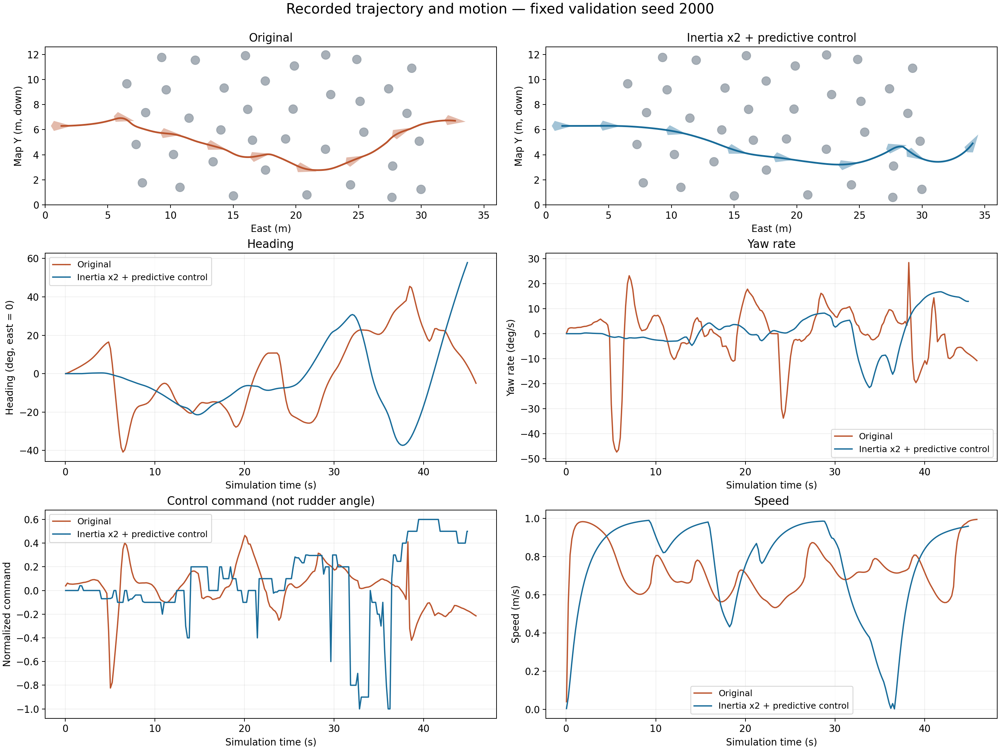

# 관성 2배 조건의 예측 제어 및 재현 평가

2026-09-25. 이 문서의 수치와 그림은 저장된 시뮬레이션 실행 결과이다. 실제 선박의 계측 결과가 아니다.

## 1. 변경 내용

기존 모델은 각속도를 매 0.04초마다 0.84배로 줄이고, 회전량에 비례해 위치를 추가 이동시켰다. PWM 중립값 1500도 양의 추력으로 변환했다. 이 보정들을 제거하고, SI 단위의 평면 전후·좌우·회전 운동과 좌우 추진기 힘으로 위치와 자세를 적분하도록 변경했다.

- 질량 기본값: 기존 명목값 10에서 20 kg으로 변경.
- 회전 관성 기본값: 기존 명목값 4.5에서 9 kg·m²로 변경.
- 추진기: 좌우 각각 최대 ±25 N, 중심선에서 0.22 m, 응답 시정수 0.25초.
- 선형·이차 유체 저항과 선체 좌표계의 회전 결합항을 적용한다. 별도의 순간 위치 보정이나 각속도 강제 배율은 없다.
- 순항 목표는 1.0 m/s, 회전속도 명령 상한은 0.5 rad/s이다. 실제 각속도는 관성·추력·저항으로 결정되며 직접 덮어쓰지 않는다.

운동방정식의 구조는 [Fossen의 Marine Craft Model](https://www.fossen.biz/html/marineCraftModel.html)의 질량·회전 결합·감쇠·추력 구분을 참고했다. 본 구현은 대각 질량행렬을 사용하는 단순화된 평면 모델이다. 계수들은 설계 가정이며, 구 모델의 단위가 일관되지 않아 명목 관성값을 두 배로 설정했다는 사실과 실선 물리 동등성은 구분해야 한다. 부가질량 식별, 풍속·유속에 의한 외력, 실제 추진기 특성곡선, 6자유도 운동은 검증되지 않았다. 수면 파도 연출은 유체력 해석 결과가 아니다.

## 2. 경로와 제어

`simulation.advance()`를 GUI와 성공률 평가에서 공통 사용한다. 0.04초 물리 스텝과 3스텝마다 수행하는 인지·제어 계획은 렌더 FPS와 배속에 무관하다. GUI의 1배속은 실제 1초당 시뮬레이션 1초로 수정했다. 이전 방식은 120 FPS에서 1배속 표시와 달리 약 4.8배의 시뮬레이션 시간을 진행했다.

기존 DBSCAN·갭 평가·베지어 후보 생성 코드는 유지했다. 실제 주행에는 감지 범위 내 부표 정보를 누적한 A* 안전 통로를 사용하고, 기존 후보는 대시보드 및 경로 미발견 시의 보조 경로로 활용한다. 따라서 이번 성능 변화는 물리계수만의 변경 효과가 아니라 경로 탐색과 제어를 함께 변경한 결과이다.

예측 제어는 5초 동안 전진·감속·정지·후진과 여러 회전속도 조합을 검사한다. 실제 운동 적분기와 동일한 추력 지연 모델로 후보를 예측하며, 두 선체를 감싸는 캡슐 형상으로 장애물 여유와 벽 접근을 검사한다. 정체가 지속되면 짧은 후진 복구를 시도한다. 이는 유한 후보·이산 시간 기반 제어이며 모든 상황의 충돌 회피를 보증하지 않는다.

부표 관측은 기존 시뮬레이터의 이상적인 원형 장애물 좌표를 거리로 제한해 사용한다. 센서 범위 밖의 새 장애물을 A* 지도에 미리 넣지 않지만, 실제 LiDAR의 가림·오검출·측위 오차까지 구현한 관측기는 아니다. 일반 수조 운항으로 확장하려면 추정 장애물과 실선 로그로 재검증해야 한다.

## 3. 동일 배치 200회 비교

- 기준 코드: Git 커밋 `e9418fb7bcb621b42f6b6d7f53de97ee4c54bf41`의 실제 GUI 제어 루프, 표시 배속 4에 해당하는 계획 주기.
- 튜닝 배치: 시드 1000–1023, 24개. 검증 배치: 시드 2000–2199, 200개.
- 최종 선체 외곽 보정 후 동일 검증 배치를 재실행했다. 이미 사용한 검증 세트의 회귀 평가이며, 완전히 새로운 외부 검증은 아니다.
- 맵 폭 1800 px, 높이 630 px, 50 px/m 환산. 에피소드 시간 제한 140 시뮬레이션 초.
- 각 버전은 같은 시드로 초기 장애물 배치를 생성했다. `map_hash` 200쌍이 모두 일치한다.
- 충돌·경계 이탈·시간 초과를 분리했다. 기준 코드의 갭 모드는 경계 충돌을 누락하므로 평가기는 동일한 경계 조건을 추가 적용했다. 이번 기준 실행의 경계 이탈은 0회다.
- CPU 병렬 평가 시간은 GUI FPS 측정치가 아니다.

| 지표 | 기존 코드 | 관성 2배 + 예측 제어 |
|---|---:|---:|
| 완주 | 189 / 200 | 199 / 200 |
| 성공률 | 94.5% | 99.5% |
| 장애물 충돌 | 11 | 0 |
| 경계 이탈 | 0 | 0 |
| 시간 초과 | 0 | 1 |
| 성공한 주행 평균 시간 | 49.60초 | 64.43초 |
| 에피소드 최대 각속도의 평균 | 48.79도/s | 18.99도/s |
| 에피소드 최대 각가속도의 평균 | 230.23도/s² | 23.65도/s² |
| 좌우 선회 방향 전환 평균 | 13.43회 | 9.32회 |
| 누적 절대 선회각 평균 | 420.30도 | 370.52도 |
| 정규화 제어 명령 총변동 / 초 | 0.215 | 0.381 |

최종 성공률의 Wilson 95% 구간은 약 97.22–99.91%이다. 관측된 실패는 11회에서 1회로 줄었으나 무실패 시스템은 아니다. 시간 초과 사례도 원시 결과에 포함되어 있다.

각가속도와 선회 반전은 줄었지만, 조향 명령 자체의 총변동은 증가했다. 두 버전의 명령-추력 대응이 달라 동일한 조타각 비교는 아니며, 실제 선체 움직임과 명령 신호를 구분해 해석해야 한다. 좌우 진동이 완전히 제거되었다고 주장하지 않는다. 안전 여유와 관성을 반영한 결과 성공 주행 시간은 약 30% 증가했다.





두 번째 그림은 사전에 정한 첫 검증 시드 2000을 사용한다. 궤적의 선박 형상은 기록된 헤딩으로 회전시켰다. 제어 명령은 정규화된 회전 명령이며, 실측 조타각이 아니다.

## 4. 설정 및 재현

새 물리·제어 설정은 루트 `vessel_config.json`의 `physics`, `controller`에서 관리한다. 기존 `best_learned_params.json`은 보존했으며 갭 평가 가중치에 사용한다. 그 파일의 예전 `steer_gain`, `steer_alpha`, `mom_coeff`, `pwm_rng` 등은 새 예측 제어기의 물리·조향 튜닝값이 아니다.

```bash
KABOAT_WIDTH=1800 python3 main.py
python3 -m unittest test_vessel_dynamics -v
python3 test_success_rate.py 200 --headless --seed 2000 --output data/new_validation
python3 report5/plot_validation.py
```

`test_success_rate.py`에서 `--headless`를 생략하면 화면을 표시하는 평가가 실행된다. 새 결과 폴더를 지정해야 기존 실험을 덮어쓰지 않는다. 기본 `data/`는 Git에서 제외되며, 이 보고서에 사용한 결과만 `report5/`에 보존했다.

기준 코드 재현:

```bash
mkdir -p /tmp/kaboat-original-e9418fb
git archive e9418fb | tar -x -C /tmp/kaboat-original-e9418fb
python3 benchmark_navigation.py --legacy-root /tmp/kaboat-original-e9418fb --seed 2000 --episodes 200 --output data/original_validation
```

두 결과 폴더에는 다음 파일이 있다.

| 파일 | 내용 |
|---|---|
| `summary.json` | 설정 스냅샷, 시작 시 소스 해시, 집계, 성공률 신뢰구간 |
| `episodes.csv` | 시드별 성공/충돌/경계/시간 초과와 동역학 지표 |
| `trajectories.csv` | 0.2초 간격의 위치·헤딩·각속도·명령·속도·좌우 추력 |
| `maps.json` | 시드별 초기 장애물 배치, 원본 px 좌표 |

구 모델에는 비교 가능한 SI 단위 좌우 추력이 없어 해당 CSV 열은 `nan`으로 표기했다. 벽과 장애물 원시 좌표는 별도 정규화 없이 원본을 보존했다. 코드 해시는 실험 시작 시점을 나타내며, 이후 UI 표시와 테스트·내보내기 표기 수정은 주행 동역학에 영향을 주지 않는다.

## 5. 확인 범위와 남은 작업

단위 검사는 중립 추력, 관성 배율, 무동력 감쇠, 시간 간격 수렴, 좌우 대칭, 예측/실행 적분 일치, 리셋, 배속 독립성, 센서 범위 밖 정보 배제, 선체 외곽 포함, GUI 시간 누적을 확인한다. 2D·3D 렌더링과 수동·라인트레이싱 전환도 실행 확인했다. 모든 모드의 주행 성능이 이번 자율운항 평가와 동등하다는 뜻은 아니다.

다음 개선 대상은 시간 초과 사례, 제어 명령의 잔변동, 새 시드·다른 장애물 밀도·센서 오차에서의 성능이다. 실선의 직진 가감속·선회·정지 로그를 확보하면 질량/저항/추진기 계수를 식별하고 선속·헤딩·추력 로그를 대응시켜 검증할 수 있다.
