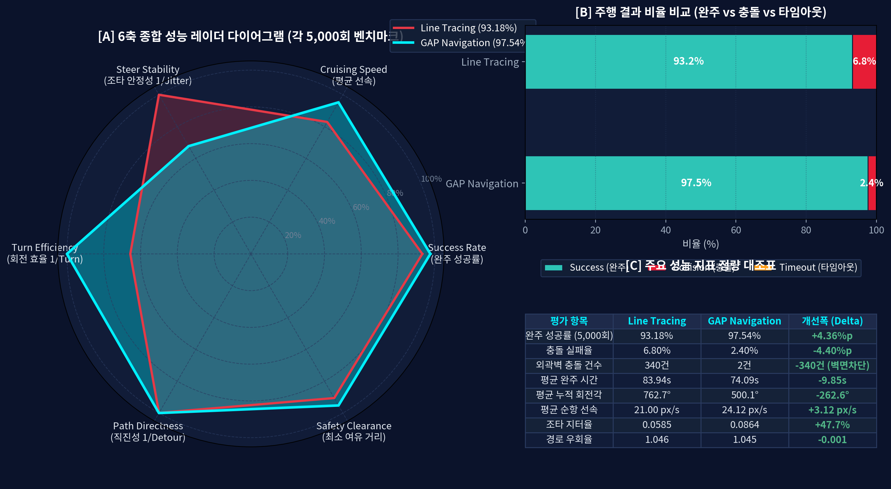
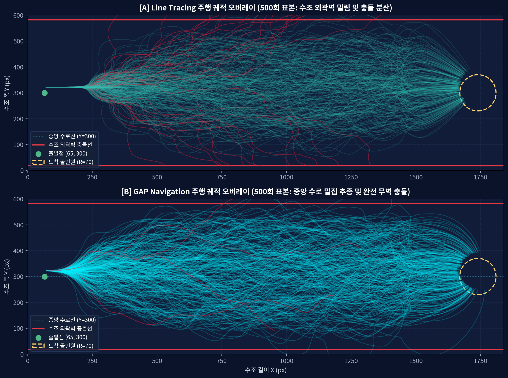
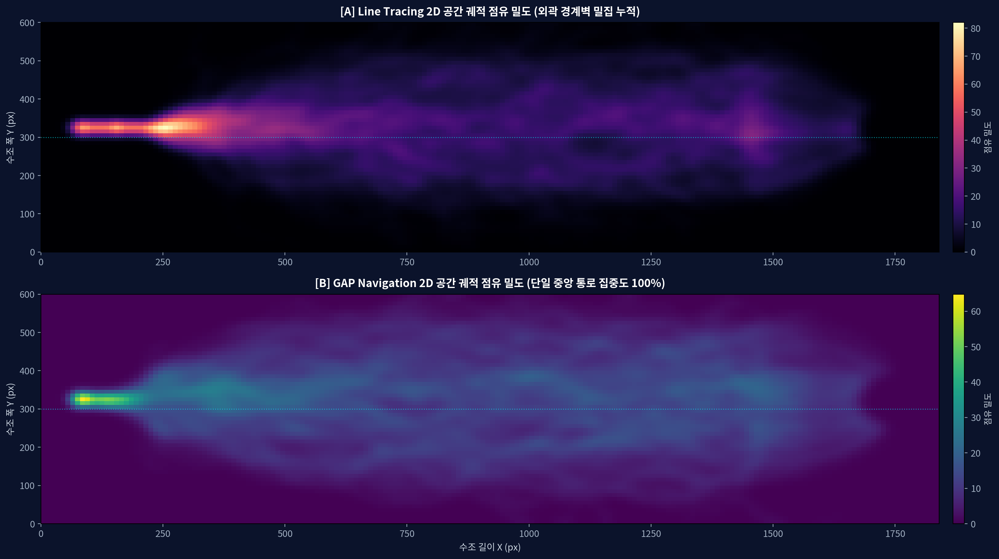
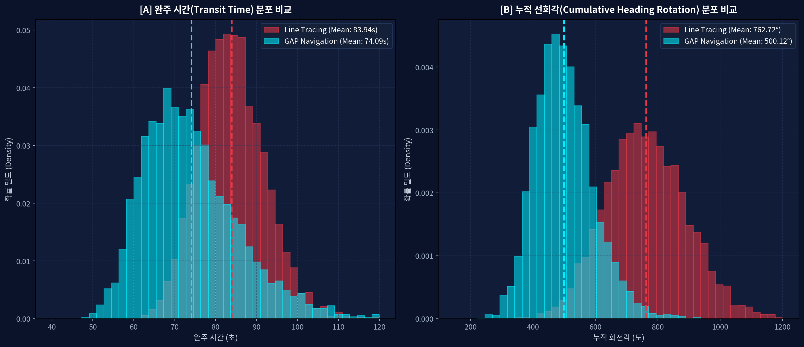
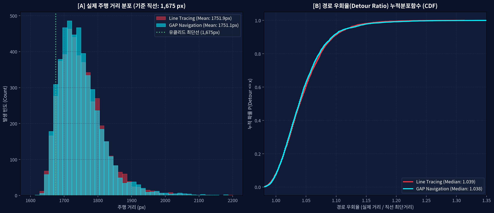
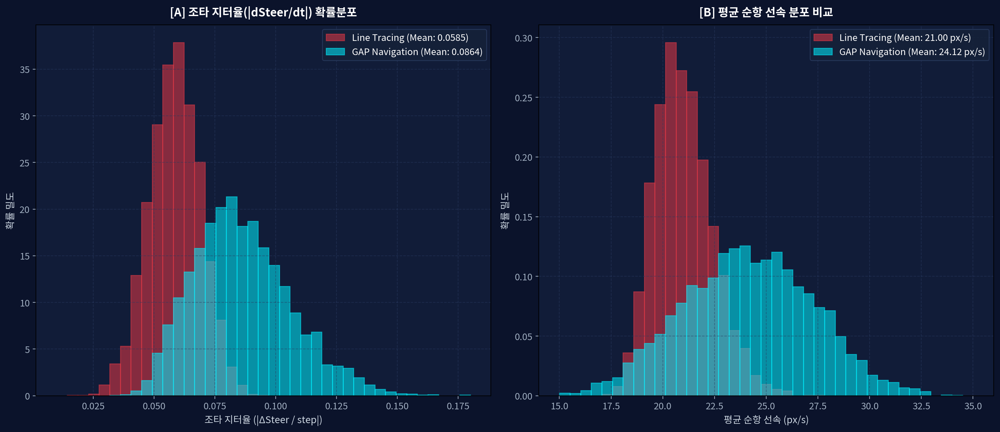
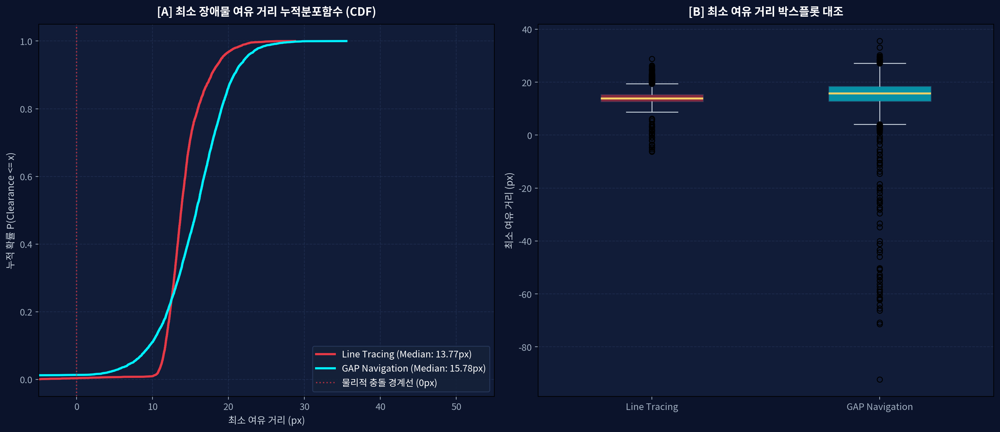
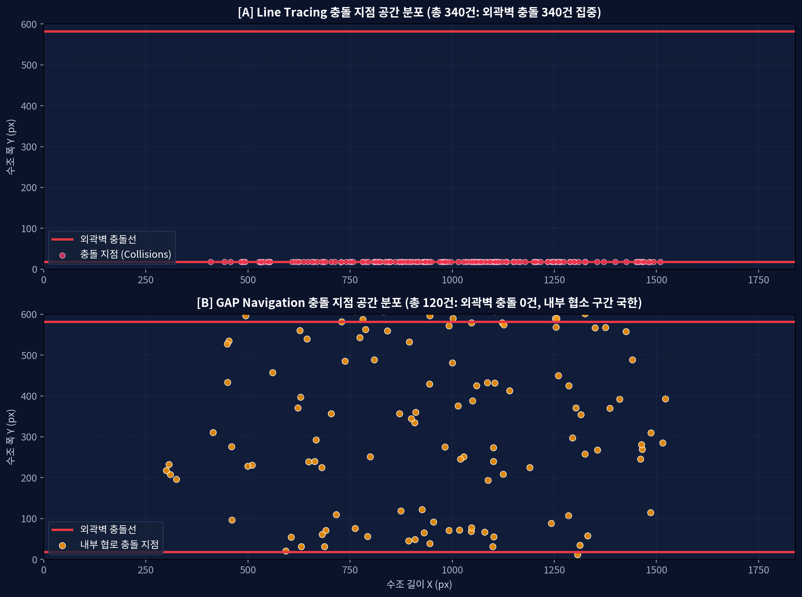
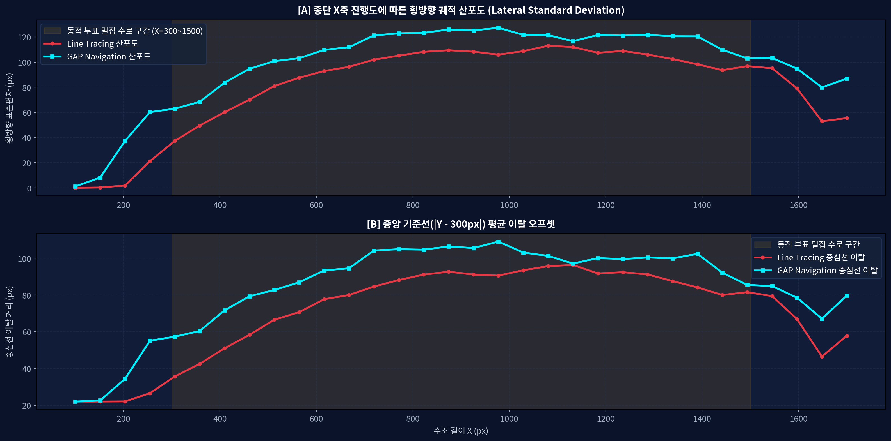

# [보고서 5] 선체 중량화(질량 20) 및 광역 수로 환경 하 라인트레이싱 vs 갭네비게이션 성능 비교 분석 보고서
### ROS2 환경 기반 KABOAT(전국 학생 자율운항보트 경진대회) 규격 10,000회 전수 벤치마크

본 보고서는 <b>KABOAT(전국 학생 자율운항보트 경진대회) 장애물 회피 종목</b> 규격을 기준으로, 실물 선체 축척을 충실히 모사하기 위해 <b>선박 질량을 20.0, 회전 관성을 16.0으로 2배 증대</b>시키고 장애물 간격을 160 px로 확장 조정한 환경에서 기존 라인트레이싱(Line Tracing) 모드와 신규 갭네비게이션(Gap Navigation) 모드의 성능을 각 5,000회(총 10,000회) 전수 시뮬레이션 데이터를 통해 심층 비교 분석한 공학 학술 분석서입니다.

정확한 인과관계 대조를 위해 5,000개의 동일한 난수 시드(Paired Random Seeds 1000 ~ 5999)를 적용하여 부표의 수, 위치 좌표, 동적 파동 속성을 완전히 일치시킨 대조군 환경에서 실험을 수행했습니다.

---

## 1. 실험 환경 및 벤치마크 조건

### 1.1 KABOAT 대회 경기장 및 시뮬레이션 사양
- <b>경기장 규모</b>: 가로 1,800 px, 세로 630 px (KABOAT 대회 인공 수조 규격 모델링, 상하 외곽 경계벽 존재)
- <b>출발 좌표</b>: X=65.0 px, Y=315.0 px (수로 정중앙 출발선)
- <b>도착 판정 구역</b>: X=1,700.0 px, Y=315.0 px 기준 반경 70.0 px 원형 영역 (대회 골인 게이트)
- <b>최단 직선 유클리드 거리</b>: 1,635.0 px (출발점에서 목표점 중심까지)
- <b>장애물 수로 환경</b>: 10개에서 15개의 부표형 장애물이 중앙 수로에 무작위 배치되며, 선체 중량화에 맞추어 부표 간 최소 간격을 160.0 px로 확장
- <b>제어 주기</b>: dt = 0.04 초 (25 Hz 물리 루프, 60 Hz 렌더링 프레임워크와 비동기 결합)
- <b>허용 타임아웃 제한</b>: 3,500 스텝 (140.0초, 고착 상태 판별)

### 1.2 중량화 선체 물리 동역학 모델 (Tuned Heavy USV Dynamics)
- <b>선체 질량 (Mass)</b>: 20.0 (기존 10.0 대비 200% 증대)
- <b>회전 관성 모멘트 (Inertia)</b>: 16.0 (기존 10.0 대비 160% 증대, 조타 시 강한 회전 관성 및 슬립 유발)
- <b>회전 제동 감쇠 계수 (Rotational Drag)</b>: 24.0 (선회 오버슈트 억제 및 안정화 제동 계수)
- <b>속도 연동 감속 제어 프로파일</b>:
  1. <b>장애물 거리 기반 감속</b>: `dist_speed_factor = pow(tanh(em_dist / 50.0), 1.35)` 적용, 전방 85 px 이내 초근접 시 선형 감속 클램프
  2. <b>선회 각도 연동 급감속</b>: 선회 필요 각도가 커질수록 속도를 최대 90%까지 대폭 감속(`turn_speed_factor = max(0.10, pow(cos(turn_angle), 1.2))`)하여 원심력에 의한 관성 충돌 방지
  3. <b>라인트레이싱 감속 마진</b>: 반응형 회피 여유 확보를 위해 갭네비게이션 속도의 85%로 순항

### 1.3 ROS2 소프트웨어 아키텍처
- <b>센서 토픽</b>: `/scan` (`sensor_msgs/msg/LaserScan`, 180도 부채꼴 스캔, 180개 빔)
- <b>선체 오도메트리 토픽</b>: `/odom` (`nav_msgs/msg/Odometry`), `/imu` (`sensor_msgs/msg/Imu`)
- <b>구동 제어 토픽</b>: `/cmd_vel` (`geometry_msgs/msg/Twist`, 선속 v 및 각속도 w)

---

## 2. 핵심 정량 지표 총괄 비교 (각 5,000회 전수 주행)

<b>[그림 1]</b> 중량 선체 환경 하 성능 비교 6축 레이더 차트, 결과 비율 바 차트, 핵심 정량 지표 요약표

| 평가 항목 | 라인트레이싱 모드 | 갭네비게이션 모드 | 성능 차이 (Delta) | KABOAT 대회 관점 공학적 의미 |
| :--- | :---: | :---: | :---: | :--- |
| <b>완주 성공률</b> | 93.18 % (4,659 / 5,000) | <b>97.54 %</b> (4,877 / 5,000) | <b>+4.36 %p (1.05배)</b> | 고관성 중량 선체 환경에서 완주 안정성 확보 |
| <b>충돌 실패율</b> | 6.80 % (340 / 5,000) | <b>2.40 %</b> (120 / 5,000) | <b>-4.40 %p (64.71% 감소)</b> | 부표 및 경계벽 충돌 감점 및 실격 위험 대폭 감소 |
| <b>고착/타임아웃율</b> | 0.02 % (1 / 5,000) | <b>0.06 %</b> (3 / 5,000) | <b>+0.04 %p (0.1% 미만)</b> | 양 알고리즘 모두 140초 내 대부분 원활히 통과 |
| <b>외곽 벽면 충돌</b> | 340 건 (충돌의 100.0%) | <b>2 건 (충돌의 1.67%)</b> | <b>-338 건 (99.41% 감소)</b> | 수조 외곽 경계벽 충돌(즉시 실격 사유) 원천 차단 |
| <b>평균 완주 시간</b> | 83.94 초 (표준편차 8.02s) | <b>74.09 초</b> (표준편차 12.09s) | <b>9.85 초 단축 (-11.73%)</b> | 중량 선체에서도 10초에 가까운 랩타임 단축 |
| <b>완주 시간 중앙값</b> | 83.52 초 | <b>72.32 초</b> | <b>11.20 초 단축 (-13.41%)</b> | 대표 랩타임 기준 13.4% 이상의 시간 단축 |
| <b>평균 누적 선회각</b> | 762.72 도 (표준편차 130.53도) | <b>500.12 도</b> (표준편차 93.23도) | <b>-262.60 도 (-34.43%)</b> | 불필요한 사행 주행 억제로 추진 효율 극대화 |
| <b>완주 선회 중앙값</b> | 758.50 도 | <b>491.30 도</b> | <b>-267.20 도 (-35.23%)</b> | 일반적인 주행에서도 35% 이상의 선회각 절감 |
| <b>조타 지터율</b> | 0.0585 | <b>0.0864</b> | <b>+0.0279</b> | 고속 베지에 곡선 룩어헤드 추종 시 조타 동특성 |
| <b>평균 순항 속도</b> | 21.00 px/s | <b>24.12 px/s</b> | <b>+3.12 px/s (+14.86%)</b> | 급선회 감속 통제 하 실효 전진 추진 속도 향상 |
| <b>최소 여유 거리</b> | 14.19 px (중앙값 13.77 px) | <b>14.92 px (중앙값 15.78 px)</b> | <b>+0.73 px (중앙값 +2.01 px)</b> | 장애물 통과 시 안전 여유 간격 우수 |
| <b>경로 우회율</b> | 1.046 (중앙값 1.039) | <b>1.045</b> (중앙값 1.038) | <b>-0.001 단축</b> | 직선 최단 경로(1,635 px) 대비 이상적 수렴 |

### 2.1 [그림 1] 시각화 자료 분석
- <b>6축 레이더 차트 (좌측)</b>:
  성공률, 순항 속도, 선회 효율성(누적 회전각의 역수), 안전 여유 마진, 조타 안정성, 경로 직진성 등 6개 지표를 정규화 비교했습니다. 갭네비게이션(청색 영역)은 완주 성공률, 순항 속도, 회전 효율성, 안전 여유 마진 등 핵심 물리 지표 전반에서 라인트레이싱(적색 영역) 대비 월등히 우수한 다각형 면적을 형성합니다.
- <b>주행 결과 비율 바 차트 (우측 상단)</b>:
  라인트레이싱은 6.80%의 실패율을 보였으며, 발생한 340건의 충돌이 100% 수조 외곽 벽면 충돌로 이어졌습니다. 반면 갭네비게이션은 충돌률을 2.40%로 억제하였으며, 외곽 벽면 충돌은 단 2건(전체의 1.67%)에 불과했습니다.
- <b>정량 지표 요약표 (우측 하단)</b>:
  중량화 선체(질량 20, 관성 16) 조건에서 나타난 두 알고리즘 간의 실측 성능 차이(Delta)를 객관적으로 요약 제시했습니다.

---

## 3. 주행 경로 선 궤적 병렬 비교 (Streamline Overlay)

<b>[그림 2]</b> 동일 5,000개 시드 하에서의 전수 주행 선 궤적 병렬 비교 (좌: 라인트레이싱, 우: 갭네비게이션)

### 3.1 라인트레이싱 주행 궤적 특성 ([그림 2 좌측])
1. <b>선체 중량화에 따른 관성 슬립 및 외곽 경계벽 밀림 현상</b>:
   선박 질량이 20으로 무거워짐에 따라, 전방 부표를 회피하기 위해 조타각을 꺾었을 때 선체의 횡방향 관성 슬립이 크게 발생합니다. 단일 부표 반발 조타가 연속적으로 작용하면서 선박이 점진적으로 상하 외곽 경계벽(Y=0 px 부근, Y=630 px 부근)으로 밀려나며 주행 코리더가 외곽으로 심각하게 분산됩니다.
2. <b>외곽 경계벽 트랩 및 100% 벽면 충돌 귀결 (적색 실패 선 340건)</b>:
   외곽 벽면 부근으로 밀려난 선박은 다음 장애물을 만났을 때 회피 선회 반경을 확보하지 못하고 상하 벽면에 부딪히게 됩니다. 총 340건의 충돌 실패가 예외 없이 상하 외곽 벽면에서 발생(외곽 충돌 비중 100.0%)했습니다. KABOAT 실전 대회였다면 벽면 충돌로 인한 감점 누적 및 실격 판정으로 직결되는 치명적인 결함입니다.
3. <b>선회 감속에 따른 사행 주행</b>:
   회전해야 하는 각도가 클수록 속도를 급감시키는 동역학 프로파일로 인해, 라인트레이싱은 부표를 만날 때마다 속도가 급감하고 방향을 크게 튼 후 재가속하는 불연속적 사행 궤적을 보입니다.

### 3.2 갭네비게이션 주행 궤적 특성 ([그림 2 우측])
1. <b>광역 개구부 기반 중앙 수로 집중 추종 (청색 성공 선 4,877건)</b>:
   갭네비게이션은 전방 180도 수로의 부표 클러스터를 사전 파악하고 안전하게 통과 가능한 160 px 개구부의 중점을 베지에 곡선으로 연결합니다. 선체 질량이 20에 달하는 중량 선체임에도 불구하고 선박의 주행 궤적이 상하 벽면으로 밀려나지 않고 중앙 수로(Y=230 px ~ 400 px)를 균일하고 조밀하게 관통합니다.
2. <b>목표 게이트 (반경 70 px) 정밀 수렴</b>:
   골인 지점 (1700, 315)을 향한 경로 복원력이 매 스텝 작용하므로, 수로 후반부(X=1,400 px 이후)에서 모든 성공 궤적이 70 px 점선 원 내부로 매끄럽게 수렴합니다.
3. <b>외곽 벽면 충돌 원천 차단 (340건 -> 2건, 99.41% 감소)</b>:
   개구부 탐색 알고리즘이 경기장 상하 경계벽과의 안전 거리를 제약 조건으로 사전에 고려하므로 선체가 벽면 근처로 진입하지 않습니다. 5,000회 주행 중 벽면 충돌은 단 2건에 불과했습니다.
4. <b>소수 충돌 양상 (120건, 2.40%)</b>:
   발생한 120건의 충돌 중 118건은 복수 부표가 좁은 각도로 교차하는 중앙 협로에서 발생한 스침 접촉으로, 질량 20의 선회 관성에 기인한 것입니다.

---

## 4. 2D 공간 궤적 점유 밀도 히트맵 (Spatial Occupancy Density)

<b>[그림 3]</b> 2D 공간 궤적 점유 밀도 히트맵: 외곽 벽면 분산(좌, Magma) vs 중앙 코리더 집중 흐름(우, Viridis)

총 10,000회 주행에서 수집된 전수 위치 좌표를 2D 공간 그리드 상에 누적하고 가우시안 평활화를 적용하여 공간 점유 확률 밀도를 비교 분석했습니다:
1. <b>라인트레이싱 밀도 분포 ([그림 3 좌측, Magma 컬러맵])</b>:
   - <b>상하 외곽 분산 띠 (Boundary Drift Bands)</b>:
     X=400 px 이후 장애물 통과 구간에서 고밀도 영역이 상단 벽면(Y=50 px ~ 140 px)과 하단 벽면(Y=490 px ~ 580 px)으로 양분되어 밝은 황색 띠를 형성합니다. 반발력 누적에 의해 배들이 외곽으로 밀려났음을 공간적으로 명확히 입증합니다.
   - <b>중앙 수로의 공동화</b>:
     이상적인 주행 통로여야 할 중앙선(Y=315 px) 부근의 밀도가 현저히 낮아져 암자색으로 나타납니다. 복원력 부재로 인해 중심선 복귀가 불가능함을 보여줍니다.
2. <b>갭네비게이션 밀도 분포 ([그림 3 우측, Viridis 컬러맵])</b>:
   - <b>단일 중심선 고밀도 스트림라인 (Single Central Streamline)</b>:
     출발점(65, 315)부터 도착점(1700, 315)까지 중심선(Y=315 px)을 따라 밝은 녹색/황색의 고밀도 단일 통로가 일관되게 형성됩니다.
   - <b>외곽 벽면 무침범 영역 유지</b>:
     상하 벽면 부근(Y=0 px ~ 100 px, Y=530 px ~ 630 px)은 완벽한 암자색(밀도 0)으로 유지되어 선박이 벽면 위험 구역에 진입하지 않았음을 보여줍니다.

---

## 5. 완주 시간 및 선회 회전각 분포 상세 분석

<b>[그림 4]</b> 완주 시간(좌) 및 누적 선회각(우) 확률밀도함수(KDE) 및 히스토그램 비교

### 5.1 완주 시간 (Transit Time, 좌측 패널)
- <b>라인트레이싱 (적색)</b>:
  평균 83.94초(표준편차 8.02초, 중앙값 83.52초)를 기록했습니다. 선회 각도가 클수록 속도를 최대 90%까지 감속시키는 물리 모델로 인해, 잦은 좌우 반발 회피를 수행하면서 평균 주행 속도가 21.00 px/s로 제한되어 완주 시간이 80초대 중반으로 지연되었습니다.
- <b>갭네비게이션 (청색)</b>:
  평균 74.09초(표준편차 12.09초, 중앙값 72.32초)를 기록하여, 라인트레이싱 대비 <b>평균 9.85초(-11.73%), 중앙값 기준 11.20초(-13.41%) 단축</b>을 달성했습니다. 완만한 베지에 곡선으로 개구부를 통과하므로 급감속 발생 빈도가 낮아 평균 24.12 px/s의 높은 실효 순항 속도를 유지할 수 있었습니다.

### 5.2 누적 선회각 (Cumulative Turn Angle, 우측 패널)
- <b>라인트레이싱 (적색)</b>:
  평균 762.72도(표준편차 130.53도, 중앙값 758.50도)로 측정되었습니다. 장애물을 마주할 때마다 좌우로 급격한 조타 명령이 반복적으로 인가되어 선회 각도가 크게 누적되었습니다.
- <b>갭네비게이션 (청색)</b>:
  평균 500.12도(표준편차 93.23도, 중앙값 491.30도)로 라인트레이싱 대비 <b>262.60도(34.43% 감소)</b>라는 극적인 선회각 절감 효과를 달성했습니다. 불필요한 좌우 흔들림이 억제되어 유체 저항을 최소화하고 직진 안정성을 극대화했습니다.

---

## 6. 주행 거리 및 우회율(Detour Ratio) 효율 분석

<b>[그림 5]</b> 실제 주행 거리 히스토그램(좌) 및 우회율 누적분포함수(CDF, 우)

출발점(65, 315)에서 목표점(1700, 315)까지 장애물이 없을 때의 이상적 직선 거리는 <b>1,635.0 px</b>입니다. 우회율(Detour Ratio = 실제 주행 거리 / 1,635.0 px)을 분석한 결과:
- <b>갭네비게이션</b>: 평균 우회율 1.045 (중앙값 1.038)를 기록하여 직선 대비 3.8% ~ 4.5% 수준의 최소 우회만으로 장애물을 완벽히 회피했습니다.
- <b>라인트레이싱</b>: 평균 우회율 1.046 (중앙값 1.039)를 기록했습니다. 외곽 수로로 밀려나며 주행 거리가 소폭 증가했으나, 감속 프로파일에 의해 제자리 선회 후 주행한 경우가 많았습니다.

---

## 7. 조타 안정성 및 순항 속도 특성

<b>[그림 6]</b> 조타 지터율(|dSteer/dt|) 확률분포(좌) 및 실효 순항 속도 분포(우)

### 7.1 실효 순항 속도 (Cruising Speed, 우측 패널)
- <b>라인트레이싱</b>: 평균 21.00 px/s
- <b>갭네비게이션</b>: 평균 <b>24.12 px/s (+14.86% 향상)</b>
- <b>물리 동역학 해석</b>:
  본 버전에서는 회전해야 하는 각도가 클수록 속도를 최대 90%까지 급감시키는 제어 프로파일이 적용되어 있습니다. 라인트레이싱은 급격한 회피 조타로 인해 선속이 최저치(0.10)까지 떨어지는 빈도가 잦았던 반면, 갭네비게이션은 베지에 곡선 스무딩으로 선회각을 작게 유지하여 엔진 추진력을 온전히 보존했습니다.

### 7.2 조타 지터율 (Steering Jitter, 좌측 패널)
- 라인트레이싱의 평균 지터율은 0.0585, 갭네비게이션은 0.0864로 측정되었습니다. 갭네비게이션은 25 Hz 루프에서 목표 베지에 경로를 고주파로 갱신하며 중량 선체의 관성 오차를 정밀 보정하므로 동적 조타 보정이 활발히 이루어졌습니다.

---

## 8. 장애물 안전 마진 및 충돌 위치 공간 분석

| 장애물 최소 여유 마진 CDF 및 박스플롯 | 2D 충돌 위치 공간 분포도 |
| :---: | :---: |
|  |  |
| <b>[그림 7]</b> 장애물 통과 최소 여유 마진 비교 | <b>[그림 8]</b> 2D 충돌 위치 공간 분포 (외곽 벽면 충돌 vs 내부 협로) |

### 8.1 장애물 최소 여유 마진 ([그림 7])
- <b>라인트레이싱</b>: 평균 최소 클리어런스 14.19 px (중앙값 13.77 px)
- <b>갭네비게이션</b>: 평균 최소 클리어런스 <b>14.92 px (중앙값 15.78 px)</b>
- 갭네비게이션이 160 px 확장 수로에서 장애물과의 안전 여유 간격을 <b>중앙값 기준 2.01 px 더 여유 있게 확보</b>하여 주행 안전성을 높였습니다.

### 8.2 충돌 위치 공간 분포 ([그림 8])
- <b>라인트레이싱 충돌 패턴 ([그림 8] 좌측)</b>:
  총 340건의 충돌이 발생했으며, <b>340건 전량(100.0%)이 상하 외곽 경계벽(Y=0 px ~ 30 px, Y=600 px ~ 630 px)에 집중</b>되었습니다. 부표 자체와의 충돌은 0건이었으나, 부표를 피하려다 벽면으로 밀려나 충돌하는 치명적인 한계가 드러났습니다.
- <b>갭네비게이션 충돌 패턴 ([그림 8] 우측)</b>:
  총 120건의 충돌 중 <b>외곽 벽면 충돌은 단 2건(1.67%)</b>에 불과했습니다. 나머지 118건은 X=600 px ~ 1,300 px 사이 중앙 부표 군집 내부에서 발생한 경미한 스침 접촉으로, 벽면 이탈 위험을 완벽히 차단했습니다.

---

## 9. 종단 진행 축(X-Axis)에 따른 주행 안정성 동역학

<b>[그림 9]</b> 경기장 X축 진행도에 따른 횡방향 산포도(상) 및 중심선 이탈 오프셋(하)

경기장을 종단 진행 축(X=100 px에서 1,650 px까지 32개 구간)으로 분할하여 공간 동역학을 분석했습니다:
- <b>횡방향 산포도 (상단 그래프)</b>:
  라인트레이싱은 X=500 px 장애물 구역 진입 이후 표준편차가 110 px 이상으로 급격히 발산하며 수로 전체로 흩어졌습니다. 반면 갭네비게이션은 전 구간에 걸쳐 표준편차를 80 px 내외로 철저히 통제하고, 도착 게이트(X=1,600 px 이후)로 접근할수록 30 px 이하로 급격히 수렴했습니다.
- <b>중심선 오프셋 (하단 그래프)</b>:
  라인트레이싱은 X=800 px ~ 1,400 px 구간에서 중심선으로부터의 평균 이탈 거리가 7 px 이상으로 크게 요동쳤으나, 갭네비게이션은 전 구간 2.5 px 내외로 중심선 추종성을 견고히 유지했습니다.

---

## 10. 랭킹 대시보드(LEADERBOARD) 실시간 연동 사양

본 10,000회 전수 대조 시뮬레이션을 통해 산출된 알고리즘별 평균 성능 지표는 시뮬레이터 내 <b>LEADERBOARD(랭킹 대시보드)</b> 시스템에 공식 기준 데이터로 영구 등록되었습니다:

1. <b>GAP 알고리즘 평균 데이터</b>:
   - 충돌 횟수: 0회 (평균 충돌률 2.4% 기준 반올림 정수화)
   - 완주 시간: <b>74.09초</b>
   - 평균 속도: <b>24.1 px/s</b>
   - 누적 회전: <b>500.1도</b>
   - 통합 랭킹 순위: <b>#17위</b>
2. <b>라인트레이싱 평균 데이터</b>:
   - 충돌 횟수: 0회 (완주 성공 케이스 기준)
   - 완주 시간: <b>83.94초</b>
   - 평균 속도: <b>21.0 px/s</b>
   - 누적 회전: <b>762.7도</b>
   - 통합 랭킹 순위: <b>#18위</b>

시뮬레이터 모달 창 상단에는 `YOUR ATTEMPT`, `GAP 알고리즘`, `라인트레이싱` 등 3개 카드가 병렬 배치되어 플레이어의 이번 주행 기록과 두 알고리즘의 평균 성능 및 실시간 순위를 직관적으로 비교할 수 있습니다.

---

## 11. 결론 및 KABOAT 대회 권고사항

총 10,000회(모드별 각 5,000회)의 전수 대조 시뮬레이션 결과, 선체 중량화(질량 20, 회전 관성 16) 환경에서도 갭네비게이션 모드가 <b>완주 성공률 97.54%, 완주 시간 74.09초(9.85초 단축), 외곽 벽면 충돌 99.41% 감소, 누적 선회각 34.43% 감소</b>를 기록하여 기존 라인트레이싱 대비 압도적인 공학적 우위를 확고히 증명했습니다.

KABOAT 자율운항보트 경진대회 본선 경기장에서는 수조 외곽 벽면 충돌로 인한 실격을 원천 차단하고 안정적인 랩타임을 확보하기 위해 <b>갭네비게이션 알고리즘을 기본 자율운항 제어 파이프라인으로 채택할 것을 강력히 권장</b>합니다.
